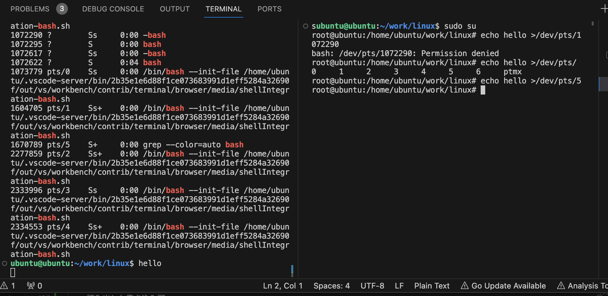

## sec 1

- カーネル
  - 命令の実行順序の正しい制御
    - 最悪文鎮化 (brick)
  - CPU のモード
    - カーネルモードとユーザーモード
- システムコール
  - プロセスがカーネルに処理を依頼するための方法
  - システムに搭載されている論理 CPU が実行している命令の割合 → sar コマンド
  - sar
    - system はシステムコールを処理している時間の割合

``` sh
# -P 0 論理 CPU0 のデータ
# 1 1 秒ごとに
# 1 1 回だけ
sar -P 0 1 1
```

- ライブラリ
  - 標準 C ライブラリ
    - glibc
    - libc
  - プログラムがどのようなライブラリをリンクしているかは ldd コマンドで見れる！

``` sh
ldd /bin/echo

        linux-vdso.so.1 (0x0000ffffba162000)
        libc.so.6 => /lib/aarch64-linux-gnu/libc.so.6 (0x0000ffffb9f50000)
        /lib/ld-linux-aarch64.so.1 (0x0000ffffba129000)
```

- システムコールのラッパー関数
  - libc は標準 C のライブラリでだけではない
  - **システムコールは通常の関数呼び出しと違って C 言語などの高級言語から直接呼び出せない！**
    - **アーキテクチャ依存のアセンブリコードを使って呼び出す**必要がある
- 静的ライブラリか共有ライブラリか
  - サイズと ldd コマンドの実行結果
  - 共有ライブラリが今までは好んで使われてきた
  - 一方 **Go 言語は基本的にライブラリを全て静的リンクにしている！**
    - メモリやストレージの大容量化によってサイズの問題は相対的に小さくなった
    - プログラムが1つの実行ファイルだけで動けば、当該ファイルをコピーするだけで別の環境でも動作するので扱いが楽
    - 実行時に共有ライブラリをリンクしなくて済むので起動が高速
    - 共有ライブラリの DLL 地獄と呼ばれる問題を回避できる

## sec 2

- ps aux
  - ps aux --no-header
- プロセスの生成
  - 同じプログラムの処理を複数のプロセスに分けて処理する（サーバー等）
  - 別のプログラムを生成する
- fork, execve 関数
  - 内部ではそれぞれ clone, execve というシステムコールを呼ぶ
- 親プロセスから子プロセスへの**メモリコピーは Copy-on-Write という機能によって非常に低コスト**ですむ！
- execve
  - execve 関数を呼び出す
  - 引数で指定した実行ファイルからプログラムを読んでメモリ上に配置する（**メモリマップ**）ために必要な情報を読み出す
  - 現在のプロセスのメモリを新しいプロセスのデータで上書きする
  - プロセスを新しいプロセスの最初に実行すべき命令から実行開始する
- execve のために必要なデータ
  - コード領域のオフセット、サイズ、メモリマップ開始アドレス
  - データ領域についての情報
  - 最初に実行する命令のメモリアドレス
- Linux の実行ファイル
  - Executable and Linking Format: ELF
    - readelf というコマンドで取得可能
    - readelf -h pause
- ASLR: Address Space Layout Randomization
  - セキュリティ機能
  - **ASLR は、プログラムを実行するたびに各セクションを異なるアドレスにマップする！**
    - 攻撃対象のコードやデータが特定のアドレスに存在することを前提とした攻撃が困難になる

``` sh
# ラズパイで確認。
$ go build -o main main.go 
## executable となってる。
$ file main
main: ELF 64-bit LSB executable, ARM aarch64, version 1 (SYSV), statically linked, Go BuildID=c9iJWpjnvgcoSycVuxnJ/A3EXOKKcGdZWo3rgHd38/5CVwxX4Wbe_m7Y8NQQpG/7d89cpjJLoZbsnnrfL1z, with debug_info, not stripped

# PIE: Position Independent Executable を有効にする！
$ go build -buildmode=pie -o main main.go 
# shared object となってる。
$ file main
main: ELF 64-bit LSB shared object, ARM aarch64, version 1 (SYSV), dynamically linked, interpreter /lib/ld-linux-aarch64.so.1, Go BuildID=cWWzX4B-jgbXgkraVNf3/ywpwy9O6IpuBcCN3bmiB/wNRGKhUqQDCqZ2Qgp2kE/LjFYyaAFmHI2hLpB9Ef8, with debug_info, not stripped


## =========================== PIE なし ===========================
## メモリマップが全く一緒！
$ go build -o main main.go 
$ ./main &
[3] 1080609
$ cat /proc/1080609/maps
[1]   Done                    ./main
00010000-00068000 r-xp 00000000 b3:02 80288                              /home/ubuntu/work/main
00070000-000da000 r--p 00060000 b3:02 80288                              /home/ubuntu/work/main
000e0000-000e5000 rw-p 000d0000 b3:02 80288                              /home/ubuntu/work/main
000e5000-0011c000 rw-p 00000000 00:00 0 
...

$ kill -KILL 1080609
[3]+  Killed                  ./main
$ ./main &
[3] 1080779
$ cat /proc/1080779/maps
00010000-00068000 r-xp 00000000 b3:02 80288                              /home/ubuntu/work/main
00070000-000da000 r--p 00060000 b3:02 80288                              /home/ubuntu/work/main
000e0000-000e5000 rw-p 000d0000 b3:02 80288                              /home/ubuntu/work/main
000e5000-0011c000 rw-p 00000000 00:00 0 
...


## =========================== PIE あり ===========================
## /home/ubuntu/work/main の部分のメモリマップが全然違う場所になっている！
$ go build -buildmode=pie -o main main.go 
$ ./main &
[2] 1079687
$ cat /proc/1079687/maps
4000000000-4000400000 rw-p 00000000 00:00 0 
4000400000-4004000000 ---p 00000000 00:00 0 
aaaac7cb1000-aaaac7d0b000 r-xp 00000000 b3:02 80279                      /home/ubuntu/work/main
aaaac7d11000-aaaac7d3c000 r--p 00060000 b3:02 80279                      /home/ubuntu/work/main
aaaac7d41000-aaaac7d92000 r--p 00090000 b3:02 80279                      /home/ubuntu/work/main
aaaac7d92000-aaaac7d93000 rw-p 000e1000 b3:02 80279                      /home/ubuntu/work/main
aaaac7da1000-aaaac7da6000 rw-p 000f0000 b3:02 80279                      /home/ubuntu/work/main
...

$ kill -KILL 1079687
[2]+  Killed                  ./main
$ ./main &
[2] 1080050
$ cat /proc/1080050/maps
4000000000-4000400000 rw-p 00000000 00:00 0 
4000400000-4004000000 ---p 00000000 00:00 0 
aaaad74f7000-aaaad7551000 r-xp 00000000 b3:02 80279                      /home/ubuntu/work/main
aaaad7557000-aaaad7582000 r--p 00060000 b3:02 80279                      /home/ubuntu/work/main
aaaad7587000-aaaad75d8000 r--p 00090000 b3:02 80279                      /home/ubuntu/work/main
aaaad75d8000-aaaad75d9000 rw-p 000e1000 b3:02 80279                      /home/ubuntu/work/main
aaaad75e7000-aaaad75ec000 rw-p 000f0000 b3:02 80279                      /home/ubuntu/work/main
aaaad75ec000-aaaad7623000 rw-p 00000000 00:00 0 
...
```

- コンピュータ起動時の挙動
  - コンピュータの電源を入れる
  - BIOS や UEFI などのファームウェアにより、**ハードウェが初期化**される
  - ファームウェアが **GRUB などのブートローダ**を起動する
  - **ブートローダが OS カーネル**を起動する。ここでは Linux カーネルとする。
  - **Linux カーネルが init プロセス**を起動する。
    - こいつが systemd でいい！？！？！
  - init うろプロセスが子プロセスを起動し、その子プロセスが起動され、、、
- pstree
  - pstree -p
- プロセスの状態
  - ps aux
    - STAT フィールドの1文字目で判断可能
  - S
    - スリープ状態！
      - イベント待ち
  - R
    - 実行状態！か実行可能状態！
      - タイムスライスとコンテキストスイッチ
  - Z
    - ゾンビ状態！
- 全プロセスが Sleep の時？
  - **アイドルプロセス**の実行！
    - 特殊なプロセスで ps からは見えない
- ゾンビプロセス
  - **終了したが、親プロセスが終了状態を得ていない！**
  - **ゾンビプロセスが大量に存在している場合は、親プロセスに対応するプログラムのバグを疑うといい！**
- シグナル
  - あるプロセスが他のプロセスに何かを通知して、**外部から実行の流れを強制的に変える**！
  - SIGKILL
    - **シグナルハンドラによる挙動の変更はできない**
  - SIGKILL でも殺せないプロセス
    - uninterruptible sleep
      - ps aux の STAT フィールドの1文字目が D
      - ディスク I/O など
- ジョブ
  - シェルがバックグラウンドで実行したプロセスを制御するための仕組み

``` sh
sleep 411 &
[1] 39280   # [1] がジョブ番号

jobs
[1]  - running    sleep 411
[2]  + running    sleep 411

# zsh は job 番号の前に % が必要。
$ fg %1
[1]  - 39529 running    sleep 411
```

- デーモン: 常駐プロセス
  - 端末からの入出力が不要なため、端末が割り当てられていない
    - TTY フィールドが ?
      - ? は端末が結びついていないことを示す
  - あらゆるログインセッションが終了しても影響を受けないよう、独自のセッションを持つ
    - セッション ID は PID に等しい
  - デーモンを生成したプロセスがデーモンの終了を気にしなくていいよう init が親になっている
    - 親プロセスが init (PPID が 1)

## sec 3

- 2つの時間
  - 経過時間:
    - プロセスが開始してから終了するまでの経過時間
    - ストップウォッチでプロセス開始から測ったイメージ
  - 使用時間:
    - プロセスが実際に論理 CPU を使用した時間

``` sh
# real は経過時間
# user, sys は使用時間
$ time python3 load.py 
real    0m11.621s
user    0m10.689s
sys     0m0.057s  # プロセスの開始・終了時に python のインタプリタがシステムコールを呼ぶため。

# スリープ状態になるため、使用時間 ~ 0
$ time sleep 11
real    0m11.014s
user    0m0.000s
sys     0m0.014s
```

``` sh
# タイムスライスの確認。
for i in 1 2 3; do python3 sched.py $i; done

# レイテンシターゲットと呼ばれる期間に一度、CPU 時間を得られる。
$ sysctl kernel.sched_latency_ns
kernel.sched_latency_ns = 18000000  # 18 msec
```

- コンテキストスイッチ
  - 論理 CPU 上で動作するプロセスが切り替わること
  - **如何なるコードを実行中でも、タイムスライスが切れると容赦なく発生**する！
- 指標
  - ターンアラウンドタイム:
    - **システムに処理を依頼してから、個々の処理が終わるまでの時間**
  - スループット:
    - 単位時間あたりに処理を終えられる数
- わかること
  - 論理 CPU をたくさん積んでるマシンがあったとしても、そこに十分な数のプロセスを実行させて初めてスループットが向上する
  - むやみにプロセス数を増やしてもスループットは上がらない
- 並列実行の重要性
  - ムーアの法則というかシングルスレッドでの性能向上の限界 → 並列実行の重要性

## sec 4

- メモリ
- free command
  - available: 実質的な空きメモリ
  - used: システムが使用中のメモリから buff/cache を引いたもの

``` sh
$ python3 memuse.py 
before memory allocation
              total        used        free      shared  buff/cache   available
Mem:        7998744     2969900      423992       66768     4604852     4846532
Swap:             0           0           0
after memory allocation
              total        used        free      shared  buff/cache   available
Mem:        7998744     2977460      416432       66768     4604852     4838972
Swap:             0           0           0
```

- ページキャッシュとバッファキャッシュ
  - available = 解放可能(カーネルが使用中のうち) + free
    - 回収可能 = ディスクから読み出してまだ変更していないページキャッシュ
- OOM: Out Of Memory killer

``` sh
dmesg | grep oom
```

- 仮想記憶がない時の課題
  - メモリの断片化
  - マルチプロセスの実現が困難
  - 不正な領域へのアクセス
- 仮想記憶の機能
  - 物理アドレス
    - アドレス空間
  - 仮想アドレス
    - 仮想アドレス空間
  - **ページテーブル**
    - 仮想アドレスから物理アドレスへの変換
    - ページテーブルエントリ

``` sh
# SIGSEGV: segmentation violation -> signal 11
$ go run segv.go
不正メモリアクセス前
panic: runtime error: invalid memory address or nil pointer dereference
[signal SIGSEGV: segmentation violation code=0x2 addr=0x0 pc=0x1028f7bfc]
```

- プロセスへの新規メモリの割り当て
  - すぐに使うわけではなく、獲得してかなり経って使うケースも多い
    - あらかじめ確保しておくと無駄が多い
    - → **デマンドページング**
  - **2つの手順！**
    - メモリ領域の割り当て
      - 仮想アドレス空間にメモリ領域をマップ
    - メモリの割り当て
      - 上記メモリ領域に物理メモリを割り当てる

``` sh
$ go run mmap.go 
新規メモリ領域獲得前のメモリマップ
00010000-000b0000 r-xp 00000000 b3:02 84071                              /tmp/go-build495116632/b001/exe/mmap
000b0000-00160000 r--p 000a0000 b3:02 84071                              /tmp/go-build495116632/b001/exe/mmap
00160000-0017a000 rw-p 00150000 b3:02 84071                              /tmp/go-build495116632/b001/exe/mmap
0017a000-001b2000 rw-p 00000000 00:00 0 
4000000000-4000400000 rw-p 00000000 00:00 0 
4000400000-4004000000 ---p 00000000 00:00 0 
ffff7f6c5000-ffff8193d000 rw-p 00000000 00:00 0 
ffff8193d000-ffff821ba000 ---p 00000000 00:00 0 
ffff821ba000-ffff821bb000 rw-p 00000000 00:00 0 
ffff821bb000-ffffa214a000 ---p 00000000 00:00 0 
ffffa214a000-ffffa214b000 rw-p 00000000 00:00 0 
ffffa214b000-ffffa613c000 ---p 00000000 00:00 0 
ffffa613c000-ffffa613d000 rw-p 00000000 00:00 0 
ffffa613d000-ffffa693a000 ---p 00000000 00:00 0 
ffffa693a000-ffffa693b000 rw-p 00000000 00:00 0 
ffffa693b000-ffffa6a3a000 ---p 00000000 00:00 0 
ffffa6a3a000-ffffa6a9a000 rw-p 00000000 00:00 0 
ffffa6a9a000-ffffa6a9b000 r--p 00000000 00:00 0                          [vvar]
ffffa6a9b000-ffffa6a9c000 r-xp 00000000 00:00 0                          [vdso]
ffffc9c57000-ffffc9c79000 rw-p 00000000 00:00 0                          [stack]
新規メモリ領域: アドレス=0xffff3f6c5000, サイズ=1073741824
新規メモリ領域獲得後のメモリマップ
00010000-000b0000 r-xp 00000000 b3:02 84071                              /tmp/go-build495116632/b001/exe/mmap
000b0000-00160000 r--p 000a0000 b3:02 84071                              /tmp/go-build495116632/b001/exe/mmap
00160000-0017a000 rw-p 00150000 b3:02 84071                              /tmp/go-build495116632/b001/exe/mmap
0017a000-001b2000 rw-p 00000000 00:00 0 
4000000000-4000400000 rw-p 00000000 00:00 0 
4000400000-4004000000 ---p 00000000 00:00 0 
ffff3f6c5000-ffff8193d000 rw-p 00000000 00:00 0 
ffff8193d000-ffff821ba000 ---p 00000000 00:00 0 
ffff821ba000-ffff821bb000 rw-p 00000000 00:00 0 
ffff821bb000-ffffa214a000 ---p 00000000 00:00 0 
ffffa214a000-ffffa214b000 rw-p 00000000 00:00 0 
ffffa214b000-ffffa613c000 ---p 00000000 00:00 0 
ffffa613c000-ffffa613d000 rw-p 00000000 00:00 0 
ffffa613d000-ffffa693a000 ---p 00000000 00:00 0 
ffffa693a000-ffffa693b000 rw-p 00000000 00:00 0 
ffffa693b000-ffffa6a3a000 ---p 00000000 00:00 0 
ffffa6a3a000-ffffa6a9a000 rw-p 00000000 00:00 0 
ffffa6a9a000-ffffa6a9b000 r--p 00000000 00:00 0                          [vvar]
ffffa6a9b000-ffffa6a9c000 r-xp 00000000 00:00 0                          [vdso]
ffffc9c57000-ffffc9c79000 rw-p 00000000 00:00 0 
```

- デマンドページング
  - プロセスがページにアクセス
  - ページフォールと発生
  - カーネルのページフォールとハンドラが動作して、物理メモリを割り当てる！

## sec 5

- 仮想記憶の機能を利用し、プロセス作成処理を高速化！
  - CoW: Copy on Write
    - fork 発行時ではなく、その後に発生する各ページへの初回書き込み時にデータをコピーする！
- プロセス間通信
  - **SIGINT, SIGTERM などのシグナルも、プロセス間通信の1つ**
    - 用途が決まっているもの
  - SIGUSR1, SIGUSR2
    - **自由に用途を決めていいシグナル**
    - シグナルが届いた、ということしか送られない（データは運ばない）
- パイプ
  - **複数のプロセスは、パイプと呼ばれるものを介して通信が可能**
- ソケット
  - 大きく2つ
    - UNIX ドメインソケット
    - TCP, UDP ソケット
- 排他制御
  - パッケージ管理のデータベースなど
  - **ファイルロック**という仕組みで説明する
    - 本当は複雑で直感的ではない？

``` sh
# 並列実行させた時。
for ((i=0; i<1000; i++)); do bash inc.sh & done; wait
```

- クリティカルセクション
  - 同時に実行されると困る一連の処理のこと
- アトミック処理
  - システムの外から見て1つの処理に見える一連の処理のこと
- **ファイルロック**
  - flock や fcntl といったシステムコールを使って、あるファイルについてロック・アンロックという状態を変更する！

``` sh
man 2 flock
man 2 fcntl

# ファイルロックを使って正しく排他制御ができている時。
for ((i=0; i<1000; i++)); do bash inc-lock.sh & done; wait
```

- スレッド
  - ユーザスレッドの方がカーネルスレッドよりもコストは低い
  - **goroutine はユーザースレッドによって実現している**

## sec 6

- プロセスはデバイスに直接アクセスできない
  - 複数のプログラムが同時に操作すると、予期せぬ動作を引き起こしてしまう
  - アクセスしてはいけないデータを破壊・閲覧できたりしてしまう
- カーネルにデバイスへのアクセスを代行してもらう！
  - デバイスファイル
  - ファイルシステム
  - **ネットワークインタフェースカード（NIC）**
    - 速度などの問題で、**デバイスファイルを使わずにソケットを使う**
- デバイスファイル
  - デバイスごとに存在する

``` sh
$ ls -l /dev/
crw-rw-rw-  1 root      wheel        0x4000017 Nov  8 22:06 ttyq7
```

- 先頭の文字
  - c: キャラクタデバイス
  - b: ブロックデバイス
- キャラクタデバイス
  - 読み出しと書き込み可
  - デバイス内で**アクセスする場所を変更するシークは不可**
  - 例
    - 端末
    - キーボード
    - マウス
- ブロックデバイス
  - ファイルの読み書き
  - シーク
  - 例
    - ストレージデバイス
      - HDD
      - SSD



- メモリマップト I/O (MMIO)
  - デバイスがレジスタにアクセスする時の仕組み
  - アドレス空間上にメモリだけではなくレジスタもマップする
- デバイスの処理完了の検知
  - ポーリング
  - 割り込み
- ポーリング
  - デバイスドライバが能動的に処理の完了を確認する
- 割り込み
  - デバイスが処理を完了すると割り込みという仕組みで CPU に通知する
  - CPU はあらかじめ登録しておいた、割り込みハンドラを呼び出す

``` sh
# 今までに起こった割り込みを確認する。
$ cat /proc/interrupts
```

## sec 7

- ファイルシステム
  - ストレージデバイスなどでは、ほとんどの場合ファイルシステムを介してデバイスにアクセスする

``` sh
$ cat testfile 
hello

$ go run filemap.go 
======== testfile のメモリマップ前のプロセスの仮想アドレス空間 ========
00010000-000b0000 r-xp 00000000 b3:02 42681                              /tmp/go-build2022718043/b001/exe/filemap
000b0000-00160000 r--p 000a0000 b3:02 42681                              /tmp/go-build2022718043/b001/exe/filemap
00160000-0017a000 rw-p 00150000 b3:02 42681                              /tmp/go-build2022718043/b001/exe/filemap
0017a000-001b2000 rw-p 00000000 00:00 0 
4000000000-4000400000 rw-p 00000000 00:00 0 
4000400000-4004000000 ---p 00000000 00:00 0 
ffff7166a000-ffff73922000 rw-p 00000000 00:00 0 
ffff73922000-ffff7419f000 ---p 00000000 00:00 0 
ffff7419f000-ffff741a0000 rw-p 00000000 00:00 0 
ffff741a0000-ffff9412f000 ---p 00000000 00:00 0 
ffff9412f000-ffff94130000 rw-p 00000000 00:00 0 
ffff94130000-ffff98121000 ---p 00000000 00:00 0 
ffff98121000-ffff98122000 rw-p 00000000 00:00 0 
ffff98122000-ffff9891f000 ---p 00000000 00:00 0 
ffff9891f000-ffff98920000 rw-p 00000000 00:00 0 
ffff98920000-ffff98a1f000 ---p 00000000 00:00 0 
ffff98a1f000-ffff98a7f000 rw-p 00000000 00:00 0 
ffff98a7f000-ffff98a80000 r--p 00000000 00:00 0                          [vvar]
ffff98a80000-ffff98a81000 r-xp 00000000 00:00 0                          [vdso]
ffffea2e4000-ffffea306000 rw-p 00000000 00:00 0                          [stack]

testfile をマップしたアドレス: 0xffff71669000

======== testfile のメモリマップ後のプロセスの仮想アドレス空間 ========
00010000-000b0000 r-xp 00000000 b3:02 42681                              /tmp/go-build2022718043/b001/exe/filemap
000b0000-00160000 r--p 000a0000 b3:02 42681                              /tmp/go-build2022718043/b001/exe/filemap
00160000-0017a000 rw-p 00150000 b3:02 42681                              /tmp/go-build2022718043/b001/exe/filemap
0017a000-001b2000 rw-p 00000000 00:00 0 
4000000000-4000400000 rw-p 00000000 00:00 0 
4000400000-4004000000 ---p 00000000 00:00 0 
ffff71669000-ffff7166a000 rw-s 00000000 b3:02 664612                     /home/ubuntu/work/linux/testfile
ffff7166a000-ffff73922000 rw-p 00000000 00:00 0 
ffff73922000-ffff7419f000 ---p 00000000 00:00 0 
ffff7419f000-ffff741a0000 rw-p 00000000 00:00 0 
ffff741a0000-ffff9412f000 ---p 00000000 00:00 0 
ffff9412f000-ffff94130000 rw-p 00000000 00:00 0 
ffff94130000-ffff98121000 ---p 00000000 00:00 0 
ffff98121000-ffff98122000 rw-p 00000000 00:00 0 
ffff98122000-ffff9891f000 ---p 00000000 00:00 0 
ffff9891f000-ffff98920000 rw-p 00000000 00:00 0 
ffff98920000-ffff98a1f000 ---p 00000000 00:00 0 
ffff98a1f000-ffff98a7f000 rw-p 00000000 00:00 0 
ffff98a7f000-ffff98a80000 r--p 00000000 00:00 0                          [vvar]
ffff98a80000-ffff98a81000 r-xp 00000000 00:00 0                          [vdso]
ffffea2e4000-ffffea306000 rw-p 00000000 00:00 0                          [stack]

$ cat testfile 
HELLO
```

- ファイルシステム
  - ext4: 過去 Linux でよく使われてきた ext2, 3 からの移行が簡単
  - XFS: スケーラビリティが良い
  - Btrfs: 機能が豊富
- クォータ（quota）
  - 用途ごとに使用できるファイルシステムの容量を制限する機能
- ファイルシステムの不整合を防ぐ技術
  - ジャーナリング
  - コピーオンライト
- ジャーナリング
  - ext4, XFS
  - ジャーナル領域という特殊なメタデータ領域
- コピーオンライト
  - 一旦ファイルにデータを書き込んだ後は、**更新するごとに別の場所にデータを書く！**
    - **うまくいった場合は、リンクを貼り替える！**
- tmpfs
  - メモリベースのファイルシステム
  - 電源を切るとなくなるが高速
  - /tmp や /var/run に使われることが多い

``` sh
$ mount | grep ^tmpfs
tmpfs on /run type tmpfs (rw,nosuid,nodev,noexec,relatime,size=799876k,mode=755)
tmpfs on /dev/shm type tmpfs (rw,nosuid,nodev)
tmpfs on /run/lock type tmpfs (rw,nosuid,nodev,noexec,relatime,size=5120k)
tmpfs on /sys/fs/cgroup type tmpfs (ro,nosuid,nodev,noexec,mode=755)
tmpfs on /run/snapd/ns type tmpfs (rw,nosuid,nodev,noexec,relatime,size=799876k,mode=755)
tmpfs on /run/user/1000 type tmpfs (rw,nosuid,nodev,relatime,size=799872k,mode=700,uid=1000,gid=1000)
```

- NFS: Network File System
  - CIFS: Common Internet File SYstem
- procfs
  - システムに存在するプロセスについての情報を得るための FS
  - /proc/pid/配下
    - maps
      - プロセスのメモリマップ
    - cmdline
      - プロセスのコマンドライン引数
    - stat
      - プロセスの状態
  - /proc/配下
    - cpuinfo
    - diskstat
    - meminfo
    - ps, sar, free などの情報はここからとっている
- sysfs
  - procfs に際限なく雑多な情報が置かれるようになってしまった
  - **procfs の濫用を防ぐために作られた！**
    - 

``` sh
$ ls /proc/$$

$ cat /proc/$$/cmdline 
/bin/bash--init-file/home/ubuntu/.vscode-server/bin/2b35e1e6d88f1ce073683991d1eff5284a32690f/out/vs/workbench/contrib/terminal/browser/media/shellIntegration-bash.sh

$ cat /proc/$$/stat
1670980 (bash) S 2835836 1670980 1670980 34822 1885051 4194304 11631 75010 0 10 28 19 174 182 20 0 1 0 250687112 11411456 1580 18446744073709551615 187651032244224 187651033402844 281474956064576 0 0 0 65536 3670020 1266777851 1 0 0 17 1 0 0 0 0 0 187651033472200 187651033522796 187651743268864 281474956068787 281474956068955 281474956068955 281474956070894 0

$ ls /sys/block

$ man 5 sysfs
```
