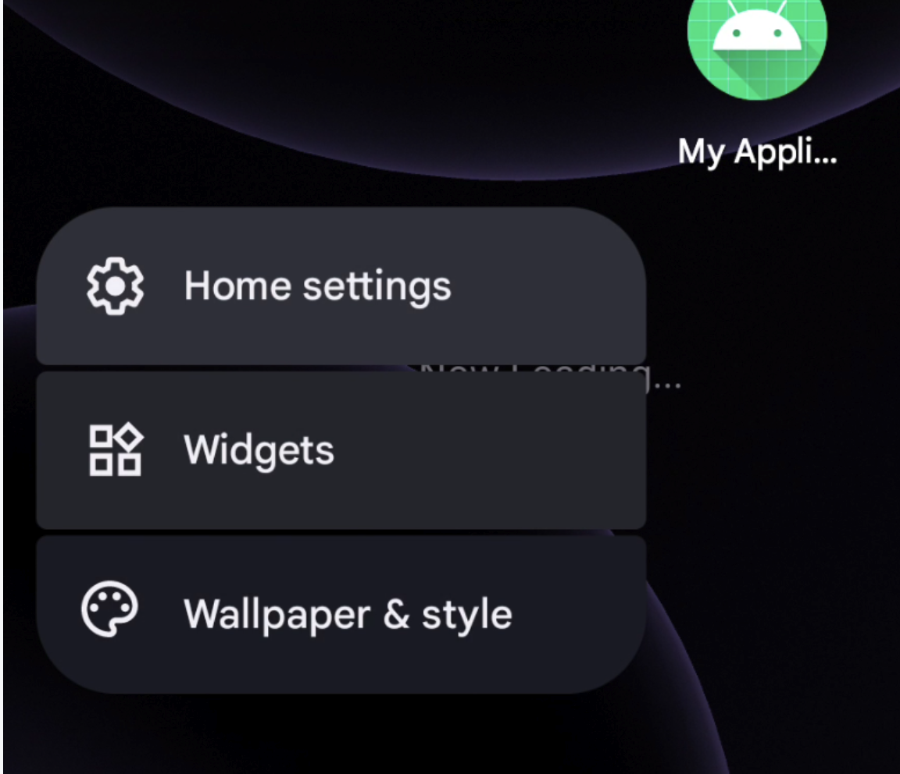
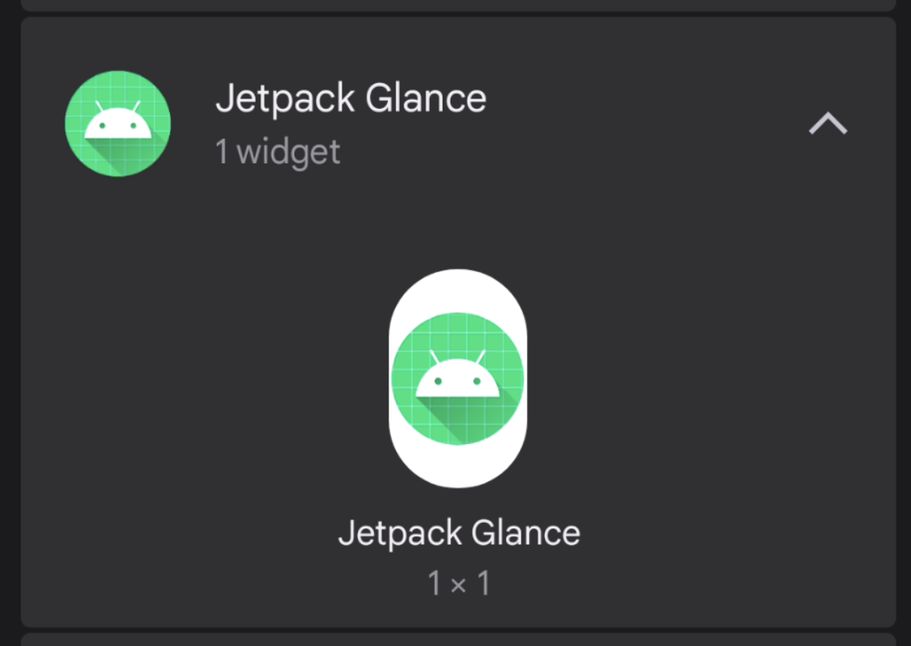
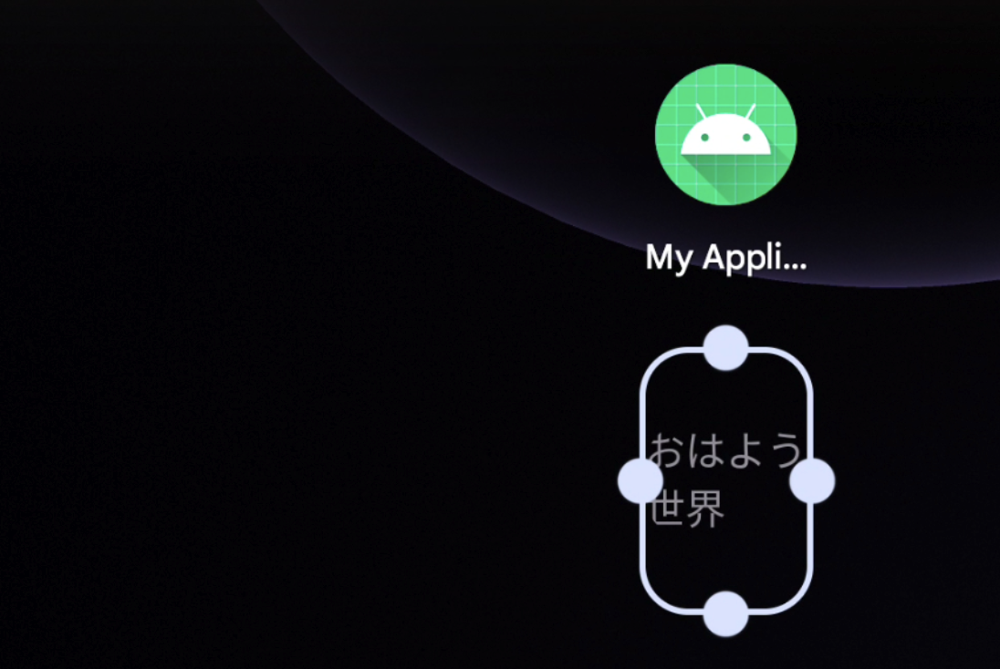
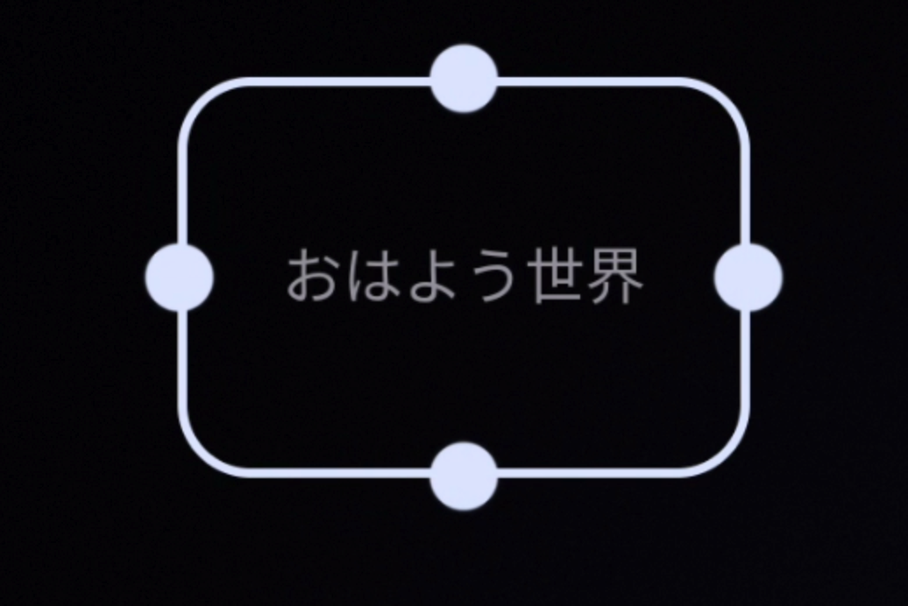

# Jetpack で Widget を作成

[「Jetpack Glance が α 版になったらしい」](https://android-developers-jp.googleblog.com/2022/01/announcing-jetpack-glance-alpha-for-app.html?m=1)という記事を見て早速遊んでみました。

予想以上に文章が長くなってしまったので、色々といじってみるのは次回にし、今回は『widget を表示させるところまで』をゴールにします。

[目次]

[:contents]

## 環境
```
- compose-version : 1.1.0-beta03
- 使用 glance version : 1.0.0-alpha02
- 検証 android 端末 : pixel3-os12
```

## Widget 作成手順
次の 5 ステップで Widget を作成します

### 1. 依存関係の追加
Compose の新規プロジェクトを作成した後、変更を加えた点について記載しておきます。

#### アプリレベルの build.gradle

プロジェクト作成時から変更した点

- kotlinCompilerVersion -> '1.6.0'
- 依存関係を追加
  - `androidx.glance:glance-appwidget`

```
...
android {
    ...
    kotlinOptions {
        jvmTarget = '1.8'
    }
    buildFeatures {
        compose true
    }
    composeOptions {
        kotlinCompilerExtensionVersion compose_version
        kotlinCompilerVersion '1.6.0'
    }
}

dependencies {
    ...
    implementation "androidx.compose.ui:ui:$compose_version"
    implementation "androidx.compose.material:material:$compose_version"
    ...

    // Jetpack Glance
    // Widget を触るだけなら不要
    // implementation "androidx.glance:glance:1.0.0-alpha02"
    implementation 'androidx.glance:glance-appwidget:1.0.0-alpha02'
}
```

#### プロジェクトレベルの build.gralde
プロジェクト作成時から変更した点

- compose_version -> 1.1.0-beta
- gradle-plugin -> 1.5.31

```
buildscript {
    ext {
        compose_version = "1.1.0-beta03"
    }
    repositories {
        google()
        mavenCentral()
    }
    dependencies {
        classpath "com.android.tools.build:gradle:7.0.4"
        classpath "org.jetbrains.kotlin:kotlin-gradle-plugin:1.5.31"
    }
}
```

### 2. Widget 表示用の新規ファイルを作成
`GlanceAppWidget`を継承したクラスと`GlanceAppWidgetReceiver`を継承したクラスの２つを作成します（kotlin では２つのクラスを並列に１つのファイルに作成できます！）

`GlanceAppWidget#Content()`に表示させる関数を記入したらいいのですが、いろいろ遊ぶのは後にしてとりあえず表示させることを目指します。

``` kotlin
class MyWidget(private val name: String) : GlanceAppWidget() {

    @Composable
    override fun Content() {
        Text(
            text = "おはよう世界"
        )
    }
}

class MyWidgetReceiver : GlanceAppWidgetReceiver() {
    override val glanceAppWidget = GreetingsWidget("Glance")
}
```

### 3. AndroidManifest に receiver を登録
``` xml
<application
    ...>
    <!-- android:nameは継承して作った receiver を指定します -->
    <receiver
        android:name=".MyWidgetReceiver"
        android:enabled="true"
        android:exported="false">
        <intent-filter>
            <action android:name="android.appwidget.action.APPWIDGET_UPDATE" />
        </intent-filter>

        <meta-data
            android:name="android.appwidget.provider"
            android:resource="@xml/first_glance_widget_info" />
    </receiver>
    ...
```

ここで resource ファイルの記述に赤線が引かれると思うので、作成していきます。

### 4. meta-data 用の resource ファイルを作成
Android Studio 上で赤く波線の引かれている`android:resource="@xml/first_glan ce_widget_info"`の上で`ALT + Enter`を押すことで res/xml の中に対象ファイルを作成します。

今回はシンプルに以下のようにしています。

``` xml
<?xml version="1.0" encoding="utf-8"?>
<appwidget-provider xmlns:android="http://schemas.android.com/apk/res/android"
    android:resizeMode="horizontal|vertical"
    android:initialLayout="@layout/widget_loading"
    android:targetCellWidth="1"
    android:targetCellHeight="1"
    android:widgetCategory="home_screen" />
```

他にどのような指定ができるかは、`android:`まで打って候補として出てくるものを眺めるといいと思います。また、`android:targetCellWidth(Height)`は API-31 以上しか対応していないためご注意ください。

ここでまた新たな resource ファイル、`"@layout/widget_loading"`が出てきました。

せっかく xml レイアウトから卒業できると思ったのですが、`android:initialLayout`の指定は現時点では必須らしいので頑張って作りましょう。


### 5. nitialLayout の作成
4 の時と同様に、赤線の上で`ALT + Enter` を押すことで layout ファイルを作成します。

Jetpack Glance で作成した関数が描画されるまでの間に表示されるものなので、基本は見ることがないと思っています。

``` xml
<?xml version="1.0" encoding="utf-8"?>
<FrameLayout xmlns:android="http://schemas.android.com/apk/res/android"
    android:layout_width="match_parent"
    android:layout_height="match_parent">

    <TextView
        android:layout_width="match_parent"
        android:layout_height="match_parent"
        android:layout_gravity="center"
        android:text="Now Loading..."
        android:gravity="center"
        />
</FrameLayout>
```
 
長かったですがこれにて作成完了です。お疲れ様でした。


## Widget 動作確認
step 5 まで終わったら一度アプリを実行してみます。

立ち上がったアプリを一旦閉じ、ディスプレイを長押しします。



Widgets という選択肢をクリックします。

上手くいっていれば、作成したプロジェクト名の widget プレビューが表示されています。




なお、ここの見た目は meta-data 用の resource ファイルで変更可能です。

アイコンをドラッグして、ディスプレイにドロップしてみましょう。




無事 Widget が作成されました！！

図の丸い部分を掴むことで大きさも変更可能です。




## Links
- [developer site](https://developer.android.com/jetpack/androidx/releases/glance?hl=ja)
- [How to build Modern Android App Widgets in Android 12 (youtube)](https://www.youtube.com/watch?v=15Q7xqxBGG0&ab_channel=AndroidDevelopers)
- [Code sample](https://github.com/android/user-interface-samples/tree/glance/AppWidget/glance-widget)
- [GlanceAppWidget](https://developer.android.com/reference/kotlin/androidx/glance/appwidget/GlanceAppWidget)

## おわりに
初めて Widget の作成をしてみましたが、より開発者っぽいことをしてる実感が出てきました。

次回は Jetpack Glance を触っていきます！
