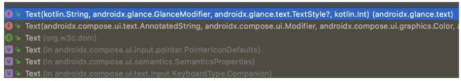
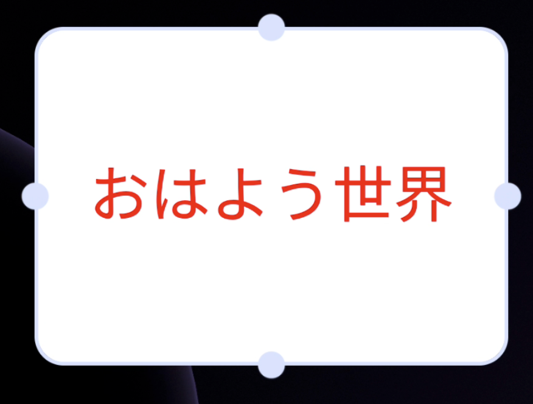
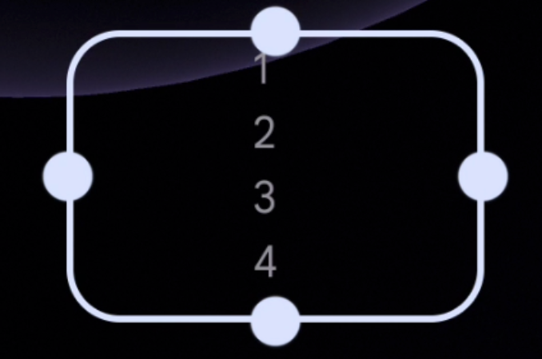
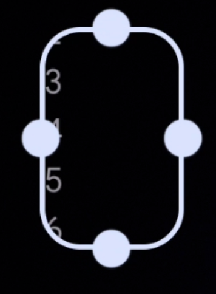
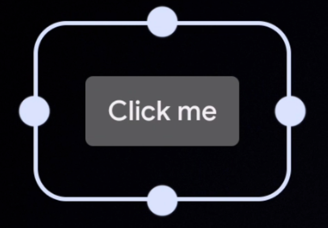
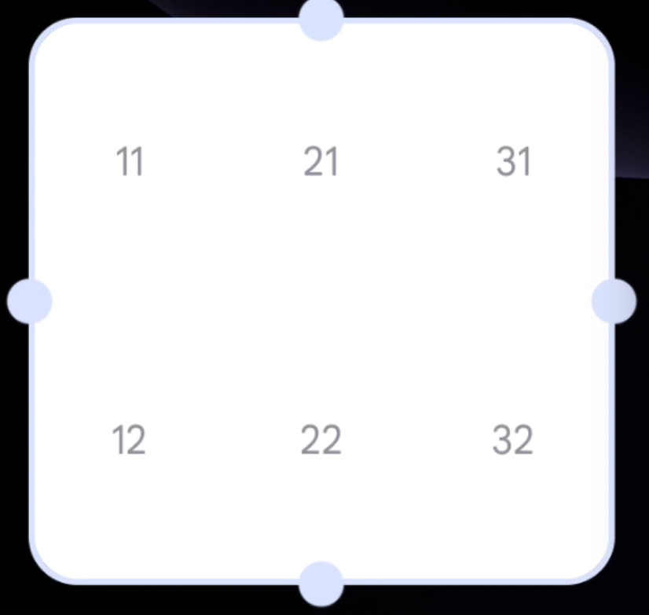
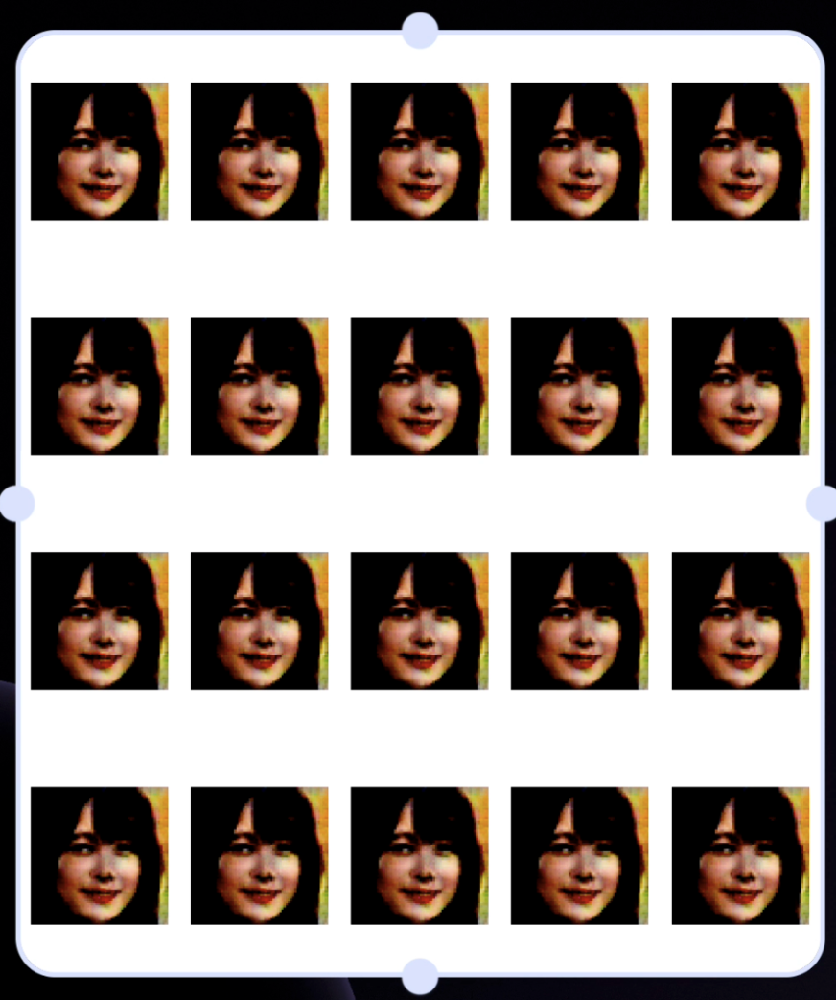

# Jetpack Glance で遊んでみた

[前回の記事](https://koko206.hatenablog.com/entry/2022/01/28/013201)では [Jetpack Glance](https://developer.android.com/jetpack/androidx/releases/glance?hl=ja) を使って Widget を実際に表示させるところまで行いました。

今回は`GlanceAppWidget`を継承させたクラスをいじって、色々と表示を変えて遊んでみようと思います！


[目次]

[:contents]

## 環境
```
- compose-version : 1.1.0-beta03
- 使用 glance version : 1.0.0-alpha02
- 検証 android 端末 : pixel3-os12
```


## サイズによって内容を変更する
widget の大きさに応じて表示内容の調整を行いたい場合、`SizeMode`を override することで実現します。

次のどちらかのパターンで行います。

### exact
サイズの変更を検知し、その度に再描画が走ります。

Composable 関数の中で使用するには、`LocalSize.current`でサイズを取得します。

``` kotlin
class MyWidget(private val name: String) : GlanceAppWidget() {

    // sizeMode を override する
    override val sizeMode = SizeMode.Exact

    @Composable
    override fun Content() {
        val size = LocalSize.current
    }
}    
```


### Responsive
サイズの変更を検知し、用意した値に近いものに設定されます。

設定が変更されると再描画が走ります。

``` kotlin
class GreetingsWidget(private val name: String) : GlanceAppWidget() {

    // 使いたいサイズを用意する
    companion object {
        private val SMALL_SQUARE = DpSize(100.dp, 100.dp)
        private val HORIZONTAL_RECTANGLE = DpSize(250.dp, 100.dp)
        private val BIG_SQUARE = DpSize(250.dp, 250.dp)
    }

    // sizeMode を override する
    override val sizeMode = SizeMode.Responsive(
        sizes = setOf(SMALL_SQUARE, HORIZONTAL_RECTANGLE, BIG_SQUARE)
    )

    @Composable
    override fun Content() {
        val size = LocalSize.current
        val context = LocalContext.current

        if (size.height > SMALL_SQUARE.height) {
            Text("xxx")
        }
        ...
    }
}
```


## いろいろな関数で遊ぶ
標準で用意されている関数に何があるか、`androidx.glance.`まで打って候補として出てくるものを一度眺めてみると良いと思います。

以下、コード例とスクショ（＋感想）をメモしておきます

### import 時の注意
Jetpack compose とは使用するものが異なるため、import 時には正しいものを選ぶようにしてください。

例えば以下は`Text`に対する import の候補なのですが、特に `compose.ui`のものと間違えないよう、きちんと`~~.glance.~~`となっているものを選択してください。




### Box
全体的に compose と似ている。

``` kotlin
Box(
    modifier = GlanceModifier
        .fillMaxSize()
        .background(Color.White)
        .cornerRadius(8.dp),
    contentAlignment = Alignment.Center,
) {
    Text(
        text = "おはよう世界",
        style = TextStyle(
            color = ColorProvider(Color.Red),
            fontSize = 36.sp,
        )
    )
}
```




### Image
``` kotlin
Box(
    modifier = GlanceModifier
        .fillMaxSize()
        .background(Color.White)
        .cornerRadius(8.dp),
    contentAlignment = Alignment.Center,
) {
    Image(
        modifier = GlanceModifier
            .cornerRadius(5.dp),
        provider = ImageProvider(R.drawable.gan),
        contentDescription = "generated by gan"
    )
}
```


### Column
``` kotlin
Column(
    modifier = GlanceModifier
        .wrapContentHeight()
) {
    for(i in 1..10) {
        Text(
            text = "$i"
        )
    }
}
```




しかしこのままでは 5 以降が切れてしまっている上に、スクロールもできません。

そんな時は、Jetpack Compose でもお馴染みの LazyColumn を使います。

### LazyColumn
``` kotlin
LazyColumn(
    horizontalAlignment = Alignment.Horizontal.CenterHorizontally,
) {
    items(10) { id ->
        Text(
            text = "$id",
        )
    }
}
```

左端に寄っちゃってますが、スクロールできるようになっています。




### Button
Button には onClick の属性が必須だったため、MainActivity を起動させてみてます。

``` kotlin
Button(
    text = "Click me",
    // MainActivity を起動させる。
    onClick = actionStartActivity<MainActivity>(),
)
```




## レスポンシブルな widget 作成
Row, Column, sizeMode などを使い、サイズによって表示内容の変わる widget を作成してみました。今回は sizeMode の override に exact パターンを使っています。

表示されている widget の行数や列数を取得する方法がわからなかったため、途中で汚い計算をしていますがお許しください。

``` kotlin
override val sizeMode = SizeMode.Exact

@Composable
override fun Content() {
    val size = LocalSize.current

    Column(
        modifier = GlanceModifier
            .background(Color.White)
            .fillMaxSize()
    ) {
        // 調整値は pixel3 で計算したもの
        val col = ((size.height - 90.dp) / 100.dp).toInt() + 1
        val row = ((size.width - 57.dp) / 70.dp).toInt() + 1
        Log.d("hoge", "size.width: ${size.width}")
        Log.d("hoge", "size.height: ${size.height}")
        for (i in 1..col) {
            Row(
                modifier = GlanceModifier
                    .fillMaxWidth()
                    .defaultWeight(),
            ) {
                for (j in 1..row) {
                    Box(
                        modifier = GlanceModifier
                            .defaultWeight()
                            .fillMaxHeight(),
                        contentAlignment = Alignment.Center,
                    ) {
                        val position = "$j$i"

                        Text(
                            text = position,
                        )
                        // Text or Image でお試し
//                        Image(
//                            modifier = GlanceModifier
//                                .size(60.dp),
//                            provider = ImageProvider(R.drawable.gan),
//                            contentDescription = "image generated by gan"
//                        )
                    }
                }
            }
        }
    }
}
```






## 遊んでみての所感
```
- Jetpack Compose に似ていて楽しい
- Jetpack Compose 用の API とは似ているが異なるものなので、import を慎重に選ぶ
- いちいち XxxProvider を使わないといけなかったり少しめんどい
  - 引数等きちんと確認する
- Widget の更新は効かないので、再度作り直す(削除⇨再度Widget登録)
```

## Links
- [developer site](https://developer.android.com/jetpack/androidx/releases/glance?hl=ja)
- [How to build Modern Android App Widgets in Android 12 (youtube)](https://www.youtube.com/watch?v=15Q7xqxBGG0&ab_channel=AndroidDevelopers)
- [Code sample](https://github.com/android/user-interface-samples/tree/glance/AppWidget/glance-widget)
- [GlanceAppWidget](https://developer.android.com/reference/kotlin/androidx/glance/appwidget/GlanceAppWidget)


## おわりに
初めての widget 作成にもかかわらず、楽しく作ることができたのは Jetpack さんのおかげだと思います。

beta・安定版になるのを楽しみに待ってます！
