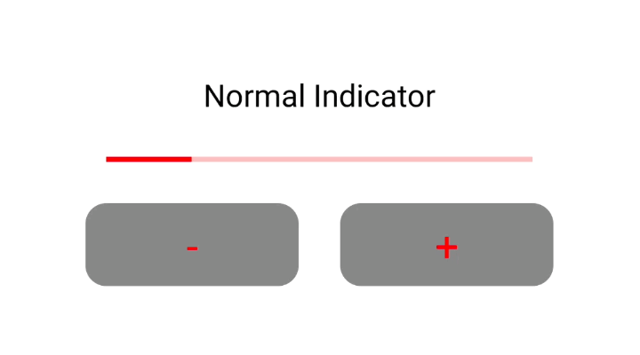

# Jetpack compose で Indicator をなめらかにする

今回は、Jetpack compose でなめらかに Indicator を表示する方法についてメモしておきます。

なお、今回の内容は[『Android DevSummit "5 quick animations to make your Compose app stand out"』](https://www.youtube.com/watch?v=0mfCbXrYBPE&list=PLWz5rJ2EKKc92MGTd1CgUtXZfhA74nUpb&index=4&ab_channel=AndroidDevelopers)から学んだものとなります。

## 環境

```
- compose "1.3.0-rc01"
- kotlin "1.7.1"
```

## 実装方法

今回は `LinearProgressIndicator` でやってますが、特にこれに限った話ではありません。  
（今回のソースコードは [github](https://github.com/kokoichi206/android-app/blob/master/PlayGround/app/src/main/java/jp/mydns/kokoichi0206/playground/blogs/AnimatedIndicator.kt) においてます。）

### 通常の Indicator

比較のため、まずは通常の `LinearProgressIndicator` を実装します。

```kotlin
var idx by remember {
    mutableStateOf(1)
}
val progress = idx.toFloat() / 5

LinearProgressIndicator(
    modifier = Modifier
        .padding(32.dp)
        .fillMaxWidth(),
    progress = progress,
    color = Color.Red,
)
```

（gif ってのもありますが）カクカクしています。



### [animate\*AsState](https://developer.android.com/jetpack/compose/animation?hl=ja#animate-as-state) を使う

`progress`の定義を以下のように変更するだけです。  
非常に簡単でありがたいです。

```kotlin
val progress by animateFloatAsState(targetValue = idx.toFloat()/5)
```

また、animationSpec を細かく変更することも可能です。

```kotlin
var idx by remember {
    mutableStateOf(1)
}
val progress by animateFloatAsState(
    targetValue = idx.toFloat() / 5,
    animationSpec = spring(
        dampingRatio = Spring.DampingRatioLowBouncy,
        stiffness = Spring.StiffnessLow,
    )
)

LinearProgressIndicator(
    modifier = Modifier
        .padding(32.dp)
        .fillMaxWidth(),
    progress = progress,
    color = Color.Red,
)
```

gif に変更してるので多少分かりにくいかもですが、通常の時に比べてなめらかに変化していることがわかります。


## リンク

- [DevSummit](https://www.youtube.com/watch?v=0mfCbXrYBPE&list=PLWz5rJ2EKKc92MGTd1CgUtXZfhA74nUpb&index=4&ab_channel=AndroidDevelopers)
- DevSummit のなかで紹介されてたリンク
  - https://developer.android.com/jetpack/compose/animation
  - https://storage.googleapis.com/android-stories/compose/Compose_Animation_Cheat_Sheet.pdf
  - https://medium.com/androiddevelopers/customizing-animatedcontent-in-jetpack-compose-629c67b45894

## おわりに

[Jetpack Compose のアニメーションのページ](https://developer.android.com/jetpack/compose/animation?hl=ja)が非常にしっかりしてて、気合い入れてる度合いが伝わってきます。  
こっちもきちんとウォッチしていきたいです。
