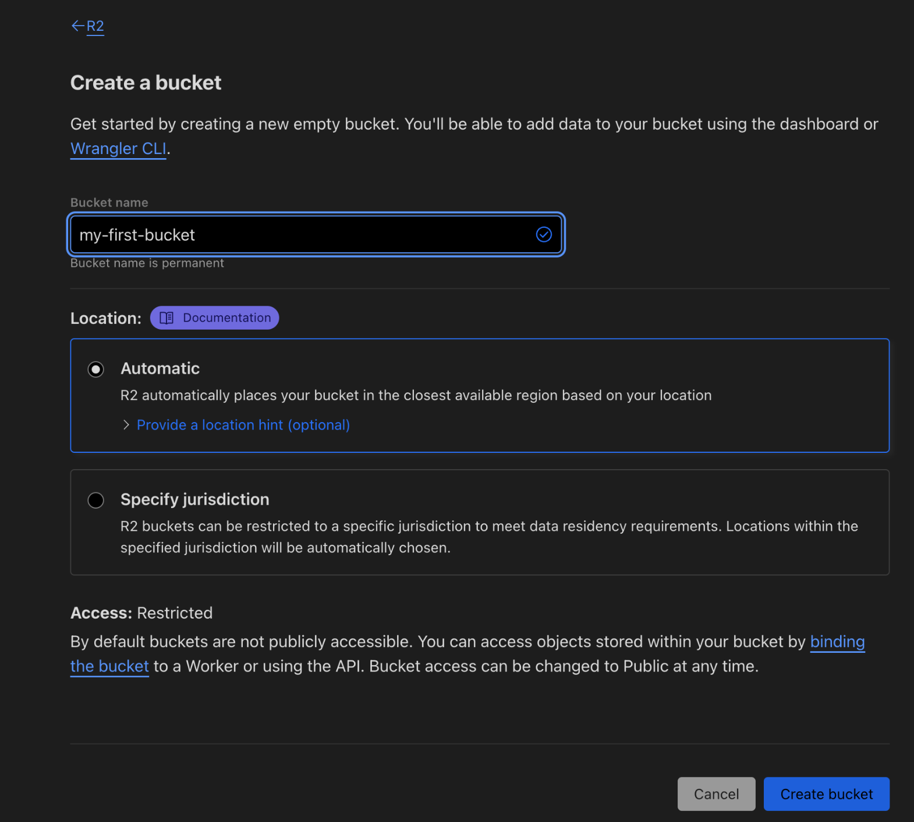
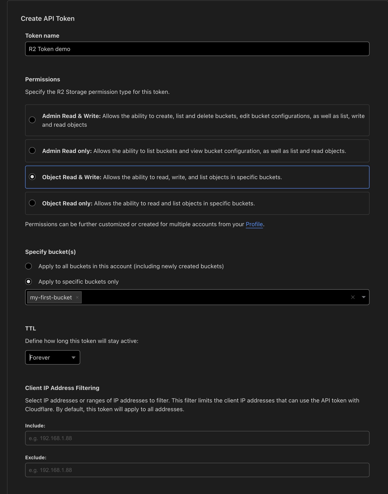

# 【Cloudflare】R2 を Go から扱う

Cloudflare でオブジェクトストレージといえば [R2](https://developers.cloudflare.com/r2/) ですが、  
[ドキュメントにもある](https://developers.cloudflare.com/r2/api/s3/api/)ように S3 との互換性を大切にしています。

今回は web 画面からの R2 バケットの作成から、**s3 の sdk を使って** object の作成・取得を試してみたいと思います。

**※ 本記事の内容は 2024/02/16 現在の情報をもとに作成しております。**

**[目次]**

```
* [R2 バケットの作成](#r2-バケットの作成)
* [Go から R2 のオブジェクトを操作する](#go-から-r2-のオブジェクトを操作する)
  * [使用ライブラリ](#使用ライブラリ)
  * [認証: トークンの発行](#認証:-トークンの発行)
  * [sdk から操作する](#sdk-から操作する)
* [おわりに](#おわりに)
```

<!-- more -->

## R2 バケットの作成

Cloudflare から R2 のページにとび、『Create bucket』を押します。

R2 を使用するにはクレジットの登録が必要になりますが、[R2 のコスト感](https://developers.cloudflare.com/r2/pricing)は全体的に [S3 の標準クラス](https://aws.amazon.com/jp/s3/pricing/)よりも安めなのでビビらずやってみましょう。  
10 GB まで無料なのも心強いです。



## Go から R2 のオブジェクトを操作する

ここから Go での扱い方の紹介になるのですが、前述した通り **R2 は S3 との互換性を意識**しており、[バケットに対しては基本的な API をサポートしております](https://developers.cloudflare.com/r2/api/s3/api/#object-level-operations)。

その中でも今回は、オブジェクトの作成（PutObject）とオブジェクトの取得（GetObject）を試してみたいと思います。

### 使用ライブラリ

S3 用のエンドポイントを叩く感じになるのですが、[AWS 公式が用意してくれてる sdk](https://github.com/aws/aws-sdk-go-v2/) があるのでそちらを用いることにします。

``` sh
go get github.com/aws/aws-sdk-go-v2/aws
go get github.com/aws/aws-sdk-go-v2/config
go get github.com/aws/aws-sdk-go-v2/service/s3
```

version

``` sh
github.com/aws/aws-sdk-go-v2 v1.25.0
github.com/aws/aws-sdk-go-v2/config v1.27.0
github.com/aws/aws-sdk-go-v2/service/s3 v1.49.0
```

### 認証: トークンの発行

認証とエンドポイントについては[こちらのドキュメント](https://developers.cloudflare.com/r2/api/s3/tokens/)に記載があります。

[Create API token のページ](https://dash.cloudflare.com/?to=/:account/r2/api-tokens)から Token を作成します。  
バケット単位のアクセス制限に加え, IP によるフィルターなどもできそうでした。



作成後 **Access Key ID** と **Secret Access Key** を取得します。

また、ログイン後のページから AccountID をメモしておきます。

```
https://dash.cloudflare.com/<account_id>/r2/overview
```

### sdk から操作する

``` go
package main

import (
	"context"
	"fmt"
	"io"
	"log"
	"os"

	"github.com/aws/aws-sdk-go-v2/aws"
	"github.com/aws/aws-sdk-go-v2/config"
	"github.com/aws/aws-sdk-go-v2/service/s3"
)

// 自身の方法で環境変数に設定してください。
func init() {
	// aws-sdk-go-v2 が内部的に使用するため、環境変数への設定のみで十分。
	// R2 Authentication: https://developers.cloudflare.com/r2/api/s3/tokens/
	os.Setenv("AWS_ACCESS_KEY_ID", "xxxxxxxxxxx")
	os.Setenv("AWS_SECRET_ACCESS_KEY", "xxxxxxxxxxx")

	// cloudflare の web ページの URL から確認可能。
	os.Setenv("ACCOUNT_ID", "xxxxxxxxxxx")
}

func s3api() {
	accountID := os.Getenv("ACCOUNT_ID")

	endpoint := fmt.Sprintf("https://%s.r2.cloudflarestorage.com", accountID)
	bucket := "my-first-bucket"
	object := "aya2.png"

	resolver := aws.EndpointResolverWithOptionsFunc(func(service, region string, opts ...interface{}) (aws.Endpoint, error) {
		return aws.Endpoint{
			URL:               endpoint,
			HostnameImmutable: true,
			SigningRegion:     region,
		}, nil
	})

	cfg, err := config.LoadDefaultConfig(
		context.TODO(),
		config.WithRegion("APAC"),
		config.WithEndpointResolverWithOptions(resolver),
	)
	if err != nil {
		log.Fatal(err)
	}

	// **aws の** s3 client を作成する。
	client := s3.NewFromConfig(cfg)

	f, _ := os.Open("upload_test.jpg")
	out, err := client.PutObject(context.TODO(), &s3.PutObjectInput{
		Bucket: aws.String(bucket),
		Key:    aws.String("upload_test.jpg"),
		Body:   f,
	})
	if err != nil {
		log.Fatal(err)
	}
	fmt.Printf("out: %v\n", out)

	// ========= Get an object =========
	obj, err := client.GetObject(context.TODO(), &s3.GetObjectInput{
		Bucket: aws.String(bucket),
		Key:    aws.String(object),
	})
	if err != nil {
		log.Fatal(err)
	}

	writeFile(obj.Body)
}

func writeFile(body io.ReadCloser) {
	defer body.Close()

	f, err := os.Create("test.png")
	if err != nil {
		log.Fatal(err)
	}
	defer f.Close()

	io.Copy(f, body)
}

func main() {
	s3api()
}
```

以上は自分で試した例ですが、[公式にもいくつかの library での example がある](https://developers.cloudflare.com/r2/examples/aws/aws-sdk-go/#generate-presigned-urls)ので、馴染みのあるものがないか覗いてみると良さそうです。

## おわりに

minio や R2 のように、オブジェクトストレージは S3 の互換性を意識したものが大半な気がします。  
デファクトサービスを作るってそういうことなんだな。。。と思いました。
