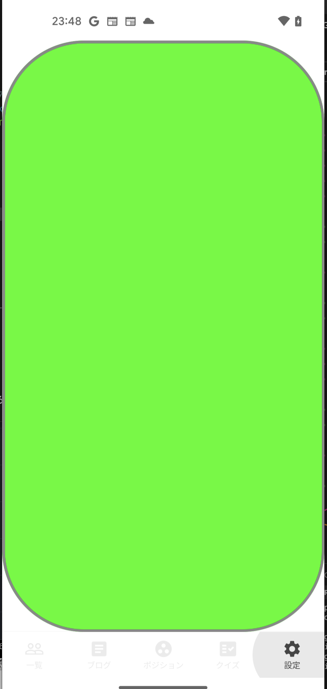
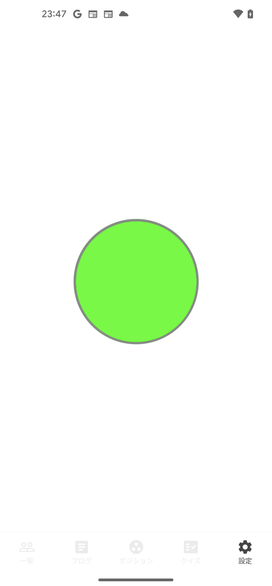

## Jetpack Compose: coil の AsyncImage が正常に clip されない？

`coil.compose.AsyncImage` を使っている時に、正常に形が clip されない？と勘違いしてしまったことがありました。  
（`Image` も同様でした。）

結論からいうと、`AsyncImage`, `Image` などの clip したい要素を、そのさらに外から fullScreen などの Column 等で囲ってあげたら解決しました。

## だめな例　

``` kotlin
AsyncImage(
    modifier = Modifier
        .clip(RoundedCornerShape(100.dp))
        .size(180.dp)
        .background(color = Color.Green)
        .border(
            width = 3.dp,
            color = Color.Gray,
        ),
    model = selectedImageUri,
    contentDescription = "",
    contentScale = ContentScale.Crop,
)
```



## 良い例

下のように外側を Column などのサイズ持ったもので囲ってあげます。  
とはいえ、通常の使い方をしてたら image のみが top にくることはないかと思います。

``` kotlin
Column(
    modifier = Modifier
        .fillMaxSize()
        .padding(SpaceSmall),
    horizontalAlignment = Alignment.CenterHorizontally,
    verticalArrangement = Arrangement.Center,
) {
    // App Icon
    Image(
        painter = painterResource(id = R.drawable.app_icon),
        contentDescription = stringResource(R.string.setting_about_app),
        contentScale = ContentScale.Crop,
        modifier = Modifier
            .size(200.dp)
            .clip(CircleShape)
            .testTag(TestTags.ABOUT_APP_APP_ICON)
    )
}
```



## 環境

```
- Android Studio: Android Studio Flamingo | 2022.2.1
- kotlinCompilerVersion '1.7.1'
- compose_ui_version = '1.3.0-rc01'
```


## おわりに

自分の view を組み立てる力が弱く、なぜ悪い例の書き方で正常に clip されないかわかりませんが（もしくは他の要因がある？）、正常に clip されない時は試してみてください。

Image でも同様の挙動だったので、自分の理解が足りない気もします。。。
