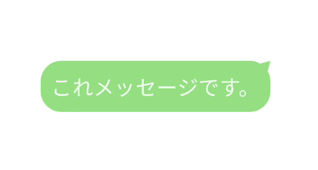

# Jetpack Compose でカスタム shape を作る

今回は、よくあるチャットメッセージのような吹き出しを作成したので、その方法を簡単に紹介します。



より一般には Text などの compose 関数を、**名前のついてない自由な形に変形させる**ことが目標です。

## 環境

```
compose_ui_version = '1.4.0-beta01'
```

## 作成方法

`androidx.compose.ui.graphics.Shape` をクラスを実装し、`createOutline` に変形させたい図形のアウトラインを描きます。
（[github](https://github.com/kokoichi206/android-app/blob/master/PlayGround/app/src/main/java/jp/mydns/kokoichi0206/playground/ChatMessage.kt)）

``` kotlin
class MessageTextShape(private val cornerRadius: Float) : Shape {

    override fun createOutline(size: Size, layoutDirection: LayoutDirection, density: Density): Outline {
        return Outline.Generic(
            path = drawMyMessagePath(size = size, cornerRadius = cornerRadius)
        )
    }
}

fun drawMyMessagePath(size: Size, cornerRadius: Float): Path {
    return Path().apply {
        // どんな関数が使えるかは this. で探せます。
        // or see: 
        // https://developer.android.com/reference/kotlin/androidx/compose/ui/graphics/Path

        reset()

        // Top left arc
        arcTo(
            rect = Rect(
                left = 0f,
                top = 0f,
                right = 2 * cornerRadius,
                bottom = 2 * cornerRadius,
            ),
            startAngleDegrees = 180.0f,
            sweepAngleDegrees = 90.0f,
            forceMoveTo = false,
        )
        lineTo(x = size.width - cornerRadius, y = 0f)

        // Top right arc
        // 何かいろいろと工夫してますが、よりっぽく書く方法あれば教えてください。
        arcTo(
            rect = Rect(
                left = size.width - 2 * cornerRadius,
                top = 0f,
                right = size.width,
                bottom = 2 * cornerRadius,
            ),
            startAngleDegrees = 270.0f,
            sweepAngleDegrees = 30.0f,
            forceMoveTo = false,
        )
        lineTo(x = size.width, y = 0f)
        lineTo(
            x = size.width - cornerRadius * (1 - cos(PI / 6)).toFloat(),
            y = cornerRadius * (1 - sin(PI / 6)).toFloat()
        )
        arcTo(
            rect = Rect(
                left = size.width - 2 * cornerRadius,
                top = 0f,
                right = size.width,
                bottom = 2 * cornerRadius,
            ),
            startAngleDegrees = 330.0f,
            sweepAngleDegrees = 30.0f,
            forceMoveTo = false,
        )
        lineTo(x = size.width, y = size.height - cornerRadius)

        // Bottom right arc
        arcTo(
            rect = Rect(
                left = size.width - 2 * cornerRadius,
                top = size.height - 2 * cornerRadius,
                right = size.width,
                bottom = size.height,
            ),
            startAngleDegrees = 0.0f,
            sweepAngleDegrees = 90.0f,
            forceMoveTo = false,
        )
        lineTo(x = cornerRadius, y = size.height)

        // Bottom left arc
        arcTo(
            rect = Rect(
                left = 0.0f,
                top = size.height - 2 * cornerRadius,
                right = 2 * cornerRadius,
                bottom = size.height,
            ),
            startAngleDegrees = 90.0f,
            sweepAngleDegrees = 90.0f,
            forceMoveTo = false,
        )
        lineTo(x = 0f, y = cornerRadius)

        close()
    }
}
```

使う時は、以下のように Shape が使える部分に割り当ててあげます。

``` kotlin
@Composable
fun MessageText() {
    Text(
        modifier = Modifier
            .wrapContentSize()
            .graphicsLayer {
                shape = MessageTextShape(16.dp.toPx())
                clip = true
            }
            .background(color = Color(0xFF79E278))
            .padding(8.dp),
        text = "これメッセージです。",
    )
}
```

## おわりに

このようにカスタムな shape を作ることができて面白かったです。

使うケースは稀かもしれませんが、いろいろと応用が効きそうだと感じました。

最近は Compose Multiplatform で iOS も Jetpack compose で書いているので、そのうちその紹介もできたらと思っています。
