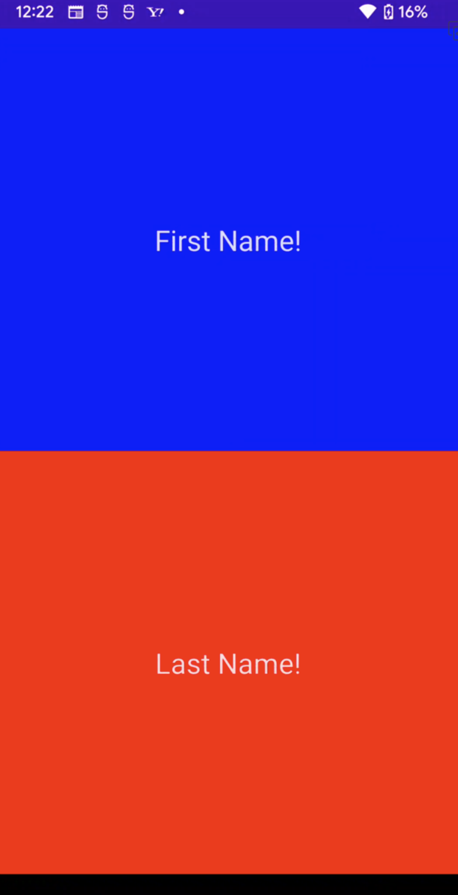
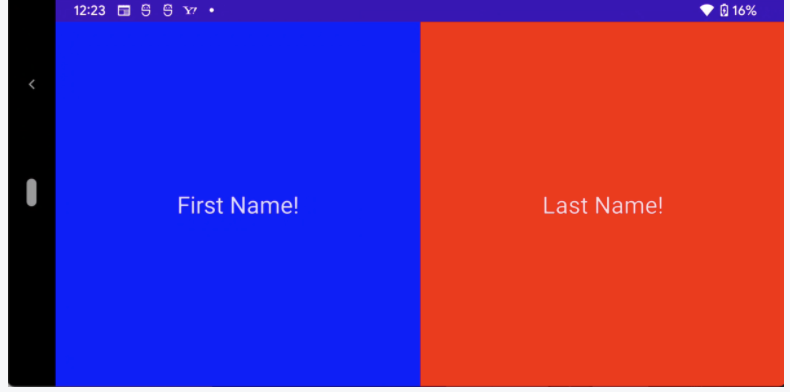

# Jetpack Compose で横画面に対応する！
『Jetpack Compose で横画面を検知しレイアウトを変更する』ことをやってみたいと思います。

## 環境
```
- build:gradle:7.0.4
- compose_version = '1.0.1'
```

## レイアウト
次のように、横画面か縦画面かを判断しレイアウトを変更できるようにことがこの記事のゴールです。

### 縦画面


### 横画面



## 現在の画面の向きを取得する
Composable 関数の中で現在の画面の向きは、以下のメソッドで取得することができます。

``` kotlin
LocalConfiguration.current.orientation
```

### 縦画面かどうかを判断する
従って、縦画面かどうかを変数として表すには次のように比較してあげます。

``` kotlin
isVertical =
    LocalConfiguration.current.orientation == Configuration.ORIENTATION_PORTRAIT

// 縦画面か横画面かに応じて次のいずれかが入る
// 縦
// Configuration.ORIENTATION_PORTRAIT
// 横
// Configuration.ORIENTATION_LANDSCAPE
```

### 縦画面や横画面の変更を検知する
またこの値の変更を検知して画面の更新をかけるには、remember を利用して値を保持しておきます。

``` kotlin
var isVertical by remember {
    mutableStateOf(true)
}
isVertical =
    LocalConfiguration.current.orientation == Configuration.ORIENTATION_PORTRAIT
```

### サンプルプログラム
冒頭の写真の物を作った際のコードを貼っておきます。

<details><summary><p style="color: blue">サンプルコード</p></summary><div>

```python
@Composable
fun ShowName() {
    var isVertical by remember {
        mutableStateOf(true)
    }
    isVertical =
        LocalConfiguration.current.orientation == Configuration.ORIENTATION_PORTRAIT

    if (isVertical) {
        Column(
            modifier = Modifier.fillMaxSize(),
            horizontalAlignment = Alignment.CenterHorizontally,
            verticalArrangement = Arrangement.Center,
        ) {
            Box(
                modifier = Modifier
                    .fillMaxSize()
                    .weight(1f)
                    .background(Color.Blue),
                contentAlignment = Alignment.Center
            ) {
                Text(
                    "First Name!", fontSize = 24.sp,
                    textAlign = TextAlign.Center
                )
            }
            Box(
                modifier = Modifier
                    .fillMaxSize()
                    .weight(1f)
                    .background(Color.Red),
                contentAlignment = Alignment.Center
            ) {
                Text(
                    "Last Name!", fontSize = 24.sp,
                    textAlign = TextAlign.Center
                )
            }
        }
    } else {
        Row(
            modifier = Modifier.fillMaxSize(),
            verticalAlignment = Alignment.CenterVertically,
            horizontalArrangement = Arrangement.Center,
        ) {
            Box(
                modifier = Modifier
                    .fillMaxSize()
                    .weight(1f)
                    .background(Color.Blue),
                contentAlignment = Alignment.Center
            ) {
                Text(
                    "First Name!", fontSize = 24.sp,
                    textAlign = TextAlign.Center
                )
            }
            Box(
                modifier = Modifier
                    .fillMaxSize()
                    .weight(1f)
                    .background(Color.Red),
                contentAlignment = Alignment.Center
            ) {
                Text(
                    "Last Name!", fontSize = 24.sp,
                    textAlign = TextAlign.Center
                )
            }
        }
    }
}
```
</div></details>


## Links
[Re-gaining orientation #1](https://dev.to/tkuenneth/re-gaining-orientation-1-5fkf)


## おわりに
今回は Jetpack Compose で『縦画面と横画面を検知しレイアウトを変更する』ということをやってみました。
