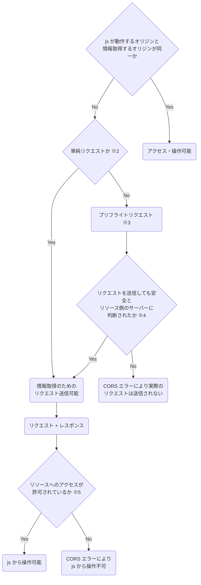
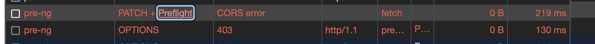

# CORS について整理しておく

最近は N 年間放置していた徳丸本を真面目に読み進めており、今回はその §3.3 CORS についてのアウトプットになります。

## CORS について

CORS とは『オリジン間リソース共有 (Cross-Origin Resource Sharing) 』の略で、**異なるオリジン間でリソースを安全に使用**するために**ブラウザのサンドボックス**に用意された制限の1つです。

CORS に対する理解を自分なりの図にまとめておきます。  
（`※` の部分について軽く説明します。）



### ※1 同一オリジンポリシーとは

『オリジンが同一』とは以下の3つが同じことを指します。

- スキーム: http, https, 等
- ホスト: example.jp 等
- ポート: 80, 443 等

### ※2 単純リクエストとは

[MDM に記載](https://developer.mozilla.org/ja/docs/Web/HTTP/CORS#%E5%8D%98%E7%B4%94%E3%83%AA%E3%82%AF%E3%82%A8%E3%82%B9%E3%83%88)がありますが、以下の全条件を満たす**リクエスト**のことを単純リクエストと呼んでいます。  
（新しい仕様書では simple request とは呼ばなくなったそうです。）

- メソッドが以下のいずれか
  - GET, HEAD, POST
- 許可されてるヘッダー（自動で付与されるものを除く）
  - Accept, Accept-Language, Content-Language, COntent-Type, Range
- メディア種別に許可される MIME タイプ
  - application/x-www-form-urlencoded
  - multipart/form-data
  - text/plain
- [XMLHttpRequest](https://developer.mozilla.org/ja/docs/Web/API/XMLHttpRequest) の場合はイベントリスナーが登録されてないこと

application/json は単純リクエストとして許可されるメディア種別に入ってないので注意が必要です。

### ※3 プリフライトリクエスト

『単純リクエスト**ではない**場合』に、送信しようとしてるリクエストの安全性を確かめるためのものです。

OPTIONS メソッドでリクエストが送信されますが、これはブラウザにより自動で制御されます。

Chrome などの Network タブからも確認できます。



### ※4 プリフライトリクエストでサーバー側に安全と判断されたか

サーバー側の実装としても、プリフライトリクエストをハンドリングする実装を書く必要があります。

具体的には、以下のように『**リクエストを受け付けても良いドメイン・メソッド・ヘッダー**』を指定します。  
（実際の開発では、フレームワークに用意されたライブラリを使うことが多いかと思います: [gin-contrib/cors](https://github.com/gin-contrib/cors) 等。）

``` go
func preFlightOK(w http.ResponseWriter, r *http.Request) {
	switch r.Method {
	case http.MethodPatch:
		w.Header().Set("Access-Control-Allow-Origin", "*")
		w.WriteHeader(http.StatusOK)
	case http.MethodOptions:
		if r.Header.Get("Origin") != frontOrigin {
			w.WriteHeader(http.StatusForbidden)
			return
		}
		// フロントエンドのドメインを指定する。
		w.Header().Set("Access-Control-Allow-Origin", "http://localhost:8070")
		w.Header().Set("Access-Control-Allow-Methods", "PATCH")
		c.Header("Access-Control-Allow-Headers", "Content-Type, Content-Length, Accept-Encoding, X-CSRF-Token, Authorization")
		w.Header().Set("Access-Control-Max-Age", "86400")
		w.WriteHeader(http.StatusOK)
	default:
		w.WriteHeader(http.StatusMethodNotAllowed)
	}
}
```

OPTIONS の結果のステータスコードが問題なかった場合、ブラウザは本来送る予定だったリクエストを送信します。

### ※5 リソースへのアクセスが許可されているか

サーバーからリクエストが許可されており、本来のリクエストを送れても、更に次の条件が必要になります。

- js で使うための許可がサーバーからされている

レスポンスに `Access-Control-Allow-Origin` ヘッダーをつけるだけであり、後述する go のコードの preFlightOK と corsOK の差になります。
この**許可設定は、単純なリクエストに対しても必要**です。

## Links

- [MDM: オリジン間リソース共有](https://developer.mozilla.org/ja/docs/Web/HTTP/CORS)
- [CORS の原理を知って正しく使おう(徳丸先生 youtube)](https://www.youtube.com/watch?v=ryztmcFf01Y&ab_channel=%E5%BE%B3%E4%B8%B8%E6%B5%A9%E3%81%AE%E3%82%A6%E3%82%A7%E3%83%96%E3%82%BB%E3%82%AD%E3%83%A5%E3%83%AA%E3%83%86%E3%82%A3%E8%AC%9B%E5%BA%A7)
- [今日こそ理解するCORS](https://www.youtube.com/watch?v=yBcnonX8Eak&ab_channel=%E5%BE%B3%E4%B8%B8%E6%B5%A9%E3%81%AE%E3%82%A6%E3%82%A7%E3%83%96%E3%82%BB%E3%82%AD%E3%83%A5%E3%83%AA%E3%83%86%E3%82%A3%E8%AC%9B%E5%BA%A7)

## おまけ: preFlight リクエストの実験用 go コード

``` go
package main

import (
	"fmt"
	"net/http"
)

const frontOrigin = "http://localhost:8050"

// preFlight で許可されないパターン（403 を返す）。
func preFlightNG(w http.ResponseWriter, r *http.Request) {
	if r.Method == http.MethodOptions {
		w.WriteHeader(http.StatusForbidden)
		return
	}

	w.WriteHeader(http.StatusOK)
}

// preFlight で許可されるが、実際のリクエストで許可されないパターン（Allow ヘッダー不足）。
func preFlightOK(w http.ResponseWriter, r *http.Request) {
	switch r.Method {
	case http.MethodPatch:
		w.WriteHeader(http.StatusOK)
	case http.MethodOptions:
		if r.Header.Get("Origin") != frontOrigin {
			w.WriteHeader(http.StatusForbidden)
			return
		}
		// フロントエンドのドメインを指定する。
		w.Header().Set("Access-Control-Allow-Origin", frontOrigin)
		w.Header().Set("Access-Control-Allow-Methods", "PATCH")
		w.Header().Set("Access-Control-Max-Age", "10")
		w.WriteHeader(http.StatusOK)
	default:
		w.WriteHeader(http.StatusMethodNotAllowed)
	}
}

// preFlight で許可され、実際のリクエストでも許可されるパターン。
func corsOK(w http.ResponseWriter, r *http.Request) {
	switch r.Method {
	case http.MethodPatch:
		w.Header().Set("Access-Control-Allow-Origin", frontOrigin) // preFlightOK Handler との差分。
		w.WriteHeader(http.StatusOK)
	case http.MethodOptions:
		if r.Header.Get("Origin") != frontOrigin {
			w.WriteHeader(http.StatusForbidden)
			return
		}
		// フロントエンドのドメインを指定する。
		w.Header().Set("Access-Control-Allow-Origin", frontOrigin)
		w.Header().Set("Access-Control-Allow-Methods", "PATCH")
		w.Header().Set("Access-Control-Max-Age", "10")
		w.WriteHeader(http.StatusOK)
	default:
		w.WriteHeader(http.StatusMethodNotAllowed)
	}
}

func serveFront() {
	mux := http.NewServeMux()
	mux.HandleFunc("/patch", func(w http.ResponseWriter, r *http.Request) {
		fmt.Fprint(w, `
			<!DOCTYPE html>
			<html lang="ja">
			<head>
				<meta charset="UTF-8">
				<title>Go HTML</title>
			</head>
			<body>
				<script>
					fetch('http://localhost:7171/pre-ng', {method: 'PATCH'})
					fetch('http://localhost:7171/pre-ok', {method: 'PATCH'})
					fetch('http://localhost:7171/cors-ok', {method: 'PATCH'})
				</script>
				<h1>Hello, Golang!</h1>
			</body>
			</html>
		`)
	})

	http.ListenAndServe(":8050", mux)
}

func main() {
	go serveFront()

	mux := http.NewServeMux()
	mux.HandleFunc("/pre-ng", preFlightNG)
	mux.HandleFunc("/pre-ok", preFlightOK)
	mux.HandleFunc("/cors-ok", corsOK)

	fmt.Println("http://localhost:8050/patch")
	if err := http.ListenAndServe(":7171", mux); err != nil {
		panic(err)
	}
}
```
