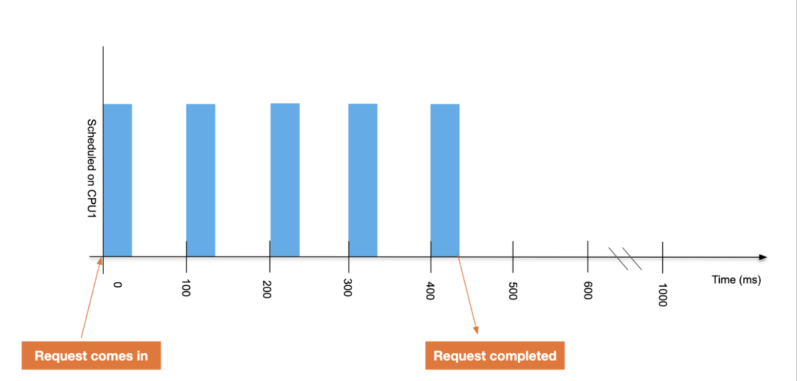

k8s の cpu limit をつけるとアプリが遅くなりすぎた

k8s の cpu limit をつけることで、実行時間が見事に遅くなってしまったのでその成果発表です。
（[参考記事](https://home.robusta.dev/blog/stop-using-cpu-limits)）


**[目次]**


- [背景](#背景)
  - [調べたこと](#調べたこと)
- [k8s が CPU を割り当てる方法](#k8s-が-cpu-を割り当てる方法)
  - [マルチコアの場合](#マルチコアの場合)
  - [Go のコンテナで動かしてるんですが](#go-のコンテナで動かしてるんですが)

## 背景

[gin](https://github.com/gin-gonic/gin) で動いてる Go のサーバーで、json のレスポンスを返すときに c.JSON を使っているのですが、ec2 で動いてる eks の node 上にデプロイされると応答が極端に遅くなるエンドポイントがありました。

トレース情報を見てみると、構造体を json に変換して返すだけの部分で 10 秒ほどかかっていました。
（22 MB ほどのデータ量であり、c.JSON メソッドは**ローカルで動かすと 600 ms 程**で終わるのですが、**k8s にデプロイされた状態だと 10 s 以上**かかってた！）
 
結論からいうと、**CPU limit を全 pod に入れており、それが原因で遅くなった**のではないかと推測しています。

### 調べたこと

まずは pod の cpu, memory を調べてみました。

pod には以下の値が設定されており、リクエスト時のリソースも limit を超えてなさそうだったので一旦スルーしました。
（これが良くなかった。なんで limit まで使ってるように見えないんだろ。）

```
resources:
 requests:
   cpu: "16m"
   memory: "640Mi"
 limits:
   cpu: "128m"
   memory: "896Mi"
```

---

c.JSON は内部的に Go 標準の json ライブラリ（encoding/json）を使っているのですが、シンプルにこれが遅いのではないかとも思い、サードパーティの json ライブラリも導入してみました。
[easyjson](https://github.com/mailru/easyjson) を導入すると、応答時間は 1/10 ほどになり、かなり改善が見込まれてしまいました。
（希望が見えたが故に、進む方向を間違えかけた時もありました。）

---

次に、[pprof](https://pkg.go.dev/net/http/pprof) などを開発環境に差し込み、各メソッドの時間・CPU・メモリなどを調べてみました。

上で 10s 以上 json の加工・レスポンスにかかっていた部分も、pprof の出力では 300ms ほどしか表示されておらず、**何らかの理由でリソースがうまいこと割り当てられてない**んじゃないかと想像しました。

---

そこで cpu limit によるスケジューラの原理を知り、request, limit を変化させて実験させてみました。

一番右の列は『pprof での出力で確認した時間 / 実際に JSON の返却にかかった値』を表示しており、実際にコンピューティングリソースが割り当てられた時間の割合だと考えています。
おおよそ limit に比例して割合が伸びており『limit により CPU の割り当てが小さくなり、アイドル時間が不当に増えた』という仮説は正しそうです。

| limit | limit/1cpu (%) | pprof での出力で確認した時間 / 実際に JSON の返却にかかった値 (%) |
| :---: | :---: | :---: |
| 128m | 12.8 | 10.6 |
| 256m | 25.6 | 25.2 |
| 512m | 51.2 | 48.3 |
| 1 | 100 | 95 |

最終的に limit を 1 core にすることで『pprof での出力が 1.32s』『実際にかかった時間が 1.39s』となり、**謎だった差分がほぼなくなりました！**

また、今回は cpu limit 128m で設定していたため 1000/128 = 7.8125 倍ほどレスポンスが遅くなってしまっていた可能性があります。

外部 api 呼び出しとか io バウンドな処理がメインなエンドポイントではそんな問題にならなく、重い計算とか cpu バウンドな処理にはモロに効いてきそうかなと思ってます。

## k8s が CPU を割り当てる方法

内部ではデフォルトで [CFS](https://ja.wikipedia.org/wiki/Completely_Fair_Scheduler) スケジューラが [--cpu-cfs-quota-period duration](https://kubernetes.io/docs/reference/command-line-tools-reference/kubelet/#:~:text=%2D%2Dcpu%!2Dcfs%2Dquota%2Dperiod%20duration) などの値を参照して pod に割り当てるコンピューティングリソースのスケジュールをしてるみたいですが、そんなことは知りません。
もっと概念的でわかりやすい説明が欲しいです。

そもそも 100m cpu ってなんでしょうか？
1 cpu ならまだしも小数点ってﾅﾝﾀﾞﾖ

その答えは cgroup にありそうですが、概念的には以下の図で説明されます。



[出典: スロットリング解除: クラウドにおける CPU の制限の修正](https://jp.engineering.indeedblog.com/blog/2019/12/%E3%82%B9%E3%83%AD%E3%83%83%E3%83%88%E3%83%AA%E3%83%B3%E3%82%B0%E8%A7%A3%E9%99%A4-%E3%82%AF%E3%83%A9%E3%82%A6%E3%83%89%E3%81%AB%E3%81%8A%E3%81%91%E3%82%8B-cpu-%E3%81%AE%E5%88%B6%E9%99%90%E3%81%AE/)

cpu core の稼働のうち、どれだけの時間その pod が稼働できるかの割合が limit で決まっています（デフォルトでは 100ms を基準として設定される）。

つまり、**limit が 200m core cpu の pod は 100ms のうち 200/1000 の 20ms しか動かないことになります！**
つまりのつまり、**アプリケーションは5倍遅くなります！**

### マルチコアの場合

CPU がマルチコアの場合も、基本の考えは同じです。
limit に応じて、どのくらいの割合で pod が専有できるかが決まります。

全てのコアに分配される可能性があるため、シングルスレッドで動くようなものに対しては、無駄なコアが生じてしまう可能性があります（**スロットルの発生**）。
そのため、1cpu を越さない範囲なのであれば、なるべく 1プロセスが動く cpu は1つに絞った方が効率が良いことになります。

### Go のコンテナで動かしてるんですが

この辺の Go に関する情報は Go100Tips にも書いてあります。

Go では [GOMAXPROCS の環境変数や runtime.GOMAXPROCS](https://pkg.go.dev/runtime#GOMAXPROCS) で稼働しうる CPU の上限を設定できますが、残念ながら現在のところ CFS を元に自動で値が変わることはありません( https://github.com/golang/go/issues/33803 )。

そのため、[automaxprocs](https://github.com/uber-go/automaxprocs#automaxprocs---) のようなライブラリを導入し、pod を適切な CPU 数で動かしてあげる必要が出てきます。

今回遅くなったアプリに入れたところ、導入前は GOMAXPROCS が 4 だった（node が乗ってる ec2 は r5.xlarge であり、その論理コア数 4 と一緒）のが導入後は 1 になりました。
