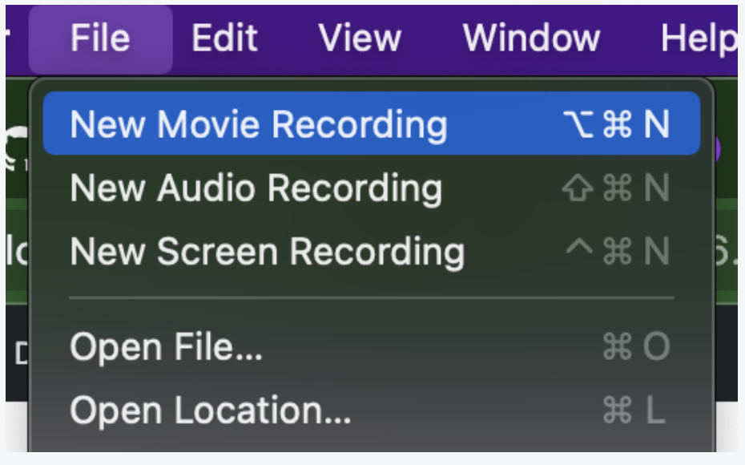
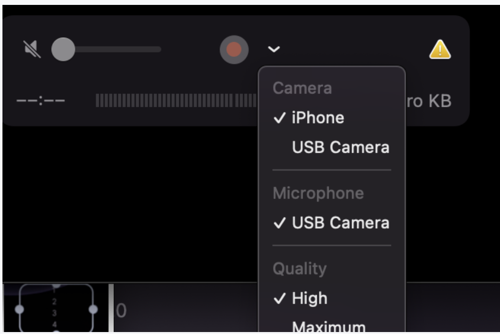

開発中などに iphone の画面を mac 上に表示させたいことがあるかと思います。

android には [scrcpy](https://github.com/Genymobile/scrcpy) という優秀なツールがあるのですが、iphone ではどうやら QuickTime Player を使えばできるらしいので、今回はその紹介をしたいと思います

## 起動方法

### 0. mac と iphone をケーブルで繋げる

### 1. QuickTime Player を起動する

### 2. File > New Movie Recording を起動する

### 3. 起動した録画画面で、Camera の設定から iPhone を選択する

以上で、無事 iphone が mac 上に描画されます

## 参考
- [使い方紹介 youtube](https://www.youtube.com/watch?v=wUOriE4awYE&ab_channel=DaveTaylor)

## おわりに
この QuickTime Player を使った方法では PC 上からの操作はできないので、その点は残念です。

最初は xcode からエミュレーターと同じように起動させられろう、と思って探していたのですが設定が見つかりませんでした。ご存じの方がいたら教えていただきたいです。

