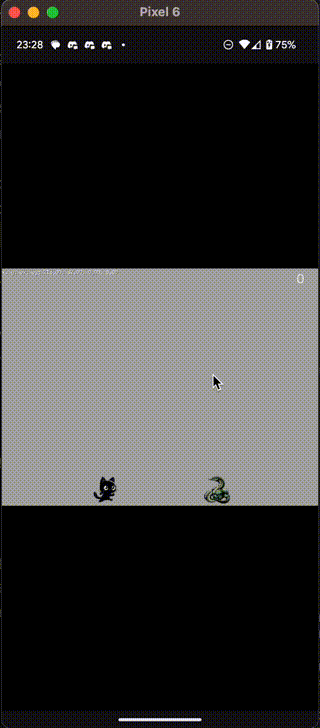
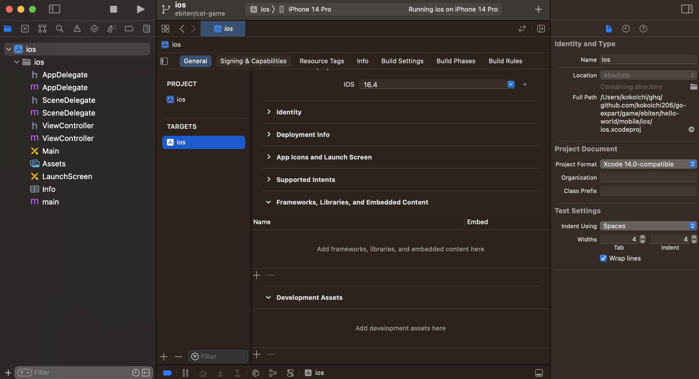
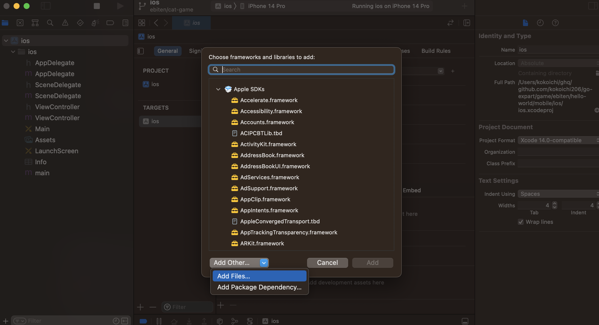
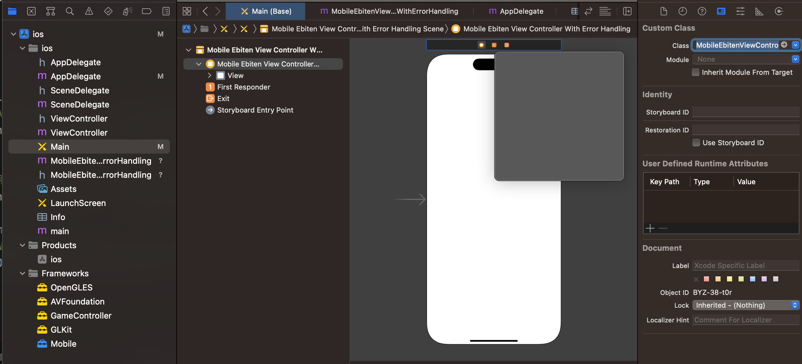
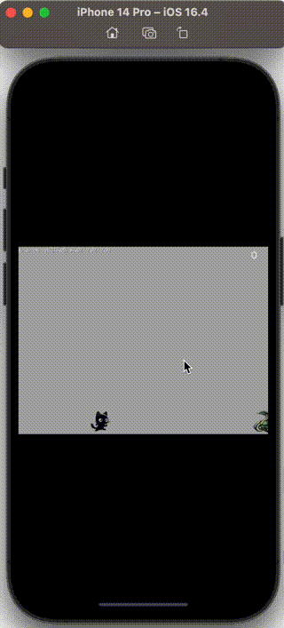

# ebiten による android/iOS/Web 対応

ebiten は様々なプラットフォームに対応しており、基本的には[公式ドキュメント](https://ebitengine.org/en/documents/mobile.html)を読みながら実装することになります。

今回は desktop アプリに加え, android/iOS/Web にも対応してみたのでその内容をまとめておきます。

書か**ない**こと

- ebiten の詳しい紹介
- ゲームの作り方
  - [ドキュメントの examples](https://ebitengine.org/) を参考にしたらいい感じにできそう

**目次**

```
* [[ebiten](https://github.com/hajimehoshi/ebiten) とは](#[ebiten](https://github.com/hajimehoshi/ebiten)-とは)
* [環境](#環境)
* [mobile に bind するための準備](#mobile-に-bind-するための準備)
  * [ディレクトリ構成](#ディレクトリ構成)
* [android](#android)
  * [shared library の作成](#shared-library-の作成)
  * [app からゲーム実行](#app-からゲーム実行)
  * [動作確認](#動作確認)
  * [ディレクトリ構成](#ディレクトリ構成)
* [iOS](#ios)
  * [shared library の作成](#shared-library-の作成)
  * [framework の読み込み](#framework-の読み込み)
  * [storybook に配置](#storybook-に配置)
  * [動作確認](#動作確認)
  * [ディレクトリ構成](#ディレクトリ構成)
* [Web](#web)
* [おわりに](#おわりに)
```

## [ebiten](https://github.com/hajimehoshi/ebiten) とは

ebiten とは Go 言語製のシンプルな 2D ゲームエンジンで、商用リリースにも使われるケースがあります。  
（簡単な成果物については 。）

- [showcase](https://ebitengine.org/en/showcase.html)
- [SAEKO](https://www.youtube.com/watch?v=rKV4H0SKmsE)
- [メグとばけもの](https://odencat.com/bakemono/ja.html)

ebiten の特徴の1つに高い移植性があり、android や iOS だけでなく, [Switch](https://ebitengine.org/ja/blog/nintendo_switch.html) や [Steam](https://ebitengine.org/ja/blog/steam.html) 用のバイナリもクロスコンパイル可能となってます！

今回は ebiten によるゲームの作り方**ではなく**、どのようにクロスコンパイルするかをまとめておきます。  
（Switch や Steam は開発者登録が必要そうだったので保留させてください。）

## 環境

本記事は以下のバージョンで動作確認をしております。

``` sh
ebiten:
    v2.6.7
Go version:
    go1.21.8 darwin/arm64
Android Studio:
    Android Studio Iguana | 2023.2.1
Xcode:
    Version 14.3 (14E222b)
```

## mobile に bind するための準備

android, ios に対応するためには [ebitenmobile](https://github.com/hajimehoshi/ebiten/tree/main/cmd/ebitenmobile) のインストールが必要です。

``` sh
go install github.com/hajimehoshi/ebiten/v2/cmd/ebitenmobile@latest
```

また[ドキュメント](https://ebitengine.org/en/documents/mobile.html)で言及されているように、bind させるためのコードを追加する必要があります。

今回は mobile 以外も同時に作りたかったため, desktop の実行ファイルと別に用意しました。  
（ディレクトリ構成をご参照ください。）

### ディレクトリ構成

[サンプルコード](https://github.com/hajimehoshi/go-inovation)を参考に、以下のような構成にしました。

``` sh
.
├── cat             # メインのゲームのコード（ebiten.Game の実装）
│   └── main.go
├── go.mod
├── go.sum
├── main.go         # desktop や WebAssembly のビルド
├── mobile
│   ├── android     # android, shared もこの中に入れる
│   ├── ios         # ios, shared もこの中に入れる
│   └── mobile.go   # mobile に bind するためのコード
└── web
    ├── index.html
    ├── main.wasm
    └── wasm_exec.js
```

## android

### shared library の作成

android では bind の成果物として aar ファイルが作成されます。

``` sh
# androidapi をつけないと『no usable NDK...unsupported API version 16』と怒られる。
ebitenmobile bind -target android -androidapi 33 -javapkg jp.mydns.kokoichi206.game.cat -o ./mobile/android/cat/cat.aar ./mobile

# .jar, .aar が作成される。
$ ls mobile/android/cat/
cat-sources.jar  cat.aar
```

library として準備するために、以下内容の `build.gradle` を用意します。  
（今回は `mobile/android/cat/build.gradle` に配置しました。）

``` sh
configurations.maybeCreate("default")
artifacts.add("default", file('cat.aar'))
```

手動ではなく準備できる方法があれば教えてください。

### app からゲーム実行

新規で作成したアプリから shared のライブラリを呼び出します。

shared のゲームは Jetpack compose ではなく AndroidView として作成されているためご注意ください。  
（compose から呼び出すこともできますが、今回は簡単にするため AndroidView として新規のプロジェクトを作成しました。）

shared のライブラリを読み込むための gradle の変更と、MainActivity の変更が必要です。

詳しい変更例はコードを見た方がいいと思うので、気になる方は [GitHub の差分](https://github.com/kokoichi206/go-expart/commit/2fd3033e671354187a07af386ea7e0996c1c3b81)をご覧ください。

### 動作確認

無事実行できました！



### ディレクトリ構成

``` sh
mobile/android
├── app
│   ├── build.gradle.kts
│   ├── libs
│   ├── proguard-rules.pro
│   └── src
├── build.gradle.kts
├── cat                 # game を実行するための shared library を置く場所
│   ├── build.gradle    # 手動で作成
│   ├── cat-sources.jar # bind により生成
│   └── cat.aar         # bind により生成
├── gradle
│   └── wrapper
├── gradle.properties
├── gradlew
├── gradlew.bat
├── local.properties
└── settings.gradle.kts
```

## iOS

iOS に関しては android よりも馴染みがないため、間違ってる箇所があれば教えてください。

今回はサンプルプロジェクトに合わせるため, objective-c × storybook という最古の組み合わせで動かしています。

### shared library の作成

iOS では bind の成果物として framework が作成されます。

``` sh
ebitenmobile bind -target ios -o ./mobile/ios/Mobile.xcframework ./mobile

# 今回はアプリと同じ階層に framework を配置しました
$ ls mobile/ios
Mobile.xcframework ios                ios.xcodeproj
```

### framework の読み込み

『Project > General > Frameworks, Libraries, and...』から追加します。



左下の『Add Other... > Add Files...』により、ローカルに作成した `Mobile.xcframework` を読み込みます。



また, **engine を動かすために `GameController.framework` も追加が必要**です。  
どちらも `Do Not Embed` で大丈夫でした。

### storybook に配置

storybook を編集する前に、（Mobile の中の MobileEbitenViewController の読み込み失敗が解消できなかったため）それを微妙に wrap したファイルを作成します（[参考](https://github.com/kokoichi206/go-expart/blob/123f26ae5f5adec6363ef05f1a21263ac342652a/game/ebiten/hello-world/mobile/ios/ios/MobileEbitenViewControllerWithErrorHandling.m)）。

続いて、作成した Controller を使う用に Main の storybook を編集します。



その他の詳しい変更は [GitHub の差分](https://github.com/kokoichi206/go-expart/commit/20a8a85591b617c096bc02b7502214cead0f7ed0)をご覧ください。

### 動作確認

無事実行できました！  
（objective-c も storybook もわからん！）



### ディレクトリ構成

``` sh
mobile/ios
├── Mobile.xcframework      # ebitenmobile により生成される framework
│   ├── Info.plist
│   ├── ios-arm64
│   └── ios-arm64_x86_64-simulator
├── ios
│   ├── AppDelegate.h
│   ├── AppDelegate.m       # 要変更
│   ├── Assets.xcassets
│   ├── Base.lproj
│   ├── Info.plist
│   ├── MobileEbitenViewControllerWithErrorHandling.h   # 新規作成
│   ├── MobileEbitenViewControllerWithErrorHandling.m   # 新規作成
│   ├── ...
│   └── main.m
└── ios.xcodeproj
    ├── project.pbxproj
    ├── project.xcworkspace
    └── xcuserdata
```

## Web

[公式ドキュメント](https://ebitengine.org/en/documents/webassembly.html)通りにやれば詰まることはなかったです。

シンプルに WebAssembly に `go build` して配信します。

``` sh
GOOS=js GOARCH=wasm go build -o ./web/main.wasm ./main.go
```

index.html や wasm のロード方法などは [GitHub](https://github.com/kokoichi206/go-expart/tree/main/game/ebiten/hello-world/web) をご覧ください。

GitHub pages などを使えば適当に遊べるようになります。
https://kokoichi206.github.io/go-expart/

## おわりに

今回紹介したクロスコンパイルの凄さもそうですが、ゲーム作成自体もシンプルな API で使いやすかったです。  
何かちゃんとしたものを作ってみたいです。
