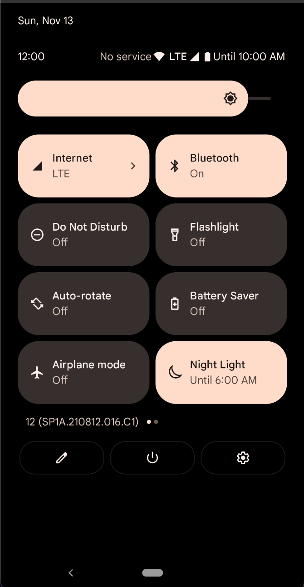
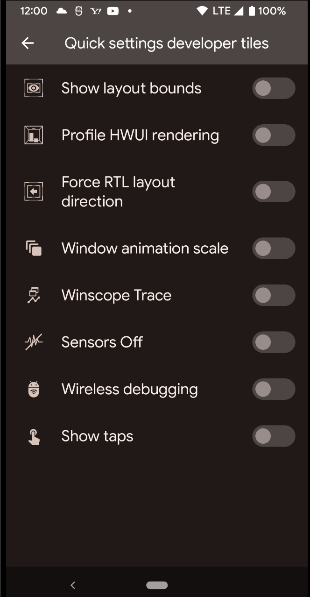
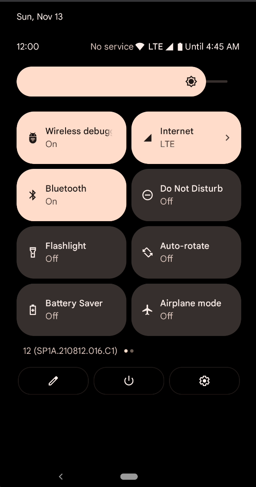

# ワイヤレスデバッグをステータスバーに表示する方法

開発者モードのオプションにあるワイヤレスデバッグを、ステータスバー（通知バー）に表示する方法をメモしておきます。

開発時、ステータスバーにデバッグオプションを表示させた方が便利なケースが多いです。

標準ではこちらに表示されておりません。

Settings から、『Quick settings developer tiles』のように検索します。  
（日本語では『クイック設定開発者用タイル』）

この中から『Wireless debugging』を ON にします。

そうすると、ステータスバーに『Wireless debug』オプションの設定が表示されます。

## Links

- https://developer.android.com/studio/debug/dev-options#general
