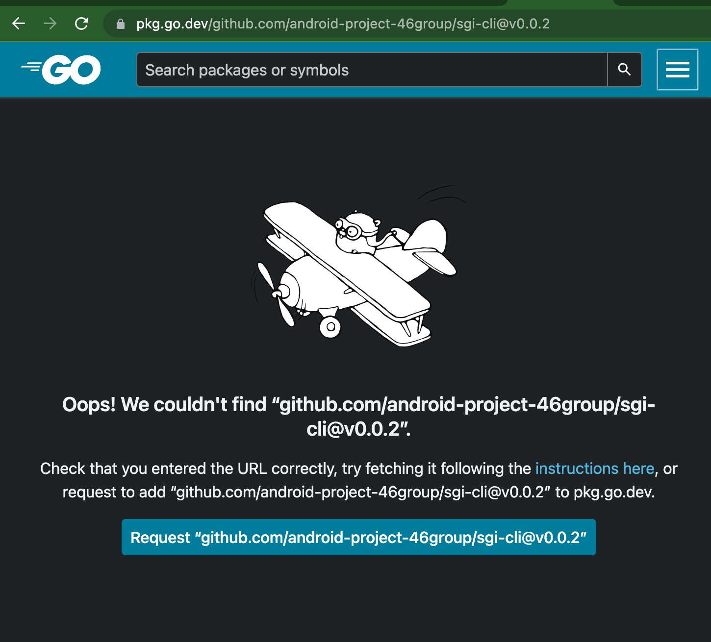

# pkg.go.dev にある godoc を強制的に更新する方法

## 前提

1. 一度は情報を読み込めている
2. tag プッシュしたものを反映させたい

## 方法

### push したタグに対応する ↓ のリンクを開く

https://pkg.go.dev/github.com/{user_name}/{repository_name}@{tag_version}

{} には以下の情報を入れてください。

- user_name: 個人の名前もしくは会社名
- repository_name: リポジトリ名
- tag_version: タグの値

例えば以下のようなリンクになると思っています。

https://pkg.go.dev/github.com/android-project-46group/sgi-cli@v0.0.2

### 強制的に反映させるボタンを押す

godoc 上に情報が反映されていない場合、以下のように『Request "github.com/{user_name}/{repository_name}@{tag_version}"』というボタンが表示されているので、クリックして待ちます

以上です！
