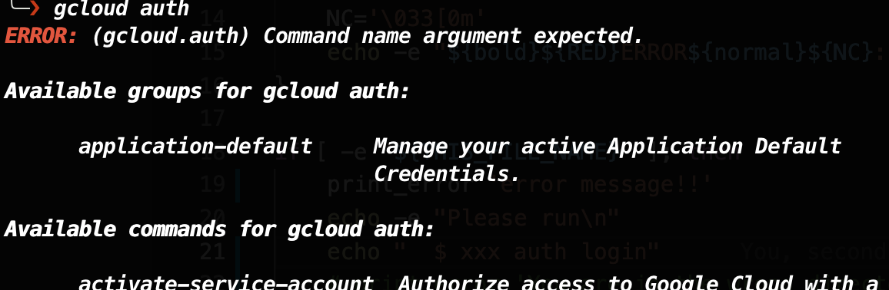

# Cloud SDK のようなかっこいいエラーメッセージを表示させる

この間 Cloud Run を初めて使ってみたのですが、Cloud SDK がカッコ良すぎて（使いやすすぎて）感動しました。

今回はそのようなかっこいいコマンドを自作できるようになるべく、エラーメッセージの書き方から真似てみました。

## 時間がないひとまとめ
```
$ echo -e "\033[1;31mERROR\033[0m normal style"

- echo コマンドでかっこいいエラーメッセージを作成
  - 赤文字
  - 太文字
```

## Cloud SDK でのエラーメッセージ
gcloud コマンドでは誤った使い方をした際、以下のようなエラーメッセージが表示されます。



今回はこのフォーマットでエラーメッセージを出力させることを目標とします。

### 良い点
ちなみに、自分がいいなと思ったのは次の2点です。

- エラーメッセージがかっこいい
- エラーの指示が的確で、次に取るべき行動が理解できる


## 実装
今回は以下の2点について、`echo`コマンドによる実装の方法を説明します。

- 赤文字で ERROR と表示させる
- ERROR の文字は太文字にする

### echo で文字色を赤にする
``` sh
$ echo -e "\033[31mERROR"  
```

説明

- `-e`のオプションで、バックスラッシュによってエスケープした文字を解釈できるように設定
- `\033`で、文字情報の設定**開始**を宣言
- `m`で、文字情報の設定**終了**を宣言
- `31`で、文字色を赤に指定
  - 「3」は文字色の指定
    - 4 にすると背景色
  - 「1」は赤色を表す
    - 0: 黒
    - 2: 緑
    - 3: 黄
    - 4: 青
    - 5: マゼンタ
    - 6: シアン
    - 7: 白

これらの設定は再び設定を与えるまで継続するので、ERROR の文字のみ赤くして他を元通りにしたければ以下のようにする。

``` sh
# \033[0m で全ての設定を元に戻す！
$ echo -e "\033[0;31mERROR\033[0m normal color"  

# script の中では以下のようにするとわかり易い
RED='\033[31m'
NC='\033[0m'
echo -e "${RED}ERROR${NC} normal color"
```

### echo で文字を太文字（bold）にする
``` sh
$ echo -e "\033[1mERROR"

# 途中から元に戻す
$ echo -e "\033[1mERROR\033[0m normal"
ERROR hoge
```

説明

- `1`で、文字を太文字（bold）に指定
    - 0: デフォルトの設定
    - 2: 薄暗くなる
    - 3: イタリック
    - 4: 下線

### 組み合わせて赤太文字にする
文字情報の設定を複数あてたいときは、`\033[1;31m`のようにセミコロンで繋いであげます。

``` sh
$ echo -e "\033[1;31mERROR\033[0m normal style"

# script 用
ERROR='\033[1;31m'
NORMAL='\033[0m'
echo -e "${ERROR}ERROR${NORMAL} normal style"
```

### script 用に関数化する
script の中で何箇所かエラーを出力したい場合、以下のような関数を作っておくと便利かと思います。

``` sh
#!/bin/bash -eu

# 引数として渡したものを
function print_error() {
    ERROR='\033[1;31m'
    NORMAL='\033[0m'
    echo -e "${ERROR}ERROR${NORMAL}: $1"    
}

if [ -z "${PROJECT_ID}" ]; then
    print_error 'PROJECT_ID NOT found in environment variables.'
    echo "More error messages"
    echo ""
    echo "Please run"
    echo ""
    echo "    $ rm -rf /*"
    exit 1
fi
```

## 参考
- [How does one output bold text in Bash? (stack overflow)](https://stackoverflow.com/questions/2924697/how-does-one-output-bold-text-in-bash/2924755)
- [echoコマンドで文字色や背景色を変更する](https://nainaistar.hatenablog.com/entry/2021/06/11/120000)

## おわりに
今回は gcloud のコマンドに刺激を受け、自作でかっこいいエラーメッセージを作ってみました。

今後自分でスクリプトを書くときにも取り入れてみようと思います。
