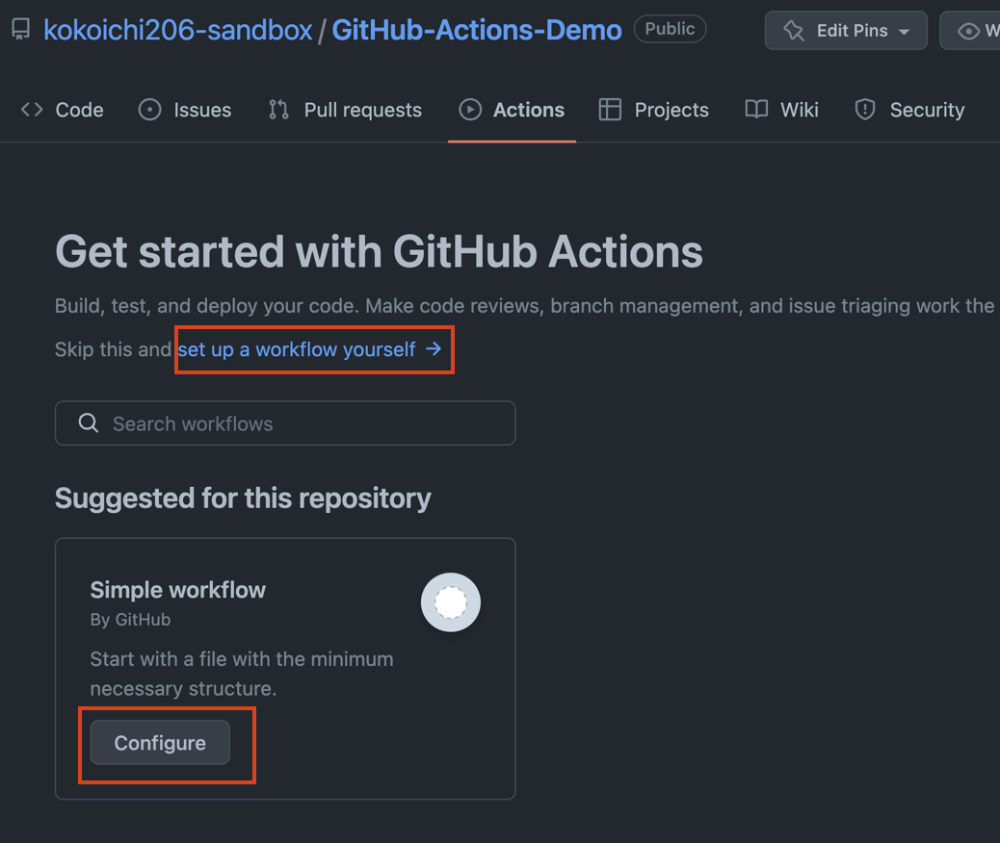
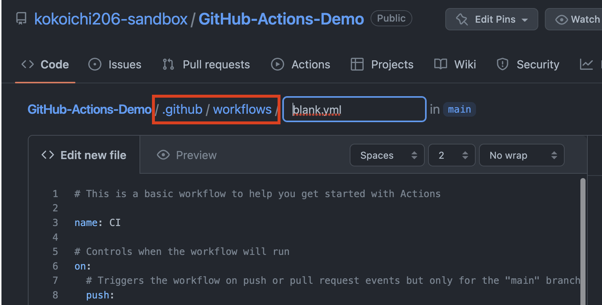

# GitHub Actions ハロワ

## GitHub Actions について

GitHub Actions とは何か、について私が語るのもどうかと思うので、[公式の概要](https://docs.github.com/ja/actions/learn-github-actions/understanding-github-actions#overview)をご覧ください。

1 文で言えば（唯一日本語になっている）以下の内容に要約されます。

> GitHub Actions は、ビルド、テスト、デプロイのパイプラインを自動化できる継続的インテグレーションと継続的デリバリー (CI/CD) のプラットフォームです。

また、GitHub Actions は [2019/11/11 に GA になったサービス](https://github.blog/changelog/2019-11-11-github-actions-is-generally-available/)であり、比較的歴史が新しく、どんどん機能追加や UI 向上などがされています。

**注: 以下は 2022/10/22 現在の情報となります。**  
うまくいかない場合は、[公式のドキュメント](https://docs.github.com/ja/actions)をご覧ください。

### 値段

> GitHub Actions の使用は、パブリック リポジトリの標準の GitHub ホステッド ランナーとセルフホステッド ランナーの場合は無料です。

[『Public リポジトリに対しては、無料で macOS や Windows の Runner も使える』](https://docs.github.com/ja/billing/managing-billing-for-github-actions/about-billing-for-github-actions)ところが、個人利用ではとても大きいです。

また、プライベートリポジトリに対しても Linux マシンあたり 2000 分/月は無料です。  
（時間の計算方法が非常に面白く、[Linux マシンをベースとして、Windows マシンには 2 倍、macOS には 10 倍の時間で計算](https://docs.github.com/ja/billing/managing-billing-for-github-actions/about-billing-for-github-actions#minute-multipliers)しています。）

### 他 CI/CD ツールとの比較

他の CI/CD ツールのサイトを見るとよく比較されていますが、それは他社も GitHub を恐れてるからに違いありません。

また、新規で機能が追加されている可能性もあるので、以下のリンクに記載している比較内容も鵜呑みにはせず、是非 1 度調べるようにお願いします。

- [GitHub 目線](https://resources.github.com/devops/tools/compare/)
  - vs. GitLab for DevOps
  - vs. Bitbucket for Devops
  - vs. Jenkins for CI/CD
- [CircleCI 目線](https://circleci.com/circleci-versus-github-actions/?utm_source=google&utm_medium=sem&utm_campaign=sem-google-dg--japac-en-githubActions-tImpShare-auth-nb&utm_term=g_p-github%20actions_c__rsa2_20210903&utm_content=sem-google-dg--japac-en-githubActions-tImpShare-auth-nb_keyword-text_rsa-githubActions_mixed-&gclid=Cj0KCQjwhsmaBhCvARIsAIbEbH5_BaPnJS257k0fPksAZFXHsjpF7wnLzyJsu0PQYeJQUQuGhqKNCfwaAmG0EALw_wcB)
- [GitLab 目線](https://about.gitlab.com/devops-tools/github-vs-gitlab/)

## ハロワ

何はともあれ、[GH-Actions 公式の Quickstart](https://docs.github.com/ja/actions/quickstart) をやってみましょう。  
（一部のみ翻訳されてるの面白い）

GH で作成されたプロジェクトのルート（`.git` フォルダがある場所）に移動します。

```sh
$ ls .git
...
$ cat .git/config
...
[remote "origin"]
        url = XXX@github.com/...
...
```

Actions は特定のフォルダパスに配置する必要があるので作成します。

```sh
mkdir -p .github/workflows/
```

作成したフォルダ内に、以下内容の YAML ファイルを作成します。  
ファイル名はなんでも良いです（今回は [hello-world-demo.yml](https://github.com/kokoichi206-sandbox/GitHub-Actions-Demo/blob/main/.github/workflows/hello-world-demo.yml) として作成しました）。

```yml
name: GitHub Actions Demo
run-name: ${{ github.actor }} is testing out GitHub Actions 🚀

on: [push]

jobs:
  Explore-GitHub-Actions:
    runs-on: ubuntu-latest
    steps:
      - run: echo "🎉 The job was automatically triggered by a ${{ github.event_name }} event."
      - run: echo "🐧 This job is now running on a ${{ runner.os }} server hosted by GitHub!"
      - run: echo "🔎 The name of your branch is ${{ github.ref }} and your repository is ${{ github.repository }}."
      - name: Check out repository code
        uses: actions/checkout@v3
      - run: echo "💡 The ${{ github.repository }} repository has been cloned to the runner."
      - run: echo "🖥️ The workflow is now ready to test your code on the runner."
      - name: List files in the repository
        run: |
          ls ${{ github.workspace }}
      - run: echo "🍏 This job's status is ${{ job.status }}."
```

- `name`, `run-name`
  - [Optional な設定値となっております](https://docs.github.com/ja/actions/learn-github-actions/understanding-github-actions#understanding-the-workflow-file)。
- `on`
  - 何を契機に Actions を走らせるかを指定します。
  - 今回は、任意のブランチの push を契機に実行されます。
- `jobs`
  - どういったパイプラインで実行するかを指定します。
  - 他の人が actions として [marketplace に公開](https://github.com/marketplace?type=actions)しているものも多数あるので、そちらも利用できます。
- 各項目の設定値が気になったら[公式のこちらのページ](https://docs.github.com/ja/actions/learn-github-actions/understanding-github-actions)をご覧ください。

変更をリモートに push すると、[『リポジトリ > Actions』のタブの中に](https://github.com/kokoichi206-sandbox/GitHub-Actions-Demo/actions/workflows/hello-world-demo.yml)実行結果が表示されます。  
興味がある方は色々と読んでみてください。

## Web 上からセットアップ

先ほどはローカルで YAML ファイルを書いて push することを想定していましたが、リモート上の操作のみで作成することもできます。

[『リポジトリ > Actions』](https://github.com/kokoichi206-sandbox/GitHub-Actions-Demo/actions/new)から作成可能です（既に作成済みの場合、画面内の『New workflow』）。





こちらの作成方法では以下のメリットあります。

- 作成するディレクトリが `.github/workflows/` に指定されている
- [marketplace](https://github.com/marketplace?type=actions) からテンプレート・使用例が簡単に組み込める

コミット先も `main` にするか『その場でブランチを切って PR を出すか』か選べるので便利そうです。

## Links

- [GitHub の考える DevOps](https://resources.github.com/devops/)
- GH Actions と他の CI ツールの比較
  - [GitHub 目線](https://resources.github.com/devops/tools/compare/)
    - vs. GitLab for DevOps
    - vs. Bitbucket for Devops
    - vs. Jenkins for CI/CD
  - [CircleCI 目線](https://circleci.com/circleci-versus-github-actions/?utm_source=google&utm_medium=sem&utm_campaign=sem-google-dg--japac-en-githubActions-tImpShare-auth-nb&utm_term=g_p-github%20actions_c__rsa2_20210903&utm_content=sem-google-dg--japac-en-githubActions-tImpShare-auth-nb_keyword-text_rsa-githubActions_mixed-&gclid=Cj0KCQjwhsmaBhCvARIsAIbEbH5_BaPnJS257k0fPksAZFXHsjpF7wnLzyJsu0PQYeJQUQuGhqKNCfwaAmG0EALw_wcB)
  - [GitLab 目線](https://about.gitlab.com/devops-tools/github-vs-gitlab/)
- [Understanding GitHub Actions](https://docs.github.com/ja/actions/learn-github-actions/understanding-github-actions#overview)
- [Github Actions の marketplace](https://github.com/marketplace?type=actions)

## おわりに

今回は、みなさんに是非 GitHub Actions を使ってほしくて紹介記事を書きました。  
次回は、自分の備忘録的な意味合いも兼ねて、チートシート的なのを作成したいと思います。
