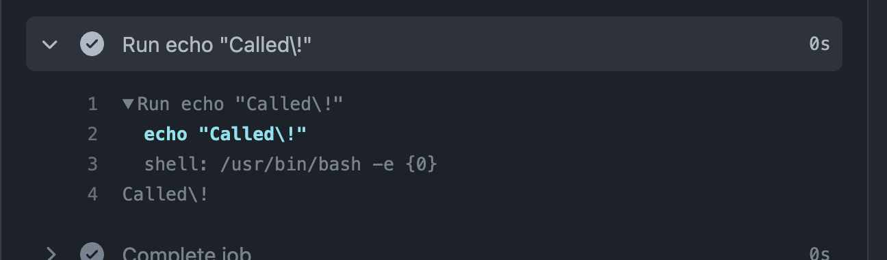

# GitHub Actions の shell 設定について調査

GitHub Actions の shell の設定について、以前から ubuntu の通常 shell とは異なってるな〜と、気になっていたので調べてみました。

**[目次]**

- [時間がない人まとめ](#%E6%99%82%E9%96%93%E3%81%8C%E3%81%AA%E3%81%84%E4%BA%BA%E3%81%BE%E3%81%A8%E3%82%81)
- [`set -o` で確認](#set--o-%E3%81%A7%E7%A2%BA%E8%AA%8D)
  - [emacs](#emacs)
  - [errexit](#errexit)
  - [histexpand](#histexpand)
  - [history](#history)
  - [monitor](#monitor)
- [Actions の実行結果確認](#actions-%E3%81%AE%E5%AE%9F%E8%A1%8C%E7%B5%90%E6%9E%9C%E7%A2%BA%E8%AA%8D)
  - [`-e`](#-e)
  - [`-e` を解除したい（力技）](#-e-%E3%82%92%E8%A7%A3%E9%99%A4%E3%81%97%E3%81%9F%E3%81%84%E5%8A%9B%E6%8A%80)
  - [`{0}`](#0)
  - [Links](#links)
- [おわりに](#%E3%81%8A%E3%82%8F%E3%82%8A%E3%81%AB)

## 時間がない人まとめ

```
- GitHub Actions の run: について
    - shell が明示的に指定されてない時 bash -e {0}
    - https://docs.github.com/en/actions/using-workflows/workflow-syntax-for-github-actions#jobsjob_idstepsshell
- `-e` がついてるので注意
    - `set` コマンドで無理やり回避可能
```

## `set -o` で確認

`set -o` を呼び出すことで、どのオプション付きで実行されているかを調べることができます。

まずは GH-Actions 内で確認しました。

```yml
# GH-Actions の jobs
jobs:
  Options-test:
    runs-on: ubuntu-latest
    steps:
      - name: シェルの設定を調べる
        run: |
          set -o
```

**結果**

```sh
# GitHub Actions のコマンドの中で実行したもの
$ set -o
allexport      	off
braceexpand    	on
emacs          	off
errexit        	on
errtrace       	off
functrace      	off
hashall        	on
histexpand     	off
history        	off
ignoreeof      	off
interactive-comments	on
keyword        	off
monitor        	off
noclobber      	off
noexec         	off
noglob         	off
nolog          	off
notify         	off
nounset        	off
onecmd         	off
physical       	off
pipefail       	off
posix          	off
privileged     	off
verbose        	off
vi             	off
xtrace         	off
```

手元の ubuntu（ラズパイ上）のものと比べてみます。

```sh
# ubuntu
$ set -o
allexport       off
braceexpand     on
emacs           on
errexit         off
errtrace        off
functrace       off
hashall         on
histexpand      on
history         on
ignoreeof       off
interactive-comments    on
keyword         off
monitor         on
noclobber       off
noexec          off
noglob          off
nolog           off
notify          off
nounset         off
onecmd          off
physical        off
pipefail        off
posix           off
privileged      off
verbose         off
vi              off
xtrace          off
```

どちらも行数が多い（項目は同じそう）ため、差分があるところのみ表示させてみます。

```sh
# 左がラズパイの ubuntu で、右が github
$ paste raspi_set_o github_runner_set_o |\
 awk '$2 != $4 {print $1"\t"$2"\t"$4}'
emacs   on      off
errexit off     on
histexpand      on      off
history on      off
monitor on      off
```

結果、5 つのオプションに違いがあることがわかったので、それぞれ確認していきます。

基本的には [4.3.1 The Set Builtin](https://www.gnu.org/software/bash/manual/html_node/The-Set-Builtin.html) を参考にしています。

### emacs

| ラズパイ | GitHub Runner |
| :------: | :-----------: |
|    on    |      off      |

> Use an emacs-style line editing interface (see Command Line Editing).  
> This also affects the editing interface used for read -e.

GitHub の job 中においてはユーザーが手動で編集することがないため off になっているものと思われます。

on にするには `-o` で指定します。

```sh
set -o emacs
```

### errexit

**めっちゃ大事です（主観）**

| ラズパイ | GitHub Runner |
| :------: | :-----------: |
|   off    |      on       |

[buildin のドキュメント](https://www.gnu.org/software/bash/manual/html_node/The-Set-Builtin.html)にめちゃめちゃしっかり記載があります。

要は、『エラーが起こったとき（= status code が 1 以上）に、スクリプト実行を途中で止めるかどうか』になります。  
（パイプライン中の取り扱いは別途）

ラズパイ等 ubuntu のシェルにおいては off が通常モードですが、GitHub Runner では on が通常です（後述）。

```sh
# 次のどちらかで on に指定します。
set -e
set -o errexit
```

### histexpand

| ラズパイ | GitHub Runner |
| :------: | :-----------: |
|    on    |      off      |

> Enable '!' style history substitution (see History Expansion).  
> This option is on by default for interactive shells.

履歴展開を有効にするかどうかのフラグです。

すなわち、GitHub Actions 上で ! や !! のように打っても文字通りの出力しかされないことになります。  
（履歴展開については[過去に記事を書いてます](https://koko206.hatenablog.com/entry/2022/10/14/223249)ので、よろしければご覧ください。）

```sh
# 次のどちらかで on に指定します。
set -H
set -o histexpand
```

### history

| ラズパイ | GitHub Runner |
| :------: | :-----------: |
|    on    |      off      |

> This option is on by default in interactive shells.

コマンド履歴を有効にするかどうかのフラグです。  
インタラクティブシェルでは有効になってるらしいです。  
（ラズパイで on なのはそのせい）

```sh
# 有効にする方法
set -o history
```

### monitor

| ラズパイ | GitHub Runner |
| :------: | :-----------: |
|    on    |      off      |

> Job control is enabled (see Job Control).  
> All processes run in a separate process group.  
> When a background job completes, the shell prints a line containing its exit status.

[Job Control](https://www.gnu.org/software/bash/manual/html_node/Job-Control.html) を行った際に、バックグラウンドプロセスについて出力を行うかですかね？  
（ここは後で調べ直します）

```sh
# monitor off の時
$ set -o | grep monitor
monitor         off
$ sleep 3 &
[1] 2441186
$ wait %1; echo "fin"
fin

# monitor on の時
$ set -m
$ set -o | grep monitor
monitor         on
$ sleep 3 &
[1] 2441253
$ wait %1; echo "fin"
[1]+  Done        sleep 3 # ここの出力が違いそう？
fin
```

```sh
# 次のどちらかで on に指定します。
set -m
set -o monitor
```

## Actions の実行結果確認

実は、Actions の実行結果の欄にヒントがありました。

Actions の例。

```yml
jobs:
  Trigger-Test:
    runs-on: ubuntu-latest
    steps:
      - run: |
          echo "Called\!"
```

`run:` で指定した部分は、以下のように呼び出されていることが[確認できます](https://github.com/kokoichi206-sandbox/GitHub-Actions-Demo/actions/runs/3302445230/jobs/5449276437)。

```sh
Run echo "Called\!"
  echo "Called\!"
  shell: /usr/bin/bash -e {0}
Called\!
```



### `-e`

`-e` は [errexit](#errexit) で確認したように、エラーが起きたときに処理を中断するかどうかです。

『エラーが起きたときに処理を中断する』これは一見良さそうに見えるのですが、一部コマンドにおいては想定外のところでエラーを吐く（**= exit status が 1 以上になる**）ので、注意が必要です。

以下、想定外の値になりうる一例です。  
（他にもあれば教えてください！）

```sh
# 例

# ----- diff -----
$ diff <(echo hoge) <(echo hogee)
1c1
< hoge
---
> hogee
# diff コマンドは、差分が見つかったとき
# exit status 1 で抜ける
$ echo $?
1

# ----- grep -----
$ grep "not_found_grep" -r
# grep コマンドは、対象文字列が見つからなかったとき
# exit status 1 で抜ける
$ echo $?
1
```

例えば、『GH-Actioins において、diff コマンドで差分検知 ⇨ 通知などを行おうと思った場合』、diff の時点でエラーを返すため、そこで処理が終了して通知ができないことになってしまいます。

### `-e` を解除したい（力技）

`run:` の中には基本的なシェルスクリプトが書けるので、`set` コマンドを使って一時的に無効にしてあげます。

```yml
- run: |
    # errexit を無効にする
    set +e
    diff <(echo hoge) <(echo hogee) > hoge
    # errexit を有効にする
    set -e

    echo "notify diff"
```

これで errexit が発生しそうな箇所のみ解除することが可能です。

公式の [Exit codes and error action preference のページ](https://docs.github.com/en/actions/using-workflows/workflow-syntax-for-github-actions#exit-codes-and-error-action-preference)をみると、`bash {0}` のように shell を設定するとコントロール可能、とのことでしたが、[何故かうまくいきませんでした](https://github.com/kokoichi206-sandbox/GitHub-Actions-Demo/actions/runs/3303580372/jobs/5451665614)

設定してみた job

```yml
# https://docs.github.com/en/actions/using-workflows/workflow-syntax-for-github-actions#exit-codes-and-error-action-preference
- name: when only `bash` specified
  run: |
    echo "shell: /usr/bin/bash --noprofile --norc -e -o pipefail {0}"
    set -o
  shell: bash

# https://docs.github.com/en/actions/using-workflows/workflow-syntax-for-github-actions#exit-codes-and-error-action-preference
- name: Exit codes and error action preference
  run: |
    set -o
    # This command fails
    # diff <(echo hoge) <(echo hogee) > hoge
  shell: bash {0}

- name: Explicitly specify the errexit option [not working as expected]
  run: |
    set -o | grep errexit
    diff <(echo hoge) <(echo hogee)
    # This command still fails
    # diff <(echo hoge) <(echo hogee) > hoge
  shell: bash +e {0}
```

### `{0}`

話はそれましたが、当初のシェルの設定 `shell: /usr/bin/bash -e {0}` に戻ると、何やら数字がついています。

ここには、`run:` のあとのスクリプトが入ってくるとのことです。

何か標準的な記法なんでしょうか？

### Links

- [What does shell: /bin/bash -e {0} mean in bash shell output from a github action worker?](https://stackoverflow.com/questions/66283887/what-does-shell-bin-bash-e-0-mean-in-bash-shell-output-from-a-github-action)
- [Exit codes and error action preference](https://docs.github.com/en/actions/using-workflows/workflow-syntax-for-github-actions#exit-codes-and-error-action-preference)

## おわりに

GitHub Actions のドキュメントは結構していると思ってます。  
まともなドキュメント書けるようになりたいです。
