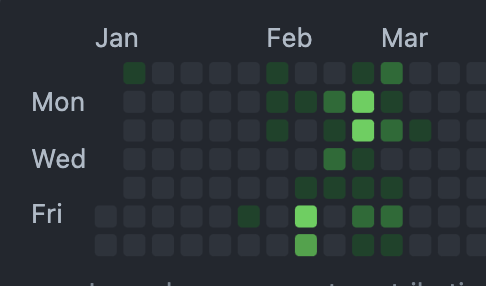

# GitHub で全リポジトリのコード行数をカウントを出力する CLI を作りました



GitHub ではアカウントページに『草』が活動量（コントリビューション）として表示され、ユーザーの日々のモチベーションに繋がっています（知らんけど）。

しかし、この表示には次のような問題があることが分かっています。

- [直接進捗以外に関係する項目もカウントされる可能性がある](https://docs.github.com/ja/account-and-profile/setting-up-and-managing-your-github-profile/managing-contribution-settings-on-your-profile/why-are-my-contributions-not-showing-up-on-my-profile#about-your-contribution-graph)
  - Issue、プルリクエスト、ディスカッションがオープンされたカウントなど（進捗ではある）
- 1 行のコミットと 1000 行のコミットが同じ 1 コントリビューションが同じ 1 コントリビューションであるのは納得がいかない

そこでこれらの問題を解決するため、1 コマンドで今までの全リポジトリの総行数が取得できる [CLI を Go で作成しました](https://github.com/kokoichi206/go-git-stats)。

詳しくは[こちらのリポジトリ](https://github.com/kokoichi206/go-git-stats)を見ていただきたいのですが、簡単にできることと工夫したところを紹介します。

**[目次]**

[:contents]

## 作成した CLI

たった 1 行です。
1 日あたりの行数を出力したい場合は、前日の情報をどこかにキャッシュしておく必要があります。

```sh
$ ggs lines -name kokoichi206
> 10452117
```

その他の使い方、インストール等については[リポジトリ](https://github.com/kokoichi206/go-git-stats)に記載しました。

## こだわったところ

### 各プラットフォーム用のバイナリ

せっかく Go で CLI ツールを作るのであれば、クロスコンパイルして各プラットフォームで使用できる形で配布したいと思っていました。
配布の形式としては GitHub のリリースでとりあえずいいかな〜、コンパイルするスクリプト作って [release API](https://docs.github.com/ja/rest/releases/assets#upload-a-release-asset) とかでリリース作ろうかな〜とか思っていたら、『クロスコンパイルをして GitHub, GitLab にリリースしてくれる』[GoReleaser](https://goreleaser.com/) というものを見つけたので、今回はこれを使用しました。

[タグプッシュによりリリースが作成されるようにしています。](https://github.com/kokoichi206/go-git-stats/blob/main/.github/workflows/release.yml#L23-L30)

### リリース物をインストールするスクリプトを作成

ここでは『インストール』=『必要ファイルをインストールして、`/usr/local/bin`に配置すること』と定義して作成しました（windows は無視）。

- リリースノートのうち最新版を取ってくるようにしている
- ダウンロードしたファイルが壊れていないことをチェックサムを用いて保証するようにしている

インストールに使うスクリプトは[こちら](https://github.com/kokoichi206/go-git-stats/blob/main/_tools/scripts/installer.sh)で、対応時の Issue は[こちら](https://github.com/kokoichi206/go-git-stats/issues/10)になります。

また、MacOS, Linux においては以下 1 行のスクリプトで[インストールされます](https://github.com/kokoichi206/go-git-stats#how-to-install)。

```sh
curl -Lsf https://raw.githubusercontent.com/kokoichi206/go-git-stats/main/_tools/scripts/installer.sh | bash
```

### 統計情報取得 API は 202 を返す

コードの行数を取得する API として、[『Get the weekly commit activity』](https://docs.github.com/ja/rest/metrics/statistics#get-the-weekly-commit-activity)を使用したのですが、こちらの注意書きに[以下の記載](https://docs.github.com/en/rest/metrics/statistics#a-word-about-caching)があります。

> GitHub API の仕様として、統計情報の計算はリソース負荷が高いため、極力キャッシュされるようになっている。
> そして、キャッシュヒットしなかった場合、一旦 202 を返し、そこから統計情報の計算を開始する。
> 202 を受け取ったら、少し待ってから再度実行してくれ。

そこで、202 を受け取ったときは、200 を受け取る準備ができるまで一定期間おきにリトライを行う[処理を実装しました](https://github.com/kokoichi206/go-git-stats/blob/main/api/stats.go#L59-L65)。

## 考慮していないもの

個人で GitHub を使っていることが前提だったので、今回以下の内容は考慮しておりません。

- Fork してきたリポジトリはどういう扱いになるか、調べていない
- Company に属するコードはどうなるか（おそらく取れていない）
- 自動生成されたコードに対して、実コントリビューションより多く見積もられてしまう
  - フレームワークでプロジェクトを初期化した時など
  - 何とかしたい: 今後の課題
- Windows はどうやってインストールさせたらいいん

## おまけ

### curl バージョン

CLI で作成する前に、API の調査として curl で遊んでいた時のコマンドも残しておきます。

```sh
# 必要な変数
#  - REPO_TOKEN: 読み取り権限を許可した access token
#  - USER_NAME: GitHub のユーザー名
# 全リポジトリの、**今週の**コミット数
#  - https://docs.github.com/ja/rest/metrics/statistics#get-the-weekly-commit-count
curl -s \
    -H "Accept: application/vnd.github.v3+json" \
    -H "Authorization: token ${{ secrets.REPO_TOKEN }}"\
    "https://api.github.com/users/${{ secrets.USER_NAME }}/repos?per_page=100" |\
    jq '.[].name' |\
    xargs -I@ curl -s \
        -H "Accept: application/vnd.github.v3+json" \
        -H "Authorization: token ${{ secrets.REPO_TOKEN }}" \
        "https://api.github.com/repos/${{ secrets.USER_NAME }}/@/stats/code_frequency" |\
        jq '.[-1][]' | paste - - - | awk '{print $2+$3}' |\
        awk '{a += $0} END {print a}' > last_result
```

## おわりに

Go で CLI 作るの楽しすぎ。
というか Go が気持ちよすぎ。
