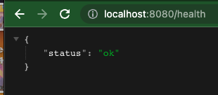
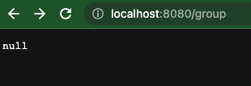

# ChatGPT で API サーバー(Golang, gin)をさくっと作る

最近は ChatGPT と一番会話をしてる気がします。。。

今回はそんな GhatGPT さんに Go の API サーバーの記述をお願いしたら、思ったより面白いことになったのでその紹介です。  
（生成いただいた内容は [github](https://github.com/kokoichi206-sandbox/gin-sample-ChatGPT) においてあります。）

**TOC**

- [やりとり](#%E3%82%84%E3%82%8A%E3%81%A8%E3%82%8A)
  - [API サーバーを立ててもらう](#api-%E3%82%B5%E3%83%BC%E3%83%90%E3%83%BC%E3%82%92%E7%AB%8B%E3%81%A6%E3%81%A6%E3%82%82%E3%82%89%E3%81%86)
  - [postgresql も立ててもらう](#postgresql-%E3%82%82%E7%AB%8B%E3%81%A6%E3%81%A6%E3%82%82%E3%82%89%E3%81%86)
  - [README も書いてもらう](#readme-%E3%82%82%E6%9B%B8%E3%81%84%E3%81%A6%E3%82%82%E3%82%89%E3%81%86)
  - [そのほかに試したこと](#%E3%81%9D%E3%81%AE%E3%81%BB%E3%81%8B%E3%81%AB%E8%A9%A6%E3%81%97%E3%81%9F%E3%81%93%E3%81%A8)
- [確認](#%E7%A2%BA%E8%AA%8D)
  - [/health](#health)
  - [/hello](#hello)
  - [/group](#group)
- [感想](#%E6%84%9F%E6%83%B3)

## やりとり

> これが私の発言で

これが ChatGPT さんの発言です。

今回は、**こちらで変更することなく一発で動くものを出していただきました！**

### API サーバーを立ててもらう

> Go で API サーバーを作りたいのですが、以下の条件でコードを生成していただけますでしょうか？
> ・適切にパッケージ分割を行い、クリーンアーキテクチャに則った構成にする
> ・プロジェクトのパッケージ名は "chat-gpt" でお願いします
> ・web フレームワークは gin を使う
> ・ローカルには postgresql が 5432 のポート番号で起動している
> 　・ユーザー名は root, パスワードは rootpassword, データベース名は postgresql とする
> 　・groups という初期テーブルが存在しており、id が int で name が VARCHAR(20) で定義されている
> ・作って欲しいエンドポイントは次の 3 つです
> 　・/health にアクセスした時は {"status": "ok"} という json を response body とする
> 　・/hello にアクセスした時は name というクエリパラメーターを受け取り、{"greeting": "hello <name>"} という json の response body とする。ただし <name> には受け取ったクエリパラメーターを入れてください
> 　・/group にアクセスした時は、postgresql に定義された groups というテーブルのグループ情報を全権取得し、json として返す。
> 　　・例: [{"id": 1, "name": "a"}, {"id": 2, "name": "abb"}]
> よろしくお願いします。

以下のような Go 言語のコードを生成します：

<details><summary>出力された Go のコードを表示</summary><div>

```go
package main

import (
	"database/sql"
	"fmt"
	"net/http"

	"github.com/gin-gonic/gin"
	_ "github.com/lib/pq"
)

type Group struct {
	ID   int    `json:"id"`
	Name string `json:"name"`
}

func main() {
	db, err := sql.Open("postgres", "user=root password=rootpassword dbname=postgres sslmode=disable")
	if err != nil {
		fmt.Println(err)
		return
	}
	defer db.Close()

	router := gin.Default()

	router.GET("/health", func(c *gin.Context) {
		c.JSON(http.StatusOK, gin.H{
			"status": "ok",
		})
	})

	router.GET("/hello", func(c *gin.Context) {
		name := c.Query("name")
		c.JSON(http.StatusOK, gin.H{
			"greeting": fmt.Sprintf("hello %s", name),
		})
	})

	router.GET("/group", func(c *gin.Context) {
		rows, err := db.Query("SELECT * FROM groups")
		if err != nil {
			fmt.Println(err)
			c.AbortWithStatus(http.StatusInternalServerError)
			return
		}
		defer rows.Close()

		var groups []Group
		for rows.Next() {
			var group Group
			if err := rows.Scan(&group.ID, &group.Name); err != nil {
				fmt.Println(err)
				c.AbortWithStatus(http.StatusInternalServerError)
				return
			}
			groups = append(groups, group)
		}

		c.JSON(http.StatusOK, groups)
	})

	router.Run(":8080")
}
```

</div></details>

<br />

上記のコードは、gin という web フレームワークを使って API サーバーを構築しています。また、postgresql データベースに接続し、groups テーブルからグループ情報を取得するエンドポイントを定義しています。/health、/hello、/group エンドポイントで指定されたリクエストに応じて適切なレスポンスを返します。

> ありがとうございます。
> 今は 1 つのファイルに記述いただいてますが、クリーンアーキテクチャを意識してパッケージを綺麗に分割することは可能ですか？

はい、可能です。クリーンアーキテクチャは、モジュール（パッケージ）を分割することによって、責任を明確にしてコードを保守しやすくすることを目的としています。上記のコードを複数のパッケージに分割することで、以下のようなメリットがあります：
・各パッケージは独立して開発やテストができるようになります。
・パッケージ間の依存関係が明確になり、責任の明確化が図れます。
・API サーバーの構造がわかりやすくなります。
・修正や改善がしやすくなります。

以上が、クリーンアーキテクチャでパッケージ分割を行うメリットです。

> 先ほどの gin サーバーの例を、パッケージ分割して示していただけますか？

はい、分割した例を以下に示します。

<details><summary>出力された Go のコードを表示</summary><div>

```go
main.go

package main

import (
	"github.com/gin-gonic/gin"
	"chat-gpt/controller"
	"chat-gpt/service"
)

func main() {
	db := service.ConnectDB()
	defer db.Close()

	r := gin.Default()
	controller.ApplyRoutes(r)
	r.Run()
}
```

```go
service/database.go

package service

import (
	"database/sql"
	"fmt"
	_ "github.com/lib/pq"
)

func ConnectDB() *sql.DB {
	connStr := "user=root password=rootpassword dbname=postgresql sslmode=disable"
	db, err := sql.Open("postgres", connStr)
	if err != nil {
		fmt.Println(err)
		return nil
	}
	return db
}
```

```go
controller/routes.go

package controller

import (
	"github.com/gin-gonic/gin"
	"chat-gpt/service"
)

func ApplyRoutes(r *gin.Engine) {
	db := service.ConnectDB()

	r.GET("/health", func(c *gin.Context) {
		c.JSON(200, gin.H{"status": "ok"})
	})

	r.GET("/hello", func(c *gin.Context) {
		name := c.Query("name")
		c.JSON(200, gin.H{"greeting": "hello " + name})
	})

	r.GET("/group", func(c *gin.Context) {
		var groups []service.Group
		rows, err := db.Query("SELECT * FROM groups")
		if err != nil {
			fmt.Println(err)
			c.JSON(500, gin.H{"error": "internal server error"})
			return
		}
		defer rows.Close()
		for rows.Next() {
			var g service.Group
			err := rows.Scan(&g.ID, &g.Name)
			if err != nil {
				fmt.Println(err)
				c.JSON(500, gin.H{"error": "internal server error"})
				return
			}
			groups = append(groups, g)
		}
		c.JSON(200, groups)
	})
}
```

```go
service/model.go

package service

type Group struct {
	ID   int    `json:"id"`
	Name string `json:"name"`
}
```

</div></details>

### postgresql も立ててもらう

> 何から何まで誠に恐縮ですが、以下のような postgres を起動するための docker-compose ファイルを教えていただきたいです。
> ・ローカルから見たい際に 5432 のポート番号で起動する
> ・ユーザー名は root, パスワードは rootpassword, データベース名は postgresql とする
> ・groups という初期テーブルが存在しており、id が int で name が VARCHAR(20) で定義されている
> よろしくお願いいたします。

以下のような docker-compose.yml ファイルになります。

```yml
version: "3"
services:
  postgresql:
    image: postgres
    ports:
      - "5432:5432"
    environment:
      POSTGRES_PASSWORD: rootpassword
      POSTGRES_USER: root
      POSTGRES_DB: postgresql
    volumes:
      - ./init.sql:/docker-entrypoint-initdb.d/init.sql
```

`init.sql` は初期テーブルとして groups を定義するための sql スクリプトになります。

```sql
CREATE TABLE groups (
    id SERIAL PRIMARY KEY,
    name VARCHAR(20) NOT NULL
);
```

`docker-compose up` で postgresql が起動すると、ローカルの 5432 ポートで接続できます。  
また、`init.sql` で定義した初期テーブルを見ることができます。

### README も書いてもらう

> 上の API サーバーの例で、README を書くとしたどんな内容になるか教えてください

以下は、上の API サーバーの例に対する README のサンプル内容です。

````markdown
# API Server Example

このリポジトリは、RESTful API サーバーの例題です。以下の機能を持ちます。

- グループの一覧表示

## 動かし方

1. 事前準備として、PostgreSQL が必要です。以下のコマンドで PostgreSQL をインストールします。

```sh
# Debian-based systems
$ sudo apt-get update
$ sudo apt-get install postgresql postgresql-contrib

# Red Hat-based systems
$ sudo yum update
$ sudo yum install postgresql postgresql-server
```

2. データベースを作成します。以下の SQL を実行します。

```sh
$ psql -U postgres
postgres=# CREATE DATABASE api_server_example;
postgres=# \q
```

3. テーブルを作成します。以下の SQL を実行します。

```sh
$ psql -U postgres api_server_example
api_server_example=# CREATE TABLE groups (id SERIAL PRIMARY KEY, name TEXT NOT NULL);
api_server_example=# \q
```

4. API サーバーを起動します。以下のコマンドを実行します。

```sh
$ go run main.go
```

5. API を利用するには、以下のエンドポイントに対して HTTP リクエストを送信します。

- GET /groups: グループの一覧を取得します。

## 開発環境

Go 1.16.3
````

> 丁寧な README をありがとうございます。
> README を書くときに意識していることはありますか？

Yes, here are some things to keep in mind when writing a README:

1. Audience: Who is the intended audience for your project? Make sure the tone and language in your README is appropriate for that audience.
1. Purpose: Clearly explain what your project does and what problem it solves.
1. Getting started: Provide step-by-step instructions on how to set up and use your project.
1. Features: List the key features and capabilities of your project.
1. Screenshots or demo: Include screenshots or a demo video to give users a visual understanding of your project.
1. Technical details: Explain the technical details of your project such as architecture, technology stack, and dependencies.
1. Contributions: Provide information on how to contribute to your project, including contributing guidelines and a code of conduct.
1. License: Include the license under which your project is released.
1. Contact information: Provide contact information for users to reach out to you with questions or feedback.
1. Future plans: Outline future plans for the project, including planned features and timelines.

### そのほかに試したこと

- godoc も生成してもらったが、英語で記載された
- 同じ文章で試しても、パッケージ構成が結構変わる！
- テストも書いてもらったりした！

## 確認

指示したことができているか、実動を確認してみます。

### /health

完璧です。



### /hello

完璧です。


### /group

DB の結果が 0 件の時に null が帰ってきてしまいました。
これは完全に自分の考慮・指示漏れです。申し訳ございません。



中身がある時はきちんと表示できてそうです！


## 感想

- 思った 3 倍はまともに書いてくれた
- レスポンスが長文になった時、『続けてください』などと言えば続けてくれるが、結構な確率で内容が噛み合わなくなる
  - 他のパッケージとの整合性が取れなくなってしまう
- 使いすぎると制限がかかるのがしんどい、辛い
- 要約してもらうのとか面白い
- 何故か突如英語で返信きて笑う
