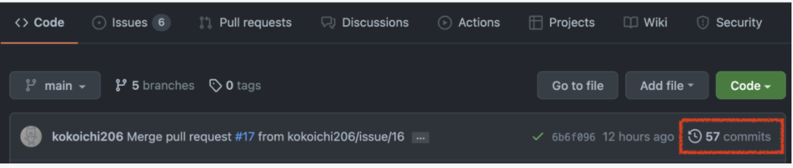

# GitHub 上でコミットを確認する２つの方法
GitHub でコミットの確認をしようと思った際、「独立した Commits 確認ボタン」がなかったので探すのに少し時間がかかりました。

## URL に打ち込む

### 特定のコミットを確認する
```
https://github.com/<name>/<repository-name>/commit/<commit-hash>
```

`https://github.com/<name>/<repository-name>`までは、いわゆるリポジトリまでの URL です。

### 過去コミット一覧を確認する
```
https://github.com/<name>/<repository-name>/commits/<branch>
```

`<branch>`の部分にはブランチ名 (main など) が入ります。

## Code 欄から飛ぶ
GitHub の Code 欄をひらき、下図赤枠の部分を確認します。


