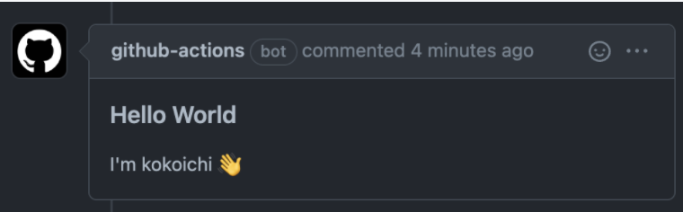

# Github Actions から PR 上にコメントを残す

Github Actions から PR 上にコメントを残す際、[actions/github-script](https://github.com/actions/github-script) を使うのがはやいです。

使用用途としては、次のようなケースが考えられるかと思います。

- 初めて PR 等をする人にメッセージを送る（[Welcome a first-time contributor](https://github.com/actions/github-script#welcome-a-first-time-contributor)）
- PR 上で確認できるよう、テスト等の詳細結果を表示させる

それでは早速使ってみたいと思います！

**[目次]**

[:contents]

## 環境
```
- actions/github-script@v5
```

## actions/github-script を使ってみる

### Pull requests にコメントさせてみる

[ここの内容](https://github.com/actions/github-script#comment-on-an-issue)を参考に記載しています。

内部では [issue comments API](https://docs.github.com/en/rest/reference/issues#comments)を使っているみたいです。

script の部分に関しては、JavaScript が使えます。

**.github/workflow/comment-test.yml**

``` yaml
name: Comment test

on:
  pull_request:
    branches:
      - main

jobs:
  build:
    runs-on: ubuntu-latest
    steps:
      - uses: actions/github-script@v5
        with:
          github-token: ${{ secrets.GITHUB_TOKEN }}
          script: |
            const output = `### Hello World
            I'm kokoichi 👋`;
            github.rest.issues.createComment({
              issue_number: context.issue.number,
              owner: context.repo.owner,
              repo: context.repo.repo,
              body: output
            })

```

Job が成功すると、以下のように`github-actions [bot]`からコメントをもらえます。



### context について確認する
先ほど API を使用する際、`context.issue.number`, `context.repo.owner`などたくさんの `context.xxx`が出てきました。

context は他にどのような情報を持っているか[出力させてみます。](https://github.com/actions/github-script#print-the-available-attributes-of-context)

``` yaml
name: Just test

on:
  pull_request:
    branches:
      - main

jobs:
  build:
    runs-on: macos-latest
    steps:
      - name: View context attributes
        uses: actions/github-script@v5
        with:
          script: console.log(context)
```

console の出力は PR チケット上ではなく個別の Action から確認します。


<details>
<summary><mark><font color=darkred>context の全文を見る</font></mark>
</summary>


```
Context {
  payload: {
    action: 'synchronize',
    after: '7d046eefa006497b44f55e6d6aeb6089f04f2c78',
    before: '9ce1abca8f0488d94e7f5245b3bb6c32c1643199',
    number: 6,
    pull_request: {
      _links: [Object],
      active_lock_reason: null,
      additions: 62,
      assignee: null,
      assignees: [],
      author_association: 'OWNER',
      auto_merge: null,
      base: [Object],
      body: null,
      changed_files: 4,
      closed_at: null,
      comments: 0,
      comments_url: 'https://api.github.com/repos/kokoichi206/golang-ci-cd/issues/6/comments',
      commits: 5,
      commits_url: 'https://api.github.com/repos/kokoichi206/golang-ci-cd/pulls/6/commits',
      created_at: '2022-01-28T17:23:11Z',
      deletions: 14,
      diff_url: 'https://github.com/kokoichi206/golang-ci-cd/pull/6.diff',
      draft: false,
      head: [Object],
      html_url: 'https://github.com/kokoichi206/golang-ci-cd/pull/6',
      id: 834662214,
      issue_url: 'https://api.github.com/repos/kokoichi206/golang-ci-cd/issues/6',
      labels: [],
      locked: false,
      maintainer_can_modify: false,
      merge_commit_sha: '506d957fc28eece820b8d7770d7ef0c8f8d1f736',
      mergeable: null,
      mergeable_state: 'unknown',
      merged: false,
      merged_at: null,
      merged_by: null,
      milestone: null,
      node_id: 'PR_kwDOGwIEb84xv-9G',
      number: 6,
      patch_url: 'https://github.com/kokoichi206/golang-ci-cd/pull/6.patch',
      html_url: 'https://github.com/kokoichi206/golang-ci-cd',
      id: 453117039,
      is_template: false,
      issue_comment_url: 'https://api.github.com/repos/kokoichi206/golang-ci-cd/issues/comments{/number}',
      issue_events_url: 'https://api.github.com/repos/kokoichi206/golang-ci-cd/issues/events{/number}',
      issues_url: 'https://api.github.com/repos/kokoichi206/golang-ci-cd/issues{/number}',
      keys_url: 'https://api.github.com/repos/kokoichi206/golang-ci-cd/keys{/key_id}',
      labels_url: 'https://api.github.com/repos/kokoichi206/golang-ci-cd/labels{/name}',
      language: 'Go',
      languages_url: 'https://api.github.com/repos/kokoichi206/golang-ci-cd/languages',
      license: null,
      merges_url: 'https://api.github.com/repos/kokoichi206/golang-ci-cd/merges',
      milestones_url: 'https://api.github.com/repos/kokoichi206/golang-ci-cd/milestones{/number}',
      mirror_url: null,
      name: 'golang-ci-cd',
      node_id: 'R_kgDOGwIEbw',
      notifications_url: 'https://api.github.com/repos/kokoichi206/golang-ci-cd/notifications{?since,all,participating}',
      open_issues: 1,
      open_issues_count: 1,
      owner: [Object],
      private: false,
      pulls_url: 'https://api.github.com/repos/kokoichi206/golang-ci-cd/pulls{/number}',
      pushed_at: '2022-01-28T17:26:45Z',
      releases_url: 'https://api.github.com/repos/kokoichi206/golang-ci-cd/releases{/id}',
      size: 9,
      ssh_url: 'git@github.com:kokoichi206/golang-ci-cd.git',
      stargazers_count: 0,
      stargazers_url: 'https://api.github.com/repos/kokoichi206/golang-ci-cd/stargazers',
      statuses_url: 'https://api.github.com/repos/kokoichi206/golang-ci-cd/statuses/{sha}',
      subscribers_url: 'https://api.github.com/repos/kokoichi206/golang-ci-cd/subscribers',
      subscription_url: 'https://api.github.com/repos/kokoichi206/golang-ci-cd/subscription',
      svn_url: 'https://github.com/kokoichi206/golang-ci-cd',
      tags_url: 'https://api.github.com/repos/kokoichi206/golang-ci-cd/tags',
      teams_url: 'https://api.github.com/repos/kokoichi206/golang-ci-cd/teams',
      topics: [],
      trees_url: 'https://api.github.com/repos/kokoichi206/golang-ci-cd/git/trees{/sha}',
      updated_at: '2022-01-28T15:29:33Z',
      url: 'https://api.github.com/repos/kokoichi206/golang-ci-cd',
      visibility: 'public',
      watchers: 0,
      watchers_count: 0
    },
    sender: {
      avatar_url: 'https://avatars.githubusercontent.com/u/52474650?v=4',
      events_url: 'https://api.github.com/users/kokoichi206/events{/privacy}',
      followers_url: 'https://api.github.com/users/kokoichi206/followers',
      following_url: 'https://api.github.com/users/kokoichi206/following{/other_user}',
      gists_url: 'https://api.github.com/users/kokoichi206/gists{/gist_id}',
      gravatar_id: '',
      html_url: 'https://github.com/kokoichi206',
      id: 52474650,
      login: 'kokoichi206',
      node_id: 'MDQ6VXNlcjUyNDc0NjUw',
      organizations_url: 'https://api.github.com/users/kokoichi206/orgs',
      received_events_url: 'https://api.github.com/users/kokoichi206/received_events',
      repos_url: 'https://api.github.com/users/kokoichi206/repos',
      site_admin: false,
      starred_url: 'https://api.github.com/users/kokoichi206/starred{/owner}{/repo}',
      subscriptions_url: 'https://api.github.com/users/kokoichi206/subscriptions',
      type: 'User',
      url: 'https://api.github.com/users/kokoichi206'
    }
  },
  eventName: 'pull_request',
  sha: 'aaf9140159b0fcf7c799cb1ee38236984c6c2026',
  ref: 'refs/pull/6/merge',
  workflow: 'Just test',
  action: '__actions_github-script',
  actor: 'kokoichi206',
  job: 'build',
  runNumber: 8,
  runId: 1762790245,
  apiUrl: 'https://api.github.com',
  serverUrl: 'https://github.com',
  graphqlUrl: 'https://api.github.com/graphql'
}
```

</details>


## 触ってみっての注意点

### ~v4, v5 では大きく異なる
[「github-script の v5 における破壊的な変更」](https://github.com/actions/github-script#breaking-changes-in-v5)にもありますが、v5 では github REST API 以外も対応するようになりました。

そのため、v4 以前で使っていたような API に対しては、明示的に `github.rest.***`のように REST であることを教えてあげるような API 名に変更になりました。

複数のサイトを参考にする際は注意しましょう。

### Github API にとって issues と PRs の区別はない
`github.rest.issues.createComment`の名前から、勝手に Github の各プロジェクトにある "Issues" にコメントをするものかと勘違いしていました。

勘違いしたまま Pull requests に対してコメントを送る方法がないかと探していたのですが、どうやら Github API において issue と pull request は同じだそうです！！

今年度一番の驚きです。

以下は [stack overflow の記事](https://stackoverflow.com/questions/58066966/commenting-a-pull-request-in-a-github-action)のコメントより

> A canonical way is using the official Github Script actions. Don't get confused, **issues and PRs are the same for the GitHub API.**


## Links
- [Commenting a pull request in a GitHub action(stack overflow)](https://stackoverflow.com/questions/58066966/commenting-a-pull-request-in-a-github-action)
- [github-script](https://github.com/actions/github-script)

## おわりに
より実践的な CI/CD を組む際にぜひ使ってみたいです。
