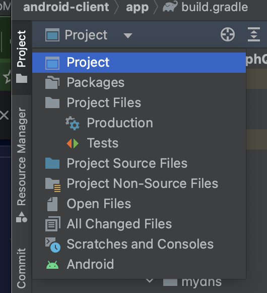
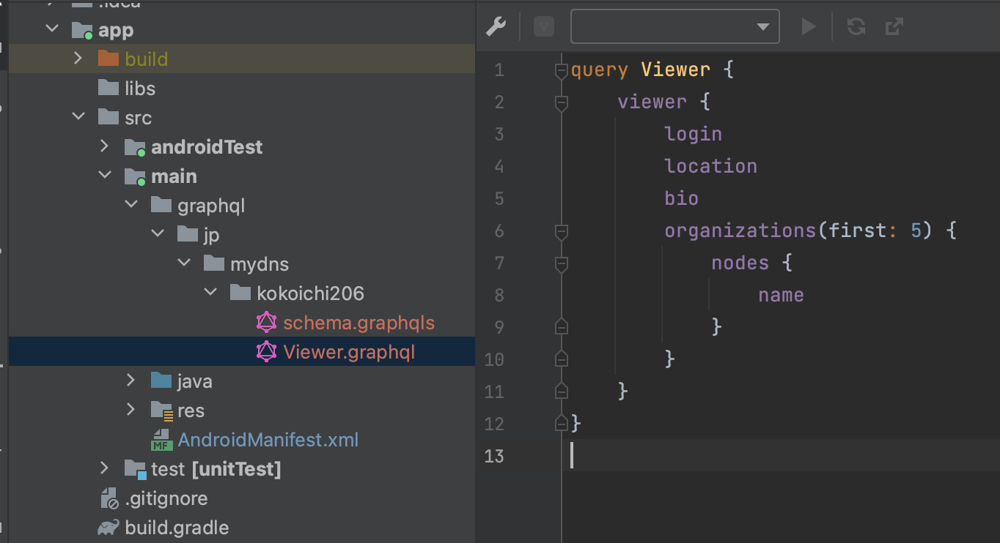

# GitHub の GraphQL を android から叩く（Apollo client）

## Apollo とは

[Apollo](https://www.apollographql.com/docs/) は GraphQL API 用のライブラリで、React, Kotlin, iOS 用のクライアント sdk が用意されています（サーバー用にも用意されています）。

android では Apollo が実質デファクトであるため、今回はこちらのライブラリを使って Github API を叩いてみます。

## [apollo kotlin](https://www.apollographql.com/docs/kotlin/)

基本的には [Getting started](https://www.apollographql.com/docs/kotlin/#getting-started) に沿って進めていきますが、変更した部分を中心に説明します。

### 0. plugin の追加

Android Studio に [GraphQL の plugin](https://plugins.jetbrains.com/plugin/8097-graphql) を追加します。

### 依存関係の追加

まず、公式の導入例は `kts` となっていますが、android studio のデフォルトの `build.gradle` では以下の様に依存関係を追加します（[コミット例](https://github.com/kokoichi206-sandbox/graphql-sample/commit/c9487740a5f62f3863e67cd055a7c948b4e54a1a)）。

project レベルの build.gradle

``` gradle
plugins {
    ...
    // 追加
    id 'com.apollographql.apollo3' version '3.7.3' apply false
}
```

app レベルの build.gradle

``` gradle
plugins {
    ...
    // 追加
    id 'com.apollographql.apollo3'
}

// 追加
apollo {
    service("service") {
        // 任意
        // src/main からのディレクトリ構成になる。
        packageName.set("jp.mydns.kokoichi206")
    }
}

dependencies {
    ...

    // 追加
    implementation "com.apollographql.apollo3:apollo-runtime:3.7.3"
}
```

現時点ではビルドは通りませんが、次に進みます（apollo の service 部分がないため）。

### schema の追加

Github API の public schema を追加していきます（[コミット例](https://github.com/kokoichi206-sandbox/graphql-sample/commit/6ca0120180a039e40f5817c6d80d74a05e073135)）。

[公式には `./gradlew :app:downloadApolloSchema` を使ってスキーマを追加](https://www.apollographql.com/docs/kotlin/tutorial/02-add-the-graphql-schema#download-your-servers-schema)するようにあったのですが、Github API は**認証で弾かれた**（401 が返ってきた）ため以下のように変更しました。

1. [こちらから public schema をダウンロード](https://docs.github.com/ja/graphql/overview/public-schema)します。
2. Android Studio の左上のメニューを『Project』に切り替えた後、ダウンロードしたファイルを `app/src/main/graphql/jp/mydns/kokoichi206/schema.graphqls` に配置します。  
    - （`jp/mydns/kokoichi206` の部分は `build.gradle` に定義した値に適宜置き換えてください。）



### クエリーの追加

続いて、schema を追加したのと同じフォルダにクエリーを追加します。

クエリーは `*.graphql` という名前で保存する必要があります。今回は `Viewer.graphql` で作ってみました。



中身は Postman で確認したのと全く同一にしています。

### クライアントの用意 + クエリの発行

いよいよクライアントを作成し、実際にクエリを実行してみます（[コミット例](https://github.com/kokoichi206-sandbox/graphql-sample/commit/97d5cd1a1bb2ea60169a60e458b89d5dfec5d23d)）。

該当する公式のページは[こちら](https://www.apollographql.com/docs/kotlin/tutorial/04-execute-the-query#create-an-apolloclient)です。

まずはクライアントを作成します。　

`<your_token>` の部分にはご自身のトークンを入れてください。

``` kotlin
val apolloClient = ApolloClient.Builder()
    .serverUrl("https://api.github.com/graphql")
    .addHttpHeader(
        "Authorization",
        "bearer <your_token>"
    )
    .build()
```

今はコードの中に token を埋め込んでますが、実際には `gradle.properties` に定義して BuildConfig として読み込ませるとか、OAuth 連携してユーザーの access_token を取得するとかになるかと思います。

クエリを発行するには以下のようにします。  
ViewerQuery 使うためには、**事前にクエリを記載した状態でビルドを成功させる**必要があります。

``` kotlin
val viewer = apolloClient
    .query(ViewerQuery())
    .execute()
    .data
    ?.viewer
```

この時 viewer の戻り値は、生成された Viewer という型になっており、**クエリで絞り込まれた変数のみが定義された** data class になっております。  
また、schema に型がきちんと定義されてるのも安心です。

``` kotlin
public class ViewerQuery() : Query<ViewerQuery.Data> {
  ...

  @ApolloAdaptableWith(ViewerQuery_ResponseAdapter.Data::class)
  public data class Data(
    /**
     * The currently authenticated user.
     */
    public val viewer: Viewer,
  ) : Query.Data

  public data class Viewer(
    /**
     * The username used to login.
     */
    public val login: String,
    /**
     * The user's public profile location.
     */
    public val location: String?,
    /**
     * The user's public profile location.
     */
    public val location: String?,
    /**
     * The user's public profile bio.
     */
    public val bio: String?,
    /**
     * A list of organizations the user belongs to.
     */
    public val organizations: Organizations,
  )

  public data class Organizations(
    /**
     * A list of nodes.
     */
    public val nodes: List<Node?>?,
  )

  public data class Node(
    /**
     * The organization's public profile name.
     */
    public val name: String?,
  )
  ...
```

## おわりに

クライアントからの呼び出しイメージとしては、言っても HTTP メソッドの call なので、大差ないことが分かりました。  
次回はいよいよサーバーサイドの実装をかじってみたいと思います。


