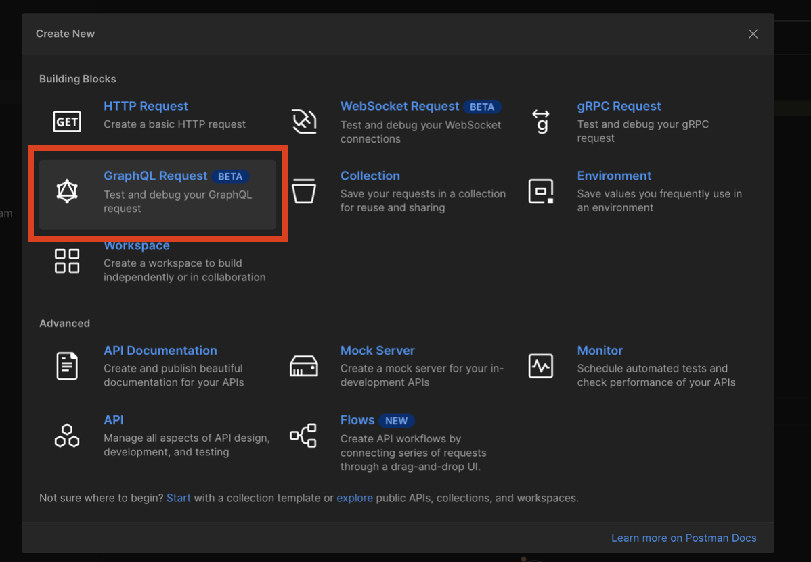
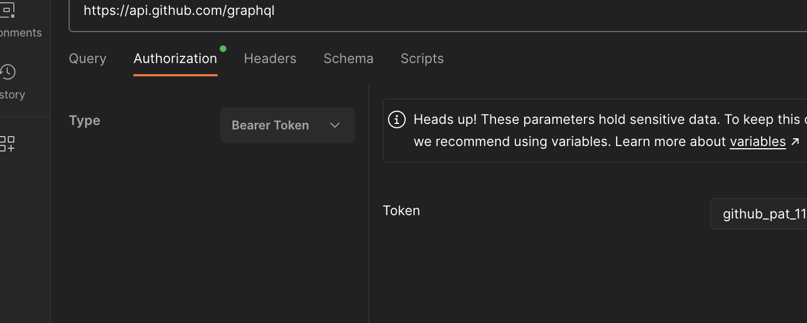
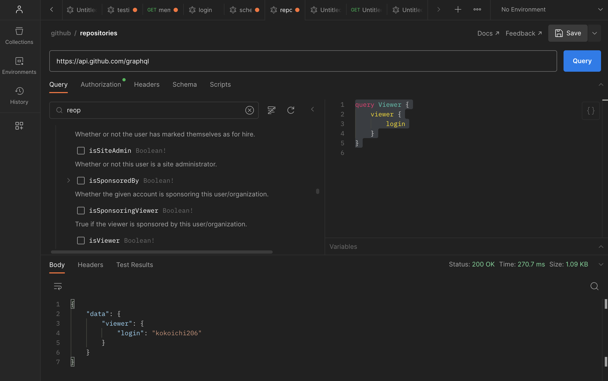
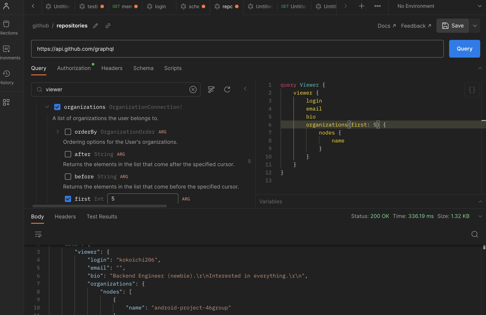
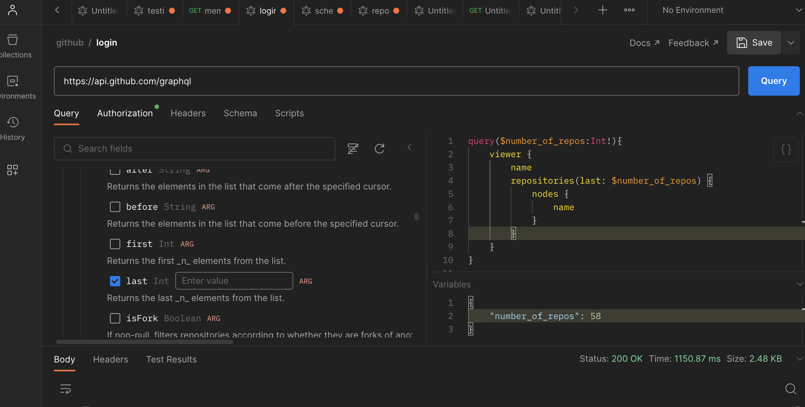

# GraphQL（GitHub API ）の叩き方

## GraphQL とは

現在主流の REST 設計では、アプリが複雑になるにつれ複数のエンドポイントが用意され、場合によっては１画面表示するのに複数の API を叩く必要があったりします。  
これを解決するため、GraphQL はクライアントが必要なデータのみを単一のリクエストで要求することを可能にしています。

その他説明は詳しい方に任せますが、以下は自分が気になった REST との相違点になります。

**REST と同じところ**

- アプリケーションレイヤーは HTTP である
  - body に必要なクエリを書くために、POST でリクエストを送る

**REST と比べたメリット**

- 必要な情報をクライアントから指定できる
  - オーバーフェッチング（不要な情報を取得してしまい、通信量が無駄に増えること）・アンダーフェッチング（必要な情報が１回で取れず、複数の API 呼び出しが必要になること）を回避できる

## github api

github api は GraphQL を提供しているため、これを練習として叩いてみます。

注: この記事は 2023/5/28 現在の github の仕様に基づいています。  
最新の情報については [github 公式のレファレンス](https://docs.github.com/ja/graphql)をご覧ください。

### 準備

github REST API には認証なしで叩けるものもありましたが、GraphQL では全てに認証が必要です。

[GitHub App, OAuth App など多数の認証方法があり](https://docs.github.com/ja/graphql/guides/forming-calls-with-graphql#authenticating-with-graphql)ますが、今回は簡単のため personal access token を使用します。

まず personal access token を[こちらのページ](https://docs.github.com/ja/authentication/keeping-your-account-and-data-secure/creating-a-personal-access-token)に従って準備します。

自分は settings > Developer settings > Personal access tokens > Fine-grained tokens から作成しました。  
（`github_pat_` から始まる文字列です。）

アプリケーションレイヤーは通常の HTTP method での通信のため curl でも叩けますが、GUI のクライアントがあると便利です。  
今回は postman を使いましたが、本格的に開発するなら Github が[推している](https://docs.github.com/ja/graphql/guides/using-the-explorer#using-the-altair-graphql-client-ide) [altair](https://github.com/altair-graphql/altair) も良さそうです。

### curl で叩く

とはいえまずは curl でイメージを掴んでみます。

[Github の最初の例](https://docs.github.com/ja/graphql/guides/forming-calls-with-graphql#communicating-with-graphql)を実行し、トークンの確認をしてみます。

``` sh
# <your_token> の部分には 準備 で発行したトークンを入れてください。
curl -H "Authorization: bearer <your_token>" -X POST -d " \
 { \
   \"query\": \"query { viewer { login }}\" \
 } \
" https://api.github.com/graphql
# 以下のように、トークンを発行したアカウントが表示されてれば成功です。
{"data":{"viewer":{"login":"kokoichi206"}}}
```

エスケープ部分が複雑に見えますが、単に query を json で記述して request body にのせてるだけです。

### Schema の取得

GraphQL ではクライアントから取得情報を変えられるということは、どこかにスキーマが公開されてるべきと想像できます。

Github API における public schema は[こちらから](https://docs.github.com/ja/graphql/overview/public-schema)ダウンロードできます。

または、GraphQL の[クエリを使って取得](https://docs.github.com/ja/graphql/guides/introduction-to-graphql#discovering-the-graphql-api)が可能です。  

``` sh
curl -H "Authorization: bearer <your_token>" -X POST -d " \
{ \
  \"query\": \"query { __schema { \
    types { \
      name \
      kind \
      description \
      fields { \
        name \
      } \
    } \
  }}\" \
} \
" https://api.github.com/graphql
```

`__schema` については[一般的な GraphQL の仕様](https://spec.graphql.org/October2021/#sec-The-__Schema-Type)に記載があるため、サーバー実装時にいまいど読んでおきたいです。

### Postman から叩く

File > New (command + n ) から新規作成ダイアログを開き『GraphQL Request』を選びます（ベータ版なんですね）。



request URL の部分には `https://api.github.com/graphql` の[エンドポイントを指定](https://docs.github.com/ja/graphql/guides/forming-calls-with-graphql#the-graphql-endpoint)します。

この時、Schema の取得は勝手に行われます（確か）。

ここで先ほどの `viewer` のクエリーを再現してみます。

まず、認証の設定を行います。  
Authentication タブに、以下のように `Bearer Token`　の設定をします。



続いて Query タブの右側の記入欄に以下のように記載します。

``` sh
query Viewer {
    viewer {
        login
    }
}
```

この状態で `Query` を実行できたら成功です。



少しクエリをいじってみます。

正しく Schema の取得が行われていたら左側にチェックマーク形式でスキーマが表示されてるはずなので、適当に追加してみます。

ネストされた構造や、引数があることを確認できました。



また、Github の説明をみると、[変数なる概念](https://docs.github.com/ja/graphql/guides/forming-calls-with-graphql#working-with-variables)もあるみたいです。

Postman では以下のように指定します。　



## おわりに

GraphQL の簡単な説明と、Github API の Postman での叩き方を紹介しました。  
また、GraphQL の概念として、ネストされたスキーマと変数の概念があることも確認しました。

次回は android の GraphQL Client である apollo を使って android から Github API を叩いてみたいと思います。
