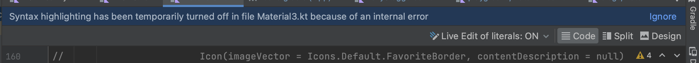
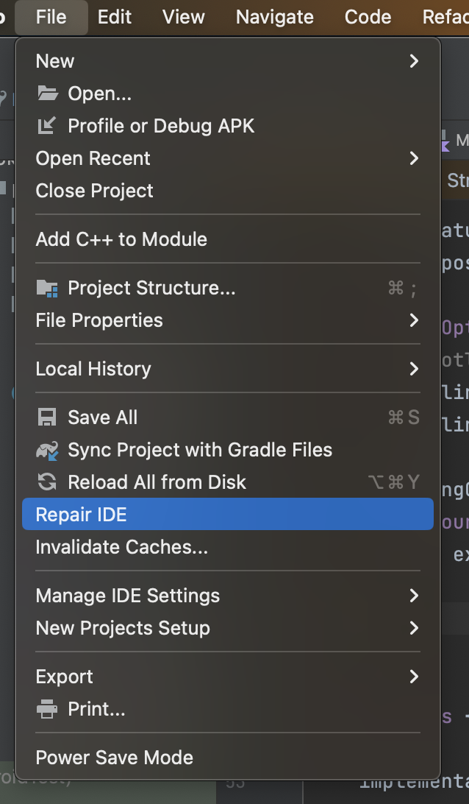
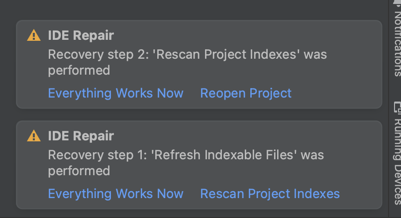
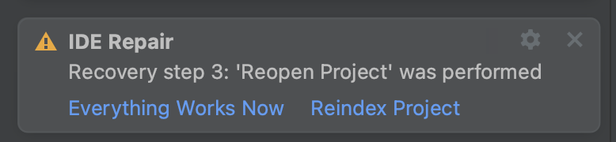

# Syntax highlighting has been temporarily turned off (Android Studio)

Android Studio から
build.gradle (app レベル) の依存関係を更新した時、Android Studio から『Syntax highlighting has been temporarily turned off』と言われ、補完等が一切効かなくなりました。




今回はその解消方法についてメモしておきます。

## 環境

```
Android Studio Flamingo | 2022.2.1
Build #AI-222.4459.24.2221.9862592, built on March 31, 2023
Runtime version: 17.0.6+0-17.0.6b802.4-9586694 aarch64
VM: OpenJDK 64-Bit Server VM by JetBrains s.r.o.
macOS 13.0.1
GC: G1 Young Generation, G1 Old Generation
Memory: 1280M
Cores: 8
Metal Rendering is ON
Registry:
    external.system.auto.import.disabled=true
    ide.text.editor.with.preview.show.floating.toolbar=false
    gradle.version.catalogs.dynamic.support=true

Non-Bundled Plugins:
    com.intellij.lang.jsgraphql (4.0.1-222)
    Dart (222.4560)
    com.localizely.flutter-intl (1.18.1-2022.2)
    com.google.d2c.androidstudio.plugin (0.3.07)
    com.squareup.sqldelight (1.5.5)
    com.jetbrains.kmm (0.5.3(222)-12)
    io.flutter (73.0.2)
```

## 解決方法

まず『File > Repair IDE』をクリックします。



クリックすると内部で修復処理が走り、完了すると右下にポップアップが出てきます。



修復処理には複数ステップあり、ステップ実行後に解消されていたら『Everything Works Now』（左の選択肢）をクリックし、治ってなければ右の選択肢をクリックします。

自分の場合は step3 で治りました！



## そのほか試したこと

- 依存しているライブラリの更新・見直し
- `.idea` の削除

## Links

- [IntelliJ IDE: IDE の修復](https://pleiades.io/help/idea/repair-ide.html)
- [YouTrack: Syntax highlighting has been temporarily turned off in IntelliJ 2022.2.2](https://youtrack.jetbrains.com/issue/KTIJ-22777/Syntax-highlighting-has-been-temporarily-turned-off-in-IntelliJ-2022.2.2)
