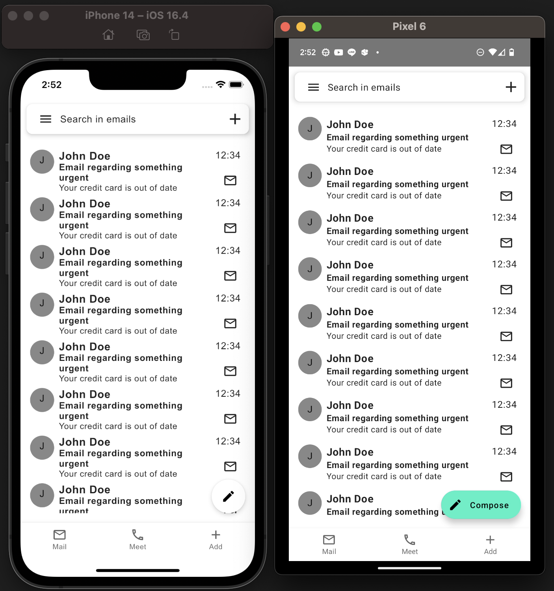

## ついに Compose Multiplatform に iOS がきたぞ！

Compose for iOS は [KotlinConf23 で発表](https://www.youtube.com/watch?v=c4f4SCEYA5Q&t=3314s)されました（2023/04/19 現在 α 版）。

KMM において UI コードを共通化する大本命でもあるため注目度は高かったと思いますが、今回ついに公式から説明があったため触ってみました！。

[目次]

- [ついに Compose Multiplatform に iOS がきたぞ！](#ついに-compose-multiplatform-に-ios-がきたぞ)
- [触ってみる](#触ってみる)
  - [前提条件](#前提条件)
  - [実際に動かしてみる](#実際に動かしてみる)
  - [Android で使ってた jetpack compose を移植してみる](#android-で使ってた-jetpack-compose-を移植してみる)
  - [環境](#環境)
- [感想](#感想)
- [links](#links)
- [おわりに](#おわりに)

## 触ってみる

基本的には[こちらのテンプレートリポジトリ](https://github.com/JetBrains/compose-multiplatform-template)を利用して遊ばせてもらいました。  
（[個人のリポジトリ](https://github.com/kokoichi206-sandbox/ios-jetpack-compose-sample)）

### 前提条件

- テンプレートリポジトリに従い `kdoctor` が正常レスポンスを返すこと
- android studio に kotlin-multiplatform-mobile のプラグインが入ってること

### 実際に動かしてみる

m1 mac でビルドするのに少し手間がかかりましたが、テンプレートリポジトリに従うだけで iOS のシミュレータにビルドできました！

### Android で使ってた jetpack compose を移植してみる

Android で jetpack compose を使っていた方は気になるところかと思いますが、結論から言うと**ほとんど既存コードがそのまま共通コードとして使えました**。

これは [compose-multiplatform のページ](https://github.com/JetBrains/compose-multiplatform#ios)にも ↓ のように書いてあるのでその通りかとは思います。

> Compose Multiplatform shares most of its API with Jetpack Compose, the Android UI framework developed by Google. 
> You can use the same APIs to build user interfaces for both Android and iOS.

余談にはなりますが、**kotlinlang 用の slack ワークスペースに、compose-web, compose-ios のチャンネルがある**あたり、kotlin 側も力を入れてきてることが伺えます。

今回は、既存の jetpack compose のプロジェクトから適当に移植するだけで以下のような UI を作ることができました。
（左: iPhone14 シミュレータ (iOS), 右: Pixel6 実機 (android)）




あとで感想としてまとめますが、『**context, resource 周りにちょっと工夫が必要そう**』ということで、一旦 dialog の表示などは飛ばしてます。　

なお、何もしなくてもデスクトプアプリのビルドも可能です（↓）。


### 環境

実行環境です。

```
- PC
    - macOS version 13.0.1 (mac mini)
    - Apple M1 chip
    - Memory 16 GB
- Android Project
    - android studio: Flamingo | 2022.2.1
    - compose: 1.4.0
    - kotlin: 1.8.20
    - agp: 7.4.2
```


## 感想

- UI 部分については、**ほぼ既存の compose のプロジェクからそのまま移植できる**ので楽！
  - context, resource 周りにちょっと工夫が必要そう
- context は android context なんだな
  - android のコードの中でも、より android より（デバイス・OS）の概念は何なのかの感覚がつきそう
  - context
    - [この辺の実装](https://github.com/JetBrains/compose-multiplatform/blob/1d955a2e6da60f695aee1efb0f1e121177ae88b0/examples/imageviewer/shared/src/commonMain/kotlin/example/imageviewer/filter/BitmapFilter.common.kt#L17-L20)参考になりそう
- 分かってないこと
  - ライフサイクルトリガーのイベントなどをどのように扱うべきか
  - di をどのようにするか
    - koin でできるっぽい
    - Hilt はダメなのか
  - navigation をどうするか
    - decompose とかが候補か？
      - https://github.com/arkivanov/Decompose
    - https://proandroiddev.com/fully-cross-platform-kotlin-applications-almost-29c7054f8f28
- kotlinlang > compose-ios の slack チャンネルがあり、650 人ほどいる
  - ここで解決する疑問も多いかも

## links

- [medium.com: Alpha Release of Jetpack Compose Multiplatform for iOS: A Gamechanger for Mobile Development](https://medium.com/@dheerubhadoria/alpha-release-of-jetpack-compose-multiplatform-for-ios-a-gamechanger-for-mobile-development-388f90118ec6)
- [github: compose-multiplatform-template](https://github.com/JetBrains/compose-multiplatform-template)
- [vkmm-awesome](https://github.com/terrakok/kmm-awesome)
- [大量サンプル](https://github.com/JetBrains/compose-multiplatform/tree/1d955a2e6da60f695aee1efb0f1e121177ae88b0/examples)
  - 更新されまくってる

## おわりに

今回は compose-multiplatform に大本命 iOS が加わったということで、実際に動かして遊んでみました。  
まだ α 版のステータスではありますが、間違いはないと思うのでこれからもおっていきたいです。

Flutter とかとの差別化も気になるところですが、Jetpack Compose, Kotlin が好きなので脳死でつっこみます。
