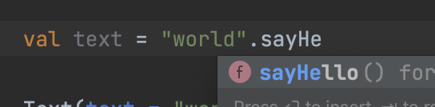
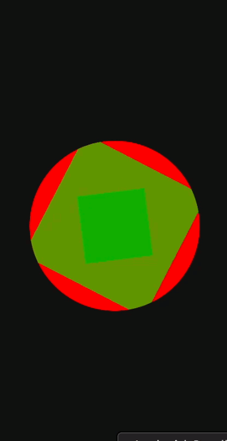

# 拡張関数を使って Jetpack Compose にカスタム Modifier を作成

[Swift](https://docs.swift.org/swift-book/LanguageGuide/Extensions.html), [Kotlin](https://kotlinlang.org/docs/extensions.html) などの言語では拡張関数なるものを定義する事が可能で、好きなクラスにメソッドを生やす事が可能です（`Int` などの基本的なクラスに対してさえ可能）。

今回はこの機能を使って Jetpack Compose でのカスタム Modifier を作成しました。

[目次]

[:contents]

## 環境

```
- compileSdk 33
- kotlinCompilerVersion '1.6'
- compose_ui_version = '1.2.1'
```

## 拡張関数

拡張関数とは、好きなクラスにメソッドを生やすことが可能な機能です（String, Int などにも可能です）。

今回、機能を詳細に説明することは避けますが、理解に必要なため紹介します。

```kotlin
// Int クラスに `square()` というメソッドを生やす例
fun Int.square(): Int {
    return this * this
}

// 呼び出し方
val area = 3.square()
```

```kotlin
// String クラスに `sayHello()` というメソッドを生やす例
fun String.sayHello(): String {
    return "hello ${this}"
}

// 呼び出し方
val text = "world".sayHello()
```

通常のメソッドのように呼び出せて非常に便利です。

もちろん、Android Studio の補完も効きます。



## Modifier とは

### Jetpack compose

[Jetpack Compose](https://developer.android.com/jetpack/compose?gclid=CjwKCAjw-rOaBhA9EiwAUkLV4kUg7H0bd9k-RWEHd4mqakFRc4HolOABbIvXD5ihiOwhAPdScS4WPRoCtNMQAvD_BwE&gclsrc=aw.ds) とは、Android における宣言的 UI ツールキットで、従来の XML を置き換えるものです。

[最新の安定版 version は 1.2.1（2022/10/18 現在）](https://developer.android.com/jetpack/androidx/releases/compose?hl=ja)と比較的新しい技術ですが、すでに多くの国内外の企業で使われており、非常に注目されています。

UI 部分も Kotlin で記述可能なこと、また、Vue, React などのフロントエンドでの宣言的 UI とも考えが似ている部分も導入しやすさにつながっていそうです。

### Modifier

Jetpack Compose での [Modifier](https://developer.android.com/reference/kotlin/androidx/compose/ui/Modifier) は、HTML における CSS 的な位置付けです。

Modifier メソッドを重ねていくことでスタイルを調整する事が可能です。  
（基本は当てた順に適応されていくので、そこは注意が必要です。）

```kotlin
Text(
    text = "Text!!",
    modifier = Modifier
        .fillMaxSize()
        .background(Color.Red)
        .clip(CircleShape)
        .clickable {
            println(" Clicked!!")
        }
)
```

## カスタム Modifier

各要素に同じスタイルを当てたい時などがあると思いますが、そういう時に自分でメソッドを生やしちゃいます。

### Getting Started

Kotlin はトップレベルに関数を宣言する事ができるので、ファイルの好きな部分に以下のように定義します。  
（メソッドチェーンで繋げていくためにメソッドの戻り値を Modifier にしてます。）

```kotlin
// 円形に切り取り、背景を赤くする Modifier
fun Modifier.redBall(): Modifier =
    clip(CircleShape)
        .background(Color.Red)
        .size(250.dp)
```

そして、以下のように redBall を呼んであげます。  
（もちろん、補完も効きます。）

```kotlin
@Composable
fun ModifierTest() {
    Box(
        modifier = Modifier
            .redBall(),
    )
}
```

### composables にアクセスする

状態を管理する変数など、composition にアクセスする必要がある時は、[Modifier.composed](<https://developer.android.com/reference/kotlin/androidx/compose/ui/package-summary#(androidx.compose.ui.Modifier).composed(kotlin.Function1,kotlin.Function1)>) を使ってあげます。

以下は、背景を緑色にしながら指定したサイズに切り取り、一定間隔で回転を続ける Modifier の例です。

```kotlin
fun Modifier.greenBoxRotate(
    size: Dp,
    duration: Int,
): Modifier = composed {

    // この情報を使用するのに composable である必要がある。
    val transition = rememberInfiniteTransition()
    val angleRatio by transition.animateFloat(
        initialValue = 0f,
        targetValue = 1f,
        animationSpec = infiniteRepeatable(
            // tween, keyframes など
            animation = keyframes {
                durationMillis = duration
            },
            // Reverse or Restart
            repeatMode = RepeatMode.Reverse,
        ),
    )

    size(size)
        .graphicsLayer(
            rotationZ = 360f * angleRatio,
            alpha = 1f * angleRatio,
        )
        .background(Color.Green)
}
```

実際に Modifier を使ってみた例はこちらになります。

```kotlin
@Composable
fun ModifierTest() {

    Box(
        modifier = Modifier
            .redBall(),
        contentAlignment = Alignment.Center,
    ) {
        Box(
            modifier = Modifier
                .greenBoxRotate(
                    size = 100.dp,
                    duration = 3000,
                )
        )
        Box(
            modifier = Modifier
                .greenBoxRotate(
                    size = 200.dp,
                    duration = 1200,
                )
        )
    }
}
```

謎の動きが完成しました。



## おわりに

Kotlin を使える、それだけで Android を書く理由になりそう。
