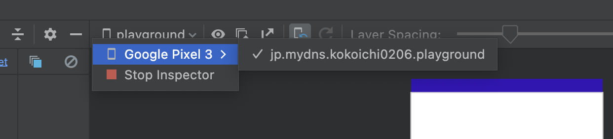
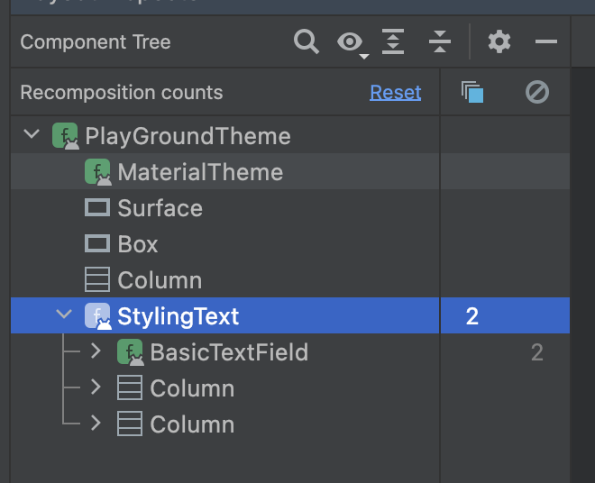

# Jetpack Compose をデバッグする方法

今回は [Android Studio の Layout Inspector](https://developer.android.com/studio/debug/layout-inspector?hl=ja) Jetpack Compose のを使ってみていくことになります。

## 環境

```
- Android Studio: Android Studio Dolphin | 2021.3.1
- kotlinCompilerVersion '1.6'
- compose_ui_version = '1.2.1'
```

## 確認方法

右下の方に `Layout Inspector` と書かれたボタンがあるので押します。

中央を確認し、自アプリのプロセスが選択されてない時は、端末・アプリを選択します。



すると、下の写真のようなことが分かります。

- 構成されている composal の情報
- 何回 recomposition されたか
  - 何回スキップされたか



また属性値も確認できます。


これを使って詳細なサイズ調整や、無駄な recomposition を見つけてパフォーマンスを上げることができそうです！
