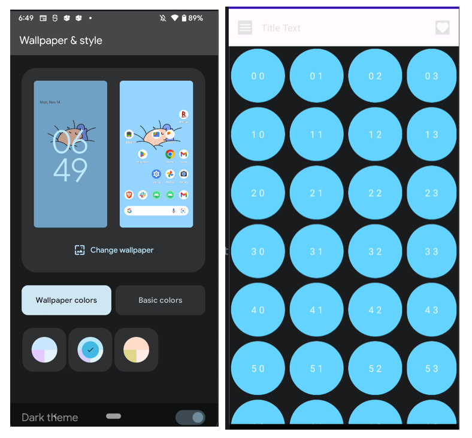
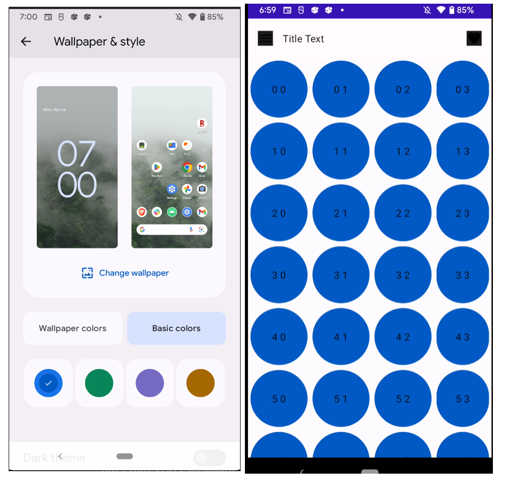
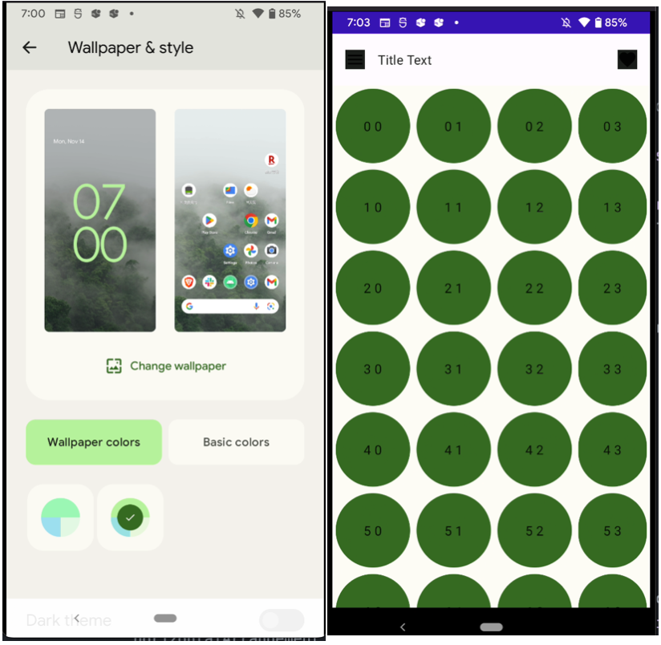

# Jetpack Compose で Material You を使う

今回は、Jetpack compose で Material You を使う方法についてメモしておきます。

なお、今回の内容は[『Android DevSummit "Material You in Compose apps"』](https://www.youtube.com/watch?v=xS4GpdIQUEo&list=PLWz5rJ2EKKc92MGTd1CgUtXZfhA74nUpb&index=40&ab_channel=AndroidDevelopers)から学んだものとなります。

## 環境

```
- kotlinCompilerVersion '1.6'
- compose_ui_version = '1.3.0-beta03'
- androidx.compose.material3:material3:1.1.0-alpha02
- androidx.compose.material3:material3-window-size-class:1.1.0-alpha02
```

## Material You

Material You とは、個々人の設定に合わせてアプリ内の色（や形？）をカスタマイズしてくれるような機能です。  
こちらの機能は Android OS 12 (API31) で追加されました。

今回は、個人の**背景設定の色に合わせてアプリ内で使用する色を変え**てみました。

### 使用準備

最初にプロジェクトを作成するときに material3 を選択しなかった場合、アプリレベルの `build.gradle` に次のライブラリを追加します。

```
dependencies {
    ...
    implementation("androidx.compose.material3:material3:1.1.0-alpha02")
    implementation("androidx.compose.material3:material3-window-size-class:1.1.0-alpha02")
}
```

色をダイナミックに変化させていくには、[dynamicDarkColorScheme](<https://developer.android.com/reference/kotlin/androidx/compose/material3/package-summary#dynamicDarkColorScheme(android.content.Context)>) 等を使います。  
ここでは、ダークモードかそうじゃないかで切り替えたいため [isSystemInDarkTheme](<https://developer.android.com/reference/kotlin/androidx/compose/foundation/package-summary#isSystemInDarkTheme()>) を使っています。

```kotlin
@OptIn(ExperimentalMaterial3Api::class)
@Composable
fun MaterialYouTest() {
    // API31 で追加された機能のため確認する。
    val dynamicColor = Build.VERSION.SDK_INT >= Build.VERSION_CODES.S
    val dark = isSystemInDarkTheme()
    val colorScheme = if (dynamicColor) {
        if (dark) {
            dynamicDarkColorScheme(LocalContext.current)
        } else {
            dynamicLightColorScheme(LocalContext.current)
        }
    } else {
        // 普通のカラースキームを使う。
        if (dark) {
            darkColorScheme()
        } else {
            lightColorScheme()
        }
    }
    ...
}
```

### 使うとき

ここで定義した `colorScheme` を次のように使っていきます。

```kotlin
Box(
    modifier = Modifier
        .size(100.dp)
        .clip(CircleShape)
        .background(colorScheme.primary),
)
```

### 確認してみる

[こちらのコード](https://github.com/kokoichi206/android-app/blob/master/PlayGround/app/src/main/java/jp/mydns/kokoichi0206/playground/blogs/MaterialYou.kt)でどのように変化するかを確認してみました。

『Wallpaper & style > Basic colors』の色が反映されてるように見えます。








## Links

- https://developer.android.com/reference/kotlin/androidx/compose/material3/package-summary#dynamicDarkColorScheme(android.content.Context)
- https://m3.material.io/get-started
- https://foso.github.io/Jetpack-Compose-Playground/cookbook/detect_darkmode/
- https://developer.android.com/reference/kotlin/androidx/compose/material3/package-summary#ModalDrawerSheet(androidx.compose.ui.Modifier,androidx.compose.ui.graphics.Shape,androidx.compose.ui.graphics.Color,androidx.compose.ui.graphics.Color,androidx.compose.ui.unit.Dp,androidx.compose.foundation.layout.WindowInsets,kotlin.Function1)

## おわりに

普通のアプリでは UI 的に使いたい色がるため使う機会は少ないと思いますが、電卓などの汎用的なアプリではいい感じにユーザー毎のカスタマイズが可能になりそうな気がします！
