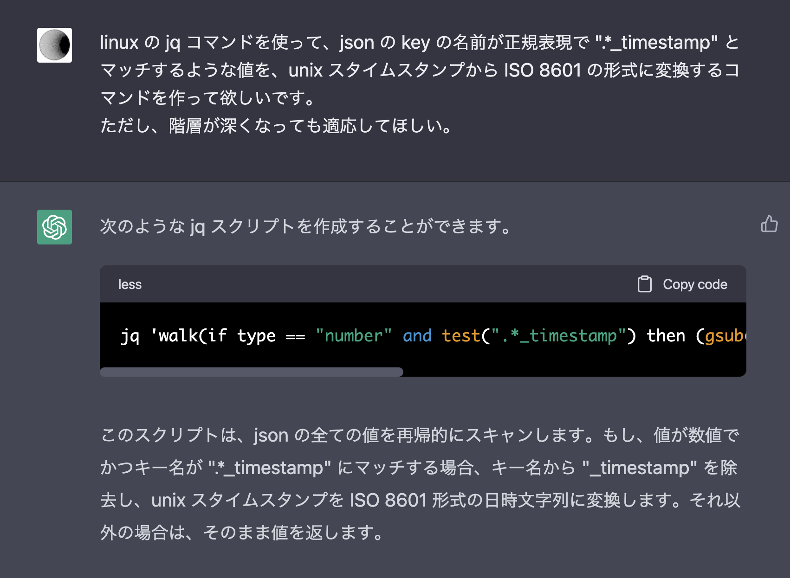

# jq: 階層化された json で UNIX タイムスタンプ を ISO 8601 形式の時間に変換する

**TOC**

- [目標](#目標)
- [結論](#結論)
- [解説](#解説)
  - [多階層を扱う](#多階層を扱う)
  - [jq で時刻を扱う](#jq-で時刻を扱う)
  - [文字列操作](#文字列操作)
  - [メモ](#メモ)
  - [疑問](#疑問)
- [おまけ](#おまけ)

## 目標

↓ の 1 つ目の json を 2 つ目の json のように変換することです。

`.*_timestamp` の key を持った部分をターゲットとし、key から `_timestamp` の suffix を削除、value を unixtimestamp から ISO 8601 形式に変換します。

```json
{
  "start_timestamp": "1674256062",
  "end_timestamp": "1675256062",
  "settings": {
    "start_timestamp": "1674256062",
    "3rd_layer": {
      "start_timestamp": "1674256062",
      "comment": "hoge"
    }
  },
  "name": "me"
}
```

```json
{
  "start": "2023-01-21T08:07:42+0900",
  "end": "2023-02-01T21:54:22+0900",
  "settings": {
    "start": "2023-01-21T08:07:42+0900",
    "3rd_layer": {
      "start": "2023-01-21T08:07:42+0900",
      "comment": "hoge"
    }
  },
  "name": "me"
}
```

## 結論

時間がない人のために、先に結論を書いておきます。

```sh
cat input.json |\
    jq 'walk(if type == "object" then with_entries( if (.key | test(".*_timestamp")) then (.value = (.value | strptime("%s") | strftime("%FT%T%z")) | .key |= gsub("_timestamp";"")) else . end ) else . end)'
```

## 解説

jq 初心者なので大した説明はできませんが、何を使ったのかだけ記載しておきます。

### 多階層を扱う

[walk](<https://stedolan.github.io/jq/manual/#walk(f)>) と [with_entries](https://stedolan.github.io/jq/manual/#to_entries,from_entries,with_entries) を使います。

with_entries を挟むことで key, value の両方を取り扱いやすくし、それを walk で全階層に当てはめるイメージです。

```sh
# 公式の walk の例
$ cat in.json
[[4, 1, 7], [8, 5, 2], [3, 6, 9]]

# sort 関数を深い階層にまで当てはめる
$ cat | in.json | jq 'walk(if type == "array" then sort else . end)'
[[1,4,7],[2,5,8],[3,6,9]]

# 公式の walk の例 その 2
$ cat in.json
[ { "_a": { "__b": 2 } } ]
# .key |= sub( "^_+"; "") という関数を深い層にまで当てはめてるイメージ
# |= は便利なので覚えたい
$ cat in.json | jq 'walk( if type == "object" then with_entries( .key |= sub( "^_+"; "") ) else . end )'
[{"a":{"b":2}}]
```

なお、jq には上の sort ような便利なメソッドがたくさんあるので、jq を毎回適当に調べてるよって方は[マニュアル](https://stedolan.github.io/jq/manual/)をみてみると新たな発見があるかもしれません。

### jq で時刻を扱う

最初何も知らなかったときは『date コマンド叩けたらな〜』とか思ってたのですが、`jq` コマンドの中に時刻を扱うメソッドを[いくつか用意してくれている](https://stedolan.github.io/jq/manual/#Dates)ようです。

`strflocaltime`, `strptime`, `strftime` などの関数が C ライブラリから提供されていますが、どれも安定版として考えるのはやめてね、とのことです。
（以下のような注意書きがあり）

> Note: these are not necessarily stable interfaces in jq,
> particularly as to their localization functionality.

しかし今回は気にせず使います。

strptime, strftime などの使い方の説明はしませんが、いくつか例だけ。

```sh
# timestamp が number で定義されてる場合
$ cat in.json
{"timestamp": 1675256062}

# strftime で可能
$ cat in.json | jq 'map_values(strftime("%FT%T%z"))'
{
  "timestamp": "2023-02-01T12:54:22+0900"
}

# timestamp が string で定義されてる場合
$ cat in_str.json
{"timestamp": "1675256062"}
# strftime だとエラーになる
$ cat in_str.json | jq 'map_values(strftime("%FT%T%z"))'
jq: error (at <stdin>:3): strftime/1 requires parsed datetime inputs
# 1 回 strptime を挟んでから strftime を通すといける
$ cat in_str.json | jq 'map_values(strptime("%s") | strftime("%FT%T%z"))'
{
  "timestamp": "2023-02-01T21:54:22+0900"
}
```

タイムゾーンの考慮が少し足りないかもしれないが、`%z` をつけたらローカルのタイムゾーンになるはず。

### 文字列操作

[test](<https://stedolan.github.io/jq/manual/#test(val),test(regex;flags)>) や [gsub](<https://stedolan.github.io/jq/manual/#gsub(regex;string),gsub(regex;string;flags)>)(文字列を切り取る)では、通常の正規表現が使えます。

### メモ

- `|=` は便利なので覚えておきたい
- [マニュアル](https://stedolan.github.io/jq/manual)はかなり詳しい

### 疑問

- with_entries を挟むと key, value になるはずなのだが、どこで元の形式（初期の json）に戻ってるのかがあまり理解できてない

## おまけ

このスクリプトは ChatGPT さんと相談させていただきながら作成しました。

そのままでバチっと動くものを出してくれることは少ないですが、非常に参考になる意見が多く刺激になります。  
私の当面の目標は ChatGPT さんが一発で回答できるような質問力をつけることです。


