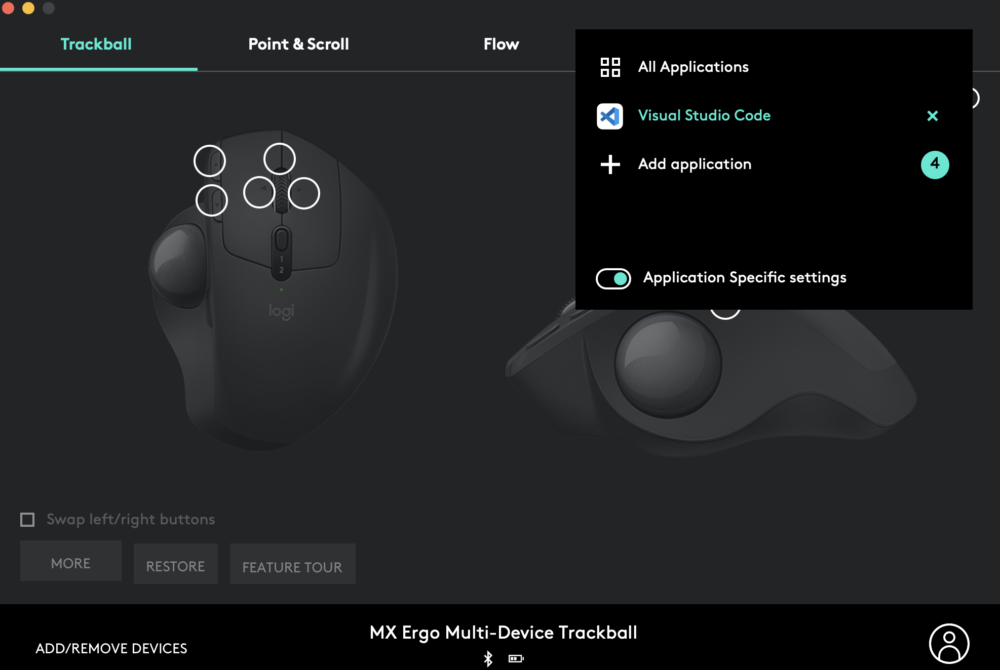
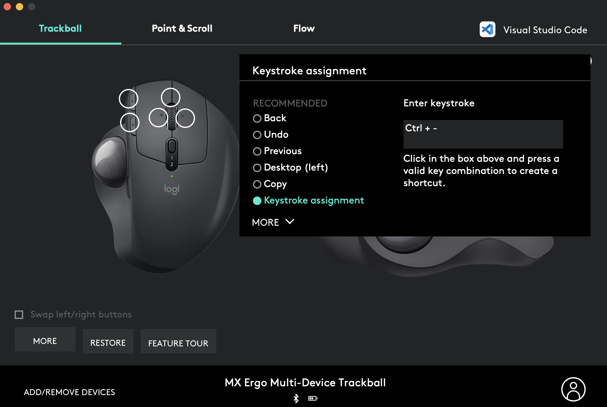

## Logicool の進む・戻るボタンが Mac の VSCode で使えなかった

Logicool のマウスを Logi Options のアプリとともに使っていたのですが、VSCode での戻る・進むボタンが機能しない問題が発生しました。

windows では機能するのにな〜とか思って VSCode の設定とかいろいろ探してたのですが、最終的には [GitHub のこちらの Issue](https://github.com/microsoft/vscode/issues/88029#issuecomment-725498758) に従うことで（暫定的に？）解決しました。

## 環境

```
本体
  M1 Mac mini
  OS: Ventura 13.0.1
VSCode
  Version: 1.78.0 (Universal)
  Commit: 252e5463d60e63238250799aef7375787f68b4ee
  Electron: 22.4.8
  Chromium: 108.0.5359.215
  Node.js: 16.17.1
  V8: 10.8.168.25-electron.0
  OS: Darwin arm64 22.1.0
  Sandboxed: No
Mouse
  MX ERGO MXTB1s
  Logi Options
```

## 解決策

[こちらの Issue](https://github.com/microsoft/vscode/issues/88029#issuecomment-725498758) のままですが。

まず 『Logi Options』の右上を押して VSCode 用の設定を作ります。



次に ↓ の写真のように『戻るジェスチャー』に『Ctrl + -』,『進むジェスチャー』に『Shift + Ctrl + -』を割り当てます。



## おわりに

windows では効くのに mac では効かなかったので結構困ってました。  
最近はよく GitHub の Issue に助けられています。
