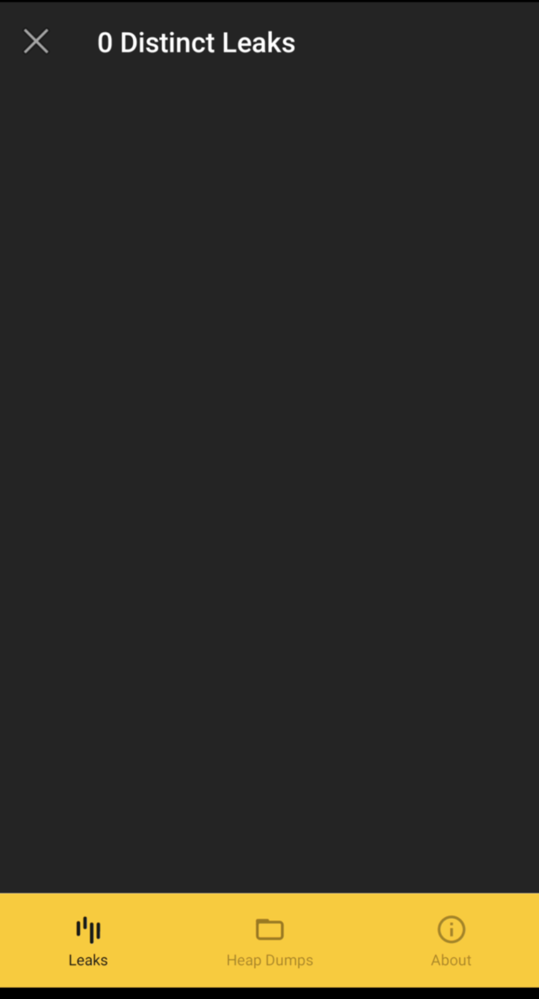
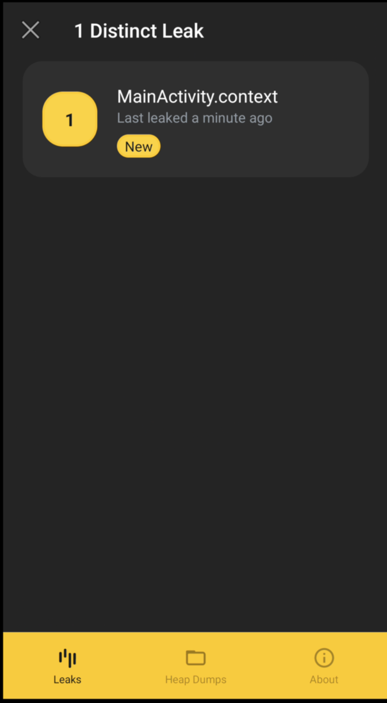
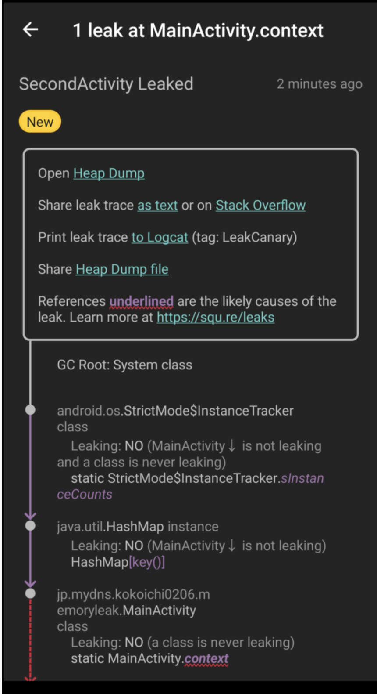

# android でメモリーリークを検知する！

## メモリーリークとは
Java のランタイムの文脈においてメモリーリークとは、**ガベージコレクション (GC) と強く関連しています**。具体的には、必要無くなったオブジェクトの参照を持ち続け、GC が削除をいつまでも行わないことを指します。

すぐにバグを引き起こすわけではありませんが、リソースが限られている Android においては OOM (out of memory) crash を引き起こす可能性があります。

また、GC を挙動を知る必要もあるため、リークを検知するのも防ぐのも簡単ではありません。

[目次]

[:contents]

## android で検知する
android で簡単にメモリーリークを調べるには、[LeakCanary](https://github.com/square/leakcanary/)というライブラリを使用します。

### 依存関係を追加する
```
dependencies {
    ...
    // to detect memory leak
    debugImplementation 'com.squareup.leakcanary:leakcanary-android:2.8.1'
}
```

### 使い方
上で依存関係を導入したら、あとはアプリを debug モードでビルドするだけです。

ビルドが完了すると、作成中ののアプリとは別アプリとして、以下のアイコンのアプリがインストールされています。


このアプリを開いてみると以下のような画面が表示されます。



このままだと面白くないので、意図的にメモリーリークを発生させてみます。

### メモリーリーク発生時
メモリーリークが検知されると、アプリ内に以下のような通知が出ます。



より詳細ページを見てみます。




どこで発生したかや、どのくらいの量のメモリーリークが発生しているか、その詳細が記載されています。


### 使用できない！
debug モードでビルドするだけなのですが、自分の場合は Logcat に以下のようなメッセージがでて使用できませんでした。

```
D/LeakCanary: LeakCanary is currently disabled: test class org.junit.Test was found in classpath.
D/LeakCanary: Setting up flushing for Thread[LeakCanary-Heap-Dump,5,main]
```

そこで、[こちらのドキュメント](https://square.github.io/leakcanary/changelog/#api-breaking-bettering-changes)に従い次の１文を`res/values/strings.xml`に追加することで解決しました。

``` xml
<resources>
    ...
    <!-- to detect memory leak -->
    <string name="leak_canary_test_class_name">assertk.Assert</string>
</resources>
```

この時は Logcat のメッセージが以下のようになっていて、検知する準備が整っていることがわかります。

```
D/LeakCanary: LeakCanary is running and ready to detect memory leaks.
D/LeakCanary: Setting up flushing for Thread[LeakCanary-Heap-Dump,5,main]
```


## おわりに
ドキュメントにはリソースファイルをどこに追加するかが書かれてなかったので少し戸惑いましたが、今作ってるアプリにメモリーリークがなくてよかったです。

定期的に確認していきたいと思います（もしくは自動で確認するフローを作りたいです）
