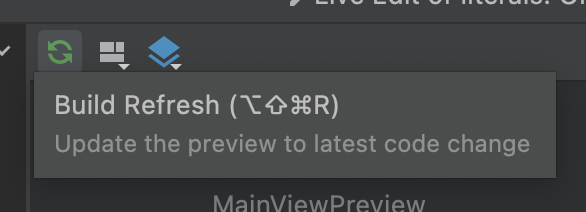
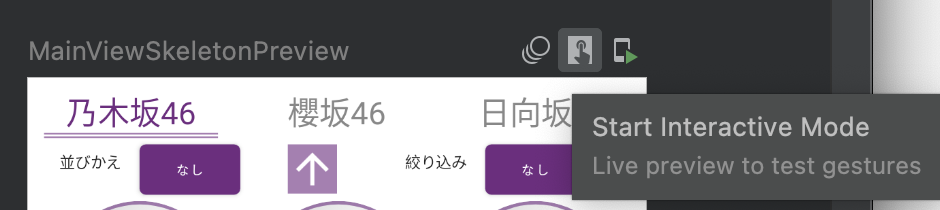

# Android のマルチモジュール化で Preview の高速化

今回は Android のプロジェクトをマルチモジュール化し、Jetpack Compose の Preview を高速化してみました。

**[目次]**

- [環境](#%E7%92%B0%E5%A2%83)
- [マルチモジュール化のメリット](#%E3%83%9E%E3%83%AB%E3%83%81%E3%83%A2%E3%82%B8%E3%83%A5%E3%83%BC%E3%83%AB%E5%8C%96%E3%81%AE%E3%83%A1%E3%83%AA%E3%83%83%E3%83%88)
  - [デメリット](#%E3%83%87%E3%83%A1%E3%83%AA%E3%83%83%E3%83%88)
- [マルチモジュール化の方法](#%E3%83%9E%E3%83%AB%E3%83%81%E3%83%A2%E3%82%B8%E3%83%A5%E3%83%BC%E3%83%AB%E5%8C%96%E3%81%AE%E6%96%B9%E6%B3%95)
- [プレビュー速度の向上](#%E3%83%97%E3%83%AC%E3%83%93%E3%83%A5%E3%83%BC%E9%80%9F%E5%BA%A6%E3%81%AE%E5%90%91%E4%B8%8A)
- [Links](#links)
- [おわりに](#%E3%81%8A%E3%82%8F%E3%82%8A%E3%81%AB)

## 環境

```
- PC
    - macOS version 12.4
    - Apple M1 chip
    - Memory 16 GB
- Android Project
    - compose "1.3.0-rc01"
    - kotlin "1.7.1"
```

## マルチモジュール化のメリット

- **ビルド時間の短縮**
  - 2 回目以降のビルドは、**変更の入ったモジュールのみ**になるため速い！
- レイヤー間の**依存関係の強制**
- 各モジュールの関心ごとを小さくできる
  - package ではクラスのグルーピングしかできないが、レイアウトファイルや resource 等も含めたグルーピングが可能！
  - string, layout, manifest 等が機能単位に集約され、見やすい
  - internal 修飾子による、モノリスより柔軟な可視性制御
- **Compose の Preview も速くなる**

特に『Compose の Preview を速くする』ことを目的に、今回はとあるプロジェクトをマルチモジュール化してみました。

### デメリット

メリットだけだと不公平なので、デメリットも思いつく限り記載しておきます。

- 初回ビルドは時間がかかる
  - らしい
  - 対象モジュールを結合するため
- 浅いモジュールを作りすぎると、複雑性が増して保守しにくくなる
  - 分割の仕方大事そう

## マルチモジュール化の方法

[『既存の Android アプリを multi-module project 化』](https://droidkaigi.github.io/codelab-2020/ja/index.html#3)のサイトが詳しいですが、概略としては以下のステップで可能です。

1. File > New > New Module
   - 何もなければ No Activity で
1. フォルダ構造を変更（refactor）
   1. settings.gradle も変更する
   1. `':data'` -> `':core:data'`
1. 余計なファイルを削除する
   - `drawable` など

module にするときは、`build.gradle > plugins` の `com.android.application` の値を `com.android.library` に変更します。

```
// module になる側
plugins {
    // id 'com.android.application'
    id 'com.android.library'
    ...
}
```

また、module を import したい時は、`build.gradle` に以下のように記載します。

```
// module を使う側
android {
    ...
}
dependencies {
    ...
    // modules
    implementation project(":core:common")
    implementation project(":core:domain")
}
```

（[実際にやった対応](https://github.com/android-project-46group/android/pull/85)と[リポジトリ](https://github.com/android-project-46group/android)です。）

## プレビュー速度の向上

Jetpack Compose には UI を即座に確認できる『`Preview`』が用意されております。

```kotlin
@Preview
@Composable
fun MainViewPreview() {
    val uiState = MemberListUiState()

    CustomTheme() {
        MainView(uiState = uiState)
    }
}
```

ここでは `Preview` を行う際に重要となる次の 3 つの動作について、それぞれ変更前と後で時間を比較しました。

- 1. Build Refresh
  - Preview の内容を変更した際に変更を反映させます。
  - 
- 2. Start Interactive Mode
  - `Interactive Mode`（Preview Mode でタッチ操作可能なモード）を有効にする
  - 
- 3. Stop Interactive Mode
  - `Interactive Mode` を止める

それぞれ 3 回ずつ測定し平均を求めております。

| 変更前 |                    | マルチモジュール |
| :----: | :----------------: | :--------------: |
|  12.1  |      1.Build       |       7.5        |
|  9.5   | 2.Start<br/>画面 1 |       2.6        |
|  11.2  | 2.Start<br/>画面 2 |       2.9        |
|  8.7   | 3.Stop<br/>画面 1  |       3.2        |
|  9.3   | 3.Stop<br/>画面 2  |       2.7        |

**2~3 倍程度速度の高速化**が確認できました。

## Links

- [Sansan Android アプリ開発におけるマルチモジュール化の進め方 / Approaches to multi-module development in Sansan Android app](https://speakerdeck.com/sansanbuildersbox/approaches-to-multi-module-development-in-sansan-android-app)
- [既存の Android アプリを multi-module project 化](https://droidkaigi.github.io/codelab-2020/ja/index.html#3)
- [now in android](https://github.com/android/nowinandroid)

## おわりに

今までは正直、Preview の動作が重くて使ってなかったのですが、これでようやく使い物になりそうです。

また、マルチモジュール化を行うことで各レイヤー・各画面の責務を考えるきっかけになったのでよかったです。
