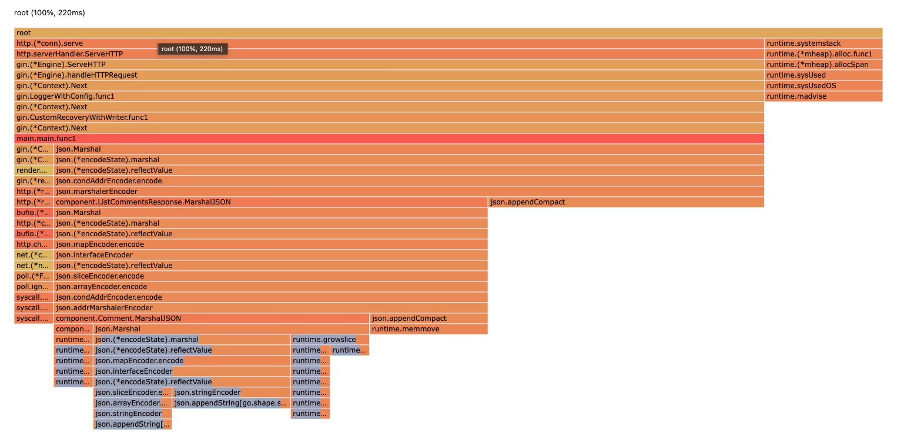
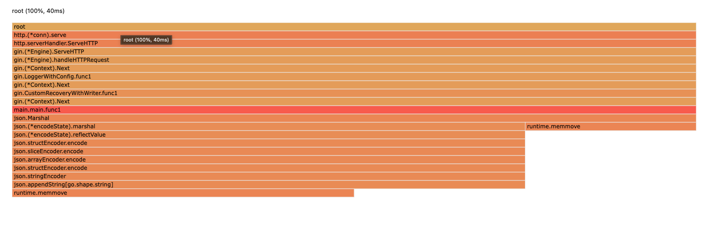

# openapi-generator の作る Go の構造体を使ったら json.Marshal が5倍以上遅くなった

openapi から Go のコードを生成するツールとしては、[oapi-codegen](https://github.com/deepmap/oapi-codegen), [ogen](https://github.com/ogen-go/ogen) などが勢いありますが、今回は [openapi generator](https://github.com/OpenAPITools/openapi-generator) にまつわる話をします。

このライブラリで**生成されたコードに起因して、json の Marshal (構造体を json に変換する処理) が極端に（5倍以上）遅くなって**しまう事件が発生しました。

```
* [生成手順と生成コード](#生成手順と生成コード)
  * [MarshalJSON を削除してみた](#marshaljson-を削除してみた)
* [差分は何か](#差分は何か)
  * [pprof による観察](#pprof-による観察)
  * [直感的な理解](#直感的な理解)
* [おわりに](#おわりに)
```

## 生成手順と生成コード

実際の生成は docker を通して行なっています。

``` makefile
current_dir := $(shell pwd)

.PHONY: gen
gen: clear
	docker run --rm -v $(current_dir):/project openapitools/openapi-generator-cli:v7.0.0 \
		generate -i /project/openapi.yaml -g go \
		--additional-properties=packageName=component -o /project/gen/component -p enumClassPrefix=true

.PHONY: clear
clear:
	ls gen/component | xargs -n1 | grep -v ".openapi-generator" | xargs -I{} rm -r "gen/component/{}"
```

最終的には、以下のようなコードが生成されます（例）。

``` go
func (o Pet) MarshalJSON() ([]byte, error) {
	toSerialize,err := o.ToMap()
	if err != nil {
		return []byte{}, err
	}
	return json.Marshal(toSerialize)
}

func (o Pet) ToMap() (map[string]interface{}, error) {
	toSerialize := map[string]interface{}{}
	if !IsNil(o.Id) {
		toSerialize["id"] = o.Id
	}
	toSerialize["name"] = o.Name
	if !IsNil(o.PhotoUrls) {
		toSerialize["photoUrls"] = o.PhotoUrls
	}
	if !IsNil(o.Status) {
		toSerialize["status"] = o.Status
	}
	return toSerialize, nil
}
```

一般に、構造体を json に変換するときは [json#Marshaler](https://pkg.go.dev/encoding/json#Marshaler) のインタフェースが使われており、上記のように各自で独自の MarshalJSON を実装することも可能です。

実装しなくても基底型の Marshaler が使われることになるため、普段から意識することは少なく、実際今回も生成されてることを忘れていました。

### MarshalJSON を削除してみた

JSON の変換に時間がかかっており、さまざまなサードパーティ製のライブラリを探す中で MarshalJSON が余計なことをしてる説が浮上し、削除したものと単純に時間を比べてみました。

``` sh
# 19.3 MB の JSON で比較

# 特徴
# {
#  "total": 20000,
#  "result": [
#   {
#     "a": "ほげほげ",
#     "b": "aaa",
#     "date": "2021/01/27 01:04:48",
#     "highlight": [
#       "Xxx"
#     ],
#     "c": "59876"
#   },
#  ]
# }

# MarshalJSON 削除前（デフォルト）
average: 235 ms (num=10)

# 削除後
average: 37 ms (num=10)
```

**MarshalJSON がある状態とない状態（削除後）で 5 倍以上の差が**ついてしまってることがわかります。

もちろん構造体の性質・データ量にもよると思いますが、これほどの差が生まれてしまうとちょっとしんどいものがあります。。。

## 差分は何か

### pprof による観察

json.Marshal 部分を調査するために以下のように pprof を差し込みます。

``` go
type ave struct {
	num   int
	total int
}

var av ave

// https://pkg.go.dev/runtime/pprof
func startCPUProf(fileNameSuffix string) (closer func(), err error) {
	fc, err := os.Create(fmt.Sprintf("cpu-%s.prof", fileNameSuffix))
	if err != nil {
		return nil, fmt.Errorf("failed to create cpu profile: %w", err)
	}

	closer = func() {
		pprof.StopCPUProfile()

		if err := fc.Close(); err != nil {
			//nolint:forbidigo
			fmt.Printf("failed to close: %v\n", err)
		}
	}

	if err := pprof.StartCPUProfile(fc); err != nil {
		closer()

		return nil, fmt.Errorf("failed to start cpu profile: %w", err)
	}

	return
}

func main() {
	runtime.GOMAXPROCS(1)
	r := gin.Default()
	r.Handle("GET", "/comments", func(c *gin.Context) {
		bytes, err := os.ReadFile("res.json")
		if err != nil {
			c.Status(http.StatusInternalServerError)
			return
		}

		var res component.ListCommentsResponse
		json.Unmarshal(bytes, &res)

		start := time.Now()

		cc, err := startCPUProf(start.Format("2006-01-02T15-04-05"))
		if err != nil {
			log.Fatal(err)
		}
		defer cc()

		rawBytes, err := json.Marshal(res)
		if err != nil {
			log.Fatal(err)
		}

		cost := time.Since(start).Milliseconds()
		fmt.Printf("time.Since(start).Milliseconds() %v\n", cost)

		av.num++
		av.total += int(cost)
		fmt.Printf("%v\n", av.total/av.num)

		c.Data(http.StatusOK, "application/json", rawBytes)
	})

	r.Run()
}
```

『MarshalJSON のメソッドあり・なし』のものでそれぞれ pprof を出力し、その差分を取ってみました。

``` sh
$ go tool pprof -diff_base cpu.prof cpu-method.prof
Type: cpu
Time: Oct 29, 2023 at 10:45pm (JST)
Duration: 504.39ms, Total samples = 40ms ( 7.93%)
Entering interactive mode (type "help" for commands, "o" for options)
(pprof) top
Showing nodes accounting for 120ms, 300.00% of 40ms total
Showing top 10 nodes out of 39
      flat  flat%   sum%        cum   cum%
      50ms 125.00% 125.00%       90ms 225.00%  encoding/json.appendCompact
      50ms 125.00% 250.00%       50ms 125.00%  runtime.madvise
      30ms 75.00% 325.00%       40ms   100%  encoding/json.stateInString
     -30ms 75.00% 250.00%      -30ms 75.00%  runtime.memmove
      10ms 25.00% 275.00%       10ms 25.00%  runtime.gopreempt_m
      10ms 25.00% 300.00%       10ms 25.00%  runtime.memclrNoHeapPointers
```

pprof を単体で見た時のグラフも載せておきます。

| MarshalJSON あり | MarshalJSON なし |
| :---: | :---: |
|  |  |


### 直感的な理解

MarshalJSON の実装の中で、string を key とする **interface** に詰め込んでました。
せっかく型情報を持っているのに**わざわざ any に落とす必要がなく**、最終的な Marshal 時に必要な情報が足りなくなることが想定されます。

実際『MarshalJSON あり』の右側の図の中には、（下の方に）reflect.(*MapIter).Value など、遅**いとされている reflect メソッドが多数呼ばれて**います。

## おわりに

普通に generate させただけなのにめちゃめちゃ遅くなっててビビりました。

nullable 属性の扱い方などはありますが、上記のような実装をしたい理由はわかってないです。
何か思いつくことあれば教えてください！
