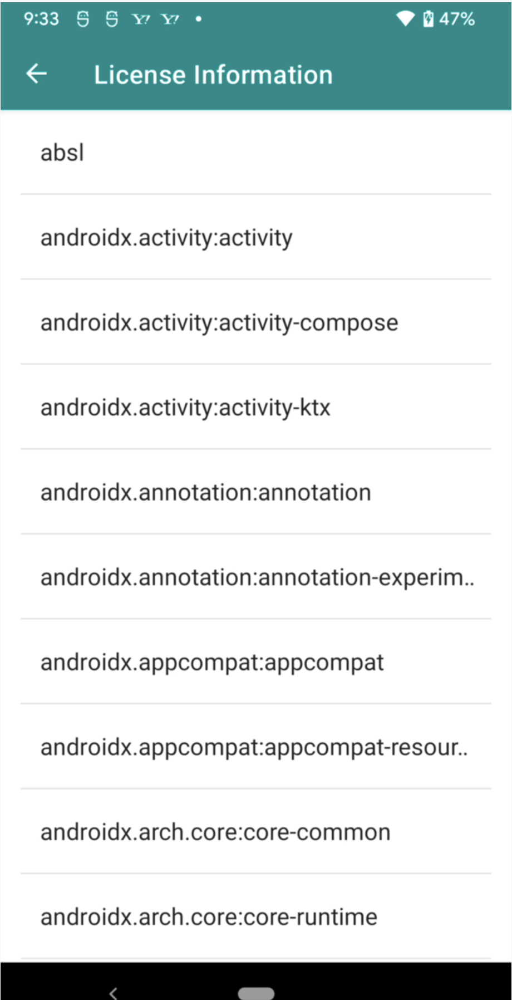

# Android アプリ内で使用 OSS を表示させる
今回は、必要な OSS の一覧を [Google Play services
](https://developers.google.com/android/guides/opensource) を使って簡単に表示させてみたいと思います。

注意点としては、表示のために新たに** Activity を立ち上げる必要があることです。**

**見た目**




## 環境
```
- Android Studio: Arctic Fox | 2020.3.1
- gradle: build:gradle:7.0.4
- 使用api: services-oss-licenses:17.0.0
```


## 実装

### プロジェクトレベルの build.gradle
`dependencies`に、次の classpath を追加します。

```
buildscript {
    ...
    dependencies {
        ...
        classpath 'com.google.android.gms:oss-licenses-plugin:0.10.4'
    }
}
```

### アプリレベルの build.gradle
`plugins`と`dependencies`に必要なものを追加します。

`'com.android.application'`が追加されていることを確認するようにしてください。

```
plugins {
    ...
    id 'com.android.application'
    id 'com.google.android.gms.oss-licenses-plugin'
}


android {
    ...
}


dependencies {
    ...
    // OSS License display
    implementation 'com.google.android.gms:play-services-oss-licenses:17.0.0'
}
```

### AndroidManifest に登録
activity を登録しておきます

``` xml
<?xml version="1.0" encoding="utf-8"?>
<manifest ...>
    <application
        ...>
        ...

        <activity
            android:name="com.google.android.gms.oss.licenses.OssLicensesMenuActivity"
            android:theme="@style/Theme.CountDownTimer" />
        <activity
            android:name="com.google.android.gms.oss.licenses.OssLicensesActivity"
            android:theme="@style/Theme.CountDownTimer" />
    </application>
</manifest>
```


### 使い方
表示させたいタイミングで、以下のような Activity をスタートさせます。

``` kotlin
import com.google.android.gms.oss.licenses.OssLicensesMenuActivity

startActivity(Intent(this, OssLicensesMenuActivity::class.java))
```

POM dependencies というものに基づきアプリに関与した OSS を表示してくれているため、おそらく大量のライセンスが表示されると思います。

また、タップすることで個別のライセンスを表示できます。

### 生成物
表示されているライセンス情報一覧は、以下の build フォルダに生成されています。

`app/build/generated/third_party_licenses/res/raw/`


## Links
- [oss-licenses-plugin (GitHub)](https://github.com/google/play-services-plugins/tree/master/oss-licenses-plugin)
- [Google Play services (official)](https://developers.google.com/android/guides/opensource)

## おわりに
OSS の利用規約により、使用 OSS のライセンスを表示させないといけないケースは多いと思います。とはいえ、そこに多くの時間はかけられないので、このようなものを公式が用意してくれているのはありがたいです。
