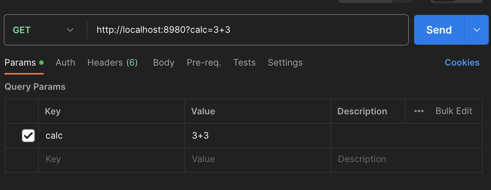
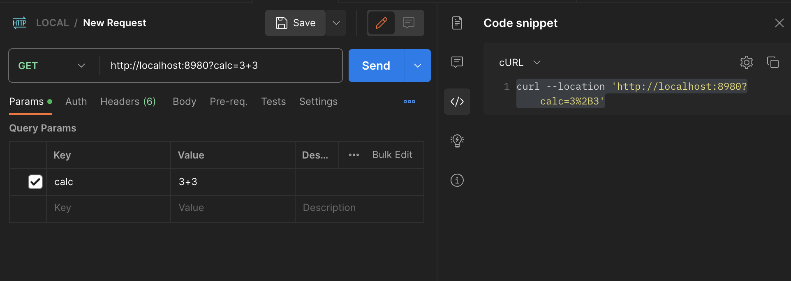

# Postman でパラメーターは URL エンコードされないらしい

結論としてはタイトルの通り『Postman でパラメーターは URL エンコードされない』っていうことなんですが、これに気づかず時間を無駄にしてしまったため共有させてください。

## Postman のバージョン

m1 mac で以下のバージョンのデスクトップアプリを使ってます。

```
Version 10.15.1
UI Version: 10.15.1-ui-230614-0648
Desktop Platform Version: 10.15.0 (10.15.0)
```

## 本当にエンコードされないのか

Postman のドキュメントを見ると、[以下のように書いてあります](https://learning.postman.com/docs/sending-requests/requests/#sending-parameters)が、実動を確認してきます。

> Parameters aren't automatically URL-encoded.
> Right-click selected text, and choose EncodeURIComponent
> to manually encode a parameter value.

### エンコードされない場合

なんでもいいですが、適当にクエリを確認するためのサーバーを立てておきます。

``` go
package main

import (
	"fmt"
	"net/http"
	"net/url"
)

func main() {
	http.HandleFunc("/", func(w http.ResponseWriter, r *http.Request) {
		fmt.Printf("r.URL.Query(): %v\n", r.URL.Query())
		fmt.Printf("r.URL.Query()[\"calc\"]: %v\n", r.URL.Query()["calc"])
		fmt.Printf("r.URL.RawQuery: %v\n", r.URL.RawQuery)
	})
	http.ListenAndServe(":8980", nil)
}
```

そして、以下のように Postman を使ってリクエストを送ってみます。



出力結果は以下のようになります。

``` sh
r.URL.Query(): map[calc:[3 3]]
r.URL.Query()["calc"]: [3 3]
r.URL.RawQuery: calc=3+3
```

`r.URL.RawQuery` には実際に渡された値が入っているはずなのですが、`calc=3+3` となっており、エンコードされてないことがわかります（`+` はエンコード対象の文字列）。

r.URL.Query の方に注目してみると、`3 3` となっていることがわかり、**「半角スペース」がエンコードされて「+」になった、と golang のパーサーに解釈されてしまっている**ことがわかります。

これは、

### エンコードされるケースもある

先ほどのリクエストのクエリ部分に `calc=あ` と記載して送ってみます。

```
r.URL.Query(): map[calc:[あ]]
r.URL.Query()["calc"]: [あ]
r.URL.RawQuery: calc=%E3%81%82
```

適切にエンコードされて送られており、go のサーバーでも期待値通り受け取れてることがわかります。

### URL エンコードについて

HTTP で運ばれるものは、基本的には [RFC3986](https://datatracker.ietf.org/doc/html/rfc3986) に則って URL エンコーディング（または%エンコーディング）されます。

この %エンコーディングに従うと、『半角スペース』は『%20』にエンコードされます。  
一方で、HTTP 4.01 の `application/x-www-form-urlencoded` でのエンコード規則によると、『半角スペース』は『+』に[変換されるようです](https://www.w3.org/TR/html401/interact/forms.html#:~:text=Control%20names%20and%20values%20are%20escaped.%20Space%20characters%20are%20replaced%20by%20%60%2B%27%2C)。

> Control names and values are escaped.
> Space characters are replaced by `+', and then 
> reserved characters are escaped as described in [RFC1738],

### Postman が推測する時としない時

スペースが『+』になるか『%20』になるかのように**エンコードルールが複数考えられるものが使われてる時は、Postman は勝手にはエンコードしない**のかと推測しています。  
（今の所見つけてるのは + のみ）

### Postman 上で URL エンコードする

Postman が基本的には URL エンコードしないスタンスであることを確認しましたが、ではどのように Postman を使ってエンコードしたらいいでしょうか。

Postman のドキュメントにも書いてありますが、エンコードさせたい文字列を選択し、『右クリック > EncodeURIComponent』とするだけです。


## なぜエンコードされると勘違いしてしまったのか

ここからはおまけですが、「なぜエンコードされると勘違いしてしまったのか」という話（~~愚痴~~）をします。

1. 仕様によらずエンコード方式が同じものは、よしなに Postman がエンコードしてくれていたから（基本的にはこれ）
2. Code Snippet の curl 表示がエンコードされたものとなっていたから

Postman には Code Snippet の部分で curl コマンドへ変換できる機能があるのですが、そこの結果を見ると URL エンコードされてるかのように見えています。  
（画像右側で `3%2B3` となっている！！）




## おわりに

Postman を信用していたことと curl の表示が正しかったがために、大量の無駄に時間を使ってしまいましたが、URL エンコードにも踏み込めたので結果オーライです。
