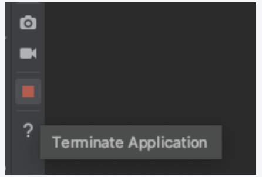

# Android における Process Death

## Process Death とは
アプリがバックグラウンドで動いている場合などに、リソースの都合で Android システムがアプリを停止させること。

### Android Studio で Process Death 実行
Android Studio で Process Death と同等のことをするには、Logcat 画面の端に存在する赤い四角ボタンを押します。




## 問題点と対策

### 問題点
当たり前ですが、保存されてない変数は破棄されます。

ところが、ユーザー目線で「復帰後に元の状態を期待する」ような場合も多々あります。

### ViewModel() において対策の実装　
みんな大好き [ViewModel](https://developer.android.com/reference/androidx/lifecycle/ViewModel?hl=ja) は、rotation 状態などの構成の変更に対しては柔軟に処理してくれるものの、Process Death に関しては対応してくれません。

そのため Process Death 後に復旧するためには、自分で `savedStateHandle` 等でバックアップをとっておく必要があります。

実装例は以下のようになります。


``` kotlin
class MainViewModel(
    private val savedStateHandle: SavedStateHandle
): ViewModel() {

    var counter by mutableStateOf(savedStateHandle.get("counter") ?: 0)
        private set

    fun count() {
        counter++
        savedStateHandle.set("counter", counter)
    }
}
```


### Links
- [UI の状態の保存 (developer.android.com)](https://developer.android.com/topic/libraries/architecture/saving-states)
- [ViewModel の保存済み状態のモジュール ()](https://developer.android.com/topic/libraries/architecture/viewmodel-savedstate?hl=ja)


## おわりに
「Android において気をつけるべきこと」みたいなものにも少しずつ詳しくなっていきたいです。
