# FCM を使って push 通知（iOS, Android）

今回は、push 通知の代表格である Firebase Cloud Messaging (FCM) を使って、プッシュ通知を行いました。

通知させる端末は iOS, Android を対象に、通知を行うサーバーは Go の admin-SDK を使って作成しました。

この記事を見たらなるべく迷わずに通知まで行えるように記載しました。

**[目次]**

- [環境](#%E7%92%B0%E5%A2%83)
- [Firebase プロジェクト作成](#firebase-%E3%83%97%E3%83%AD%E3%82%B8%E3%82%A7%E3%82%AF%E3%83%88%E4%BD%9C%E6%88%90)
  - [Fireabse から端末にメッセージを送る方法](#fireabse-%E3%81%8B%E3%82%89%E7%AB%AF%E6%9C%AB%E3%81%AB%E3%83%A1%E3%83%83%E3%82%BB%E3%83%BC%E3%82%B8%E3%82%92%E9%80%81%E3%82%8B%E6%96%B9%E6%B3%95)
  - [Links](#links)
- [Android](#android)
  - [FCM setup](#fcm-setup)
  - [FCM クライアントを設定する](#fcm-%E3%82%AF%E3%83%A9%E3%82%A4%E3%82%A2%E3%83%B3%E3%83%88%E3%82%92%E8%A8%AD%E5%AE%9A%E3%81%99%E3%82%8B)
- [iOS](#ios)
  - [FCM setup](#fcm-setup-1)
  - [APNs Keys の登録](#apns-keys-%E3%81%AE%E7%99%BB%E9%8C%B2)
  - [XCode で設定を行う](#xcode-%E3%81%A7%E8%A8%AD%E5%AE%9A%E3%82%92%E8%A1%8C%E3%81%86)
  - [FCM クライアントを設定する](#fcm-%E3%82%AF%E3%83%A9%E3%82%A4%E3%82%A2%E3%83%B3%E3%83%88%E3%82%92%E8%A8%AD%E5%AE%9A%E3%81%99%E3%82%8B-1)
- [トークンを受信するサーバー](#%E3%83%88%E3%83%BC%E3%82%AF%E3%83%B3%E3%82%92%E5%8F%97%E4%BF%A1%E3%81%99%E3%82%8B%E3%82%B5%E3%83%BC%E3%83%90%E3%83%BC)
- [Firebase-admin-sdk で通知を送信する側を実装](#firebase-admin-sdk-%E3%81%A7%E9%80%9A%E7%9F%A5%E3%82%92%E9%80%81%E4%BF%A1%E3%81%99%E3%82%8B%E5%81%B4%E3%82%92%E5%AE%9F%E8%A3%85)
  - [firebase-admin-go](#firebase-admin-go)
  - [setup](#setup)
  - [実際に送ってみる](#%E5%AE%9F%E9%9A%9B%E3%81%AB%E9%80%81%E3%81%A3%E3%81%A6%E3%81%BF%E3%82%8B)
- [詰まったところ](#%E8%A9%B0%E3%81%BE%E3%81%A3%E3%81%9F%E3%81%A8%E3%81%93%E3%82%8D)
  - [iOS で Firebase SDK 追加時に NOT FOUND](#ios-%E3%81%A7-firebase-sdk-%E8%BF%BD%E5%8A%A0%E6%99%82%E3%81%AB-not-found)
- [おわりに](#%E3%81%8A%E3%82%8F%E3%82%8A%E3%81%AB)

## 環境

```
// Android
classpath("com.google.gms:google-services:4.3.14")
implementation("com.google.firebase:firebase-messaging:23.1.0")

// iOS
firebase-ios-sdk
  kind = upToNextMajorVersion;
  minimumVersion = 9.0.0
  FirebaseMessaging

// Go SDK
firebase.google.com/go/v4 v4.9.0
google.golang.org/api v0.96.0
```

## Firebase プロジェクト作成

全体に共通する項目として、まずは [Firebase console](https://console.firebase.google.com/) から、プロジェクトを追加します。

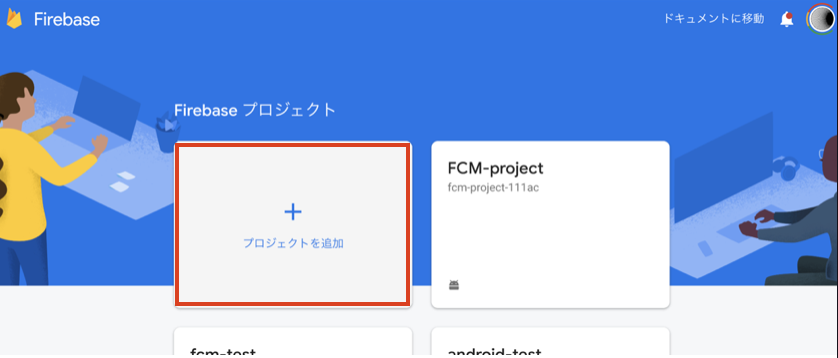

### Fireabse から端末にメッセージを送る方法

Firebase から端末に対しメッセージを送るには主に次の 2 つの方法があります。

- トピックを設定しておき、トピックグループに対し送る
- 端末ごとに発行される FCM 登録トークンを用いて、個別のメッセージを送る

今回は FCM 登録トークンを用います。

### Links

- [FCM 登録トークンを管理するベストプラクティス](https://firebase.google.com/docs/cloud-messaging/manage-tokens?hl=ja&authuser=0#basic-best-practices)

## Android

### FCM setup

何はともあれ、Android で Firebase を使えるセットアップを行います。

Firebase のプロジェクトにおいて、android アプリを追加します。

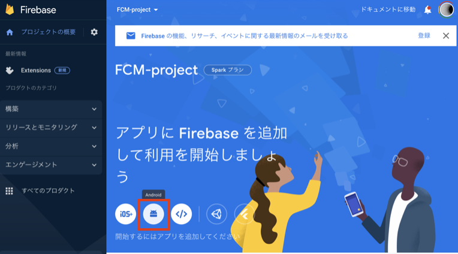

『Android アプリに Firebase を追加』のに従って、`google-services.json` をダウンロードします。

ダウンロードした json は、アプリレベルの `build.gradle` と同じ階層に入れてください。  
（Project に切り替えると分かりやすいです）

今回は KMM としてプロジェクトを作成しているため、`androidApp` フォルダ配下に入れています。

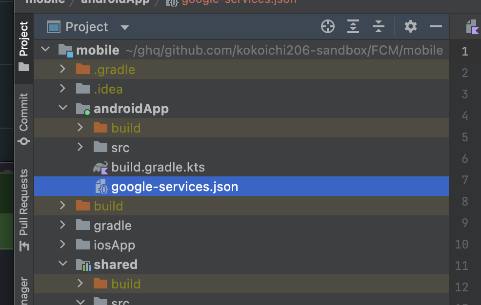

続いて[こちらの手順に従って、](https://firebase.google.com/docs/android/setup?authuser=0&hl=ja#assistant)Firebase Assistant を使用して Firebase を追加します  
（json は Git 管理対象から外すようお願いします）

Tools > Firebase > Cloud Messaging

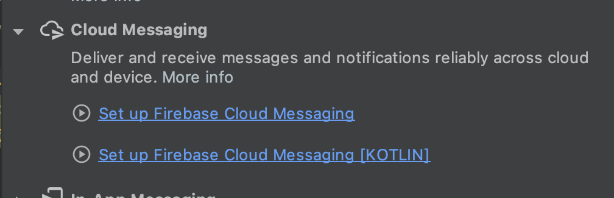

`2. Add FCM to your app` の部分で、shared のモジュールか android のメインのモジュールか選択するところがあるので、json を格納したメインモジュールを選択します。

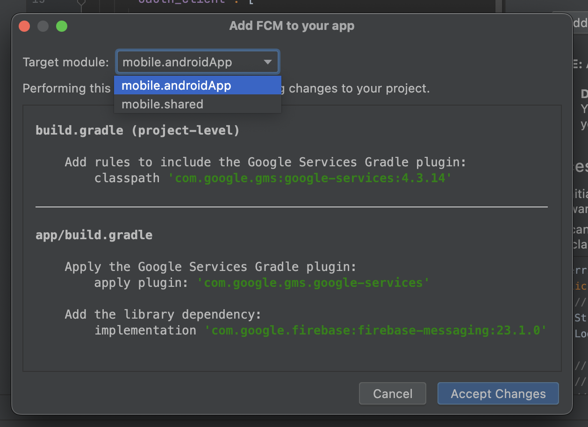

以上でセットアップは終わりです。  
お疲れ様でした。

### FCM クライアントを設定する

基本的には[『Android で Firebase Cloud Messaging クライアント アプリを設定する』](https://firebase.google.com/docs/cloud-messaging/android/client?hl=ja&authuser=0)に則って進めていきます。

やること

- サービスを登録する
- Android 13 端末に対する、ランタイム通知権限を要求
- [FCM 登録トークンの新規作成をモニタリング](https://firebase.google.com/docs/cloud-messaging/android/client?authuser=0&hl=ja#monitor-token-generation)
  - サーバーに送信するため

[サービスクラスの実装](https://github.com/kokoichi206-sandbox/FCM/blob/main/mobile/androidApp/src/main/java/jp/mydns/kokoichi0206/fcm/android/FCMService.kt)では、ローカルのサーバーを呼んでいますが、iOS と共通にするため [shared パッケージ](https://github.com/kokoichi206-sandbox/FCM/tree/main/mobile/shared/src/commonMain/kotlin/jp/mydns/kokoichi0206/fcm)で実装しています。

やはり Firebase は Google のサービスということもあり、Android との連携は簡単です。

## iOS

公式の[『Apple プラットフォームで Firebase Cloud Messaging クライアント アプリを設定する』](https://firebase.google.com/docs/cloud-messaging/ios/client?hl=ja)に沿って設定を進めます。

### FCM setup

まずは、[Firebase を Apple のプロジェクトに追加](https://firebase.google.com/docs/ios/setup?hl=ja)します。

まず、先ほど作った Firebase のプロジェクトから、『Apple アプリへの Firebase の追加』を押します。

バンドル ID は、『Xcode > Targets > General > Identity』にあります。

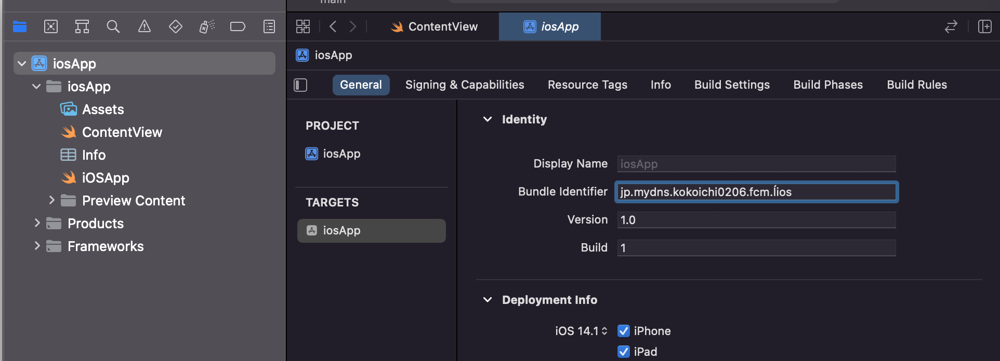

続いて、作成された json をアプリのルートに配置します。  
（Git 管理からは外してください。）

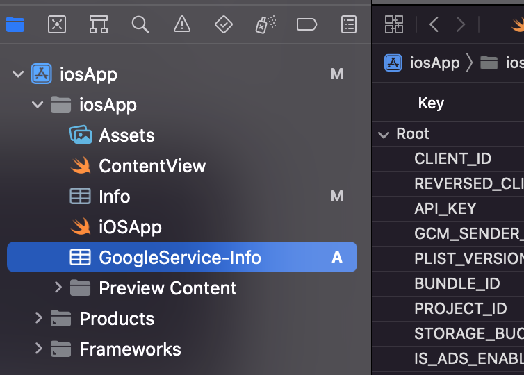

最後にパッケージマネージャから Firebase SDK を追加して設定は終わりです。

### APNs Keys の登録

続いて、Firebase コンソール上で作業を行います。

『プロジェクトの設定 > Cloud Messaging > Apple アプリの構成』に、APNs 認証キーをアップロードする必要があります。

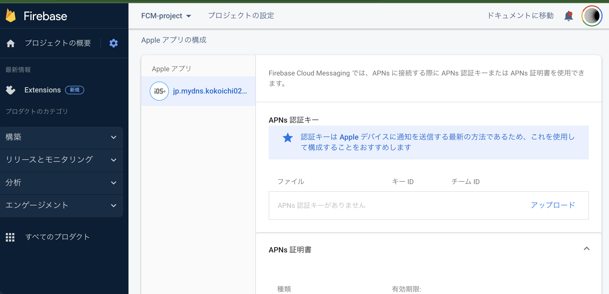

Apple サービスでは、APNs Keys

まず、以下リンクから APNs Kyes を作成します

https://developer.apple.com/account/resources/authkeys/list

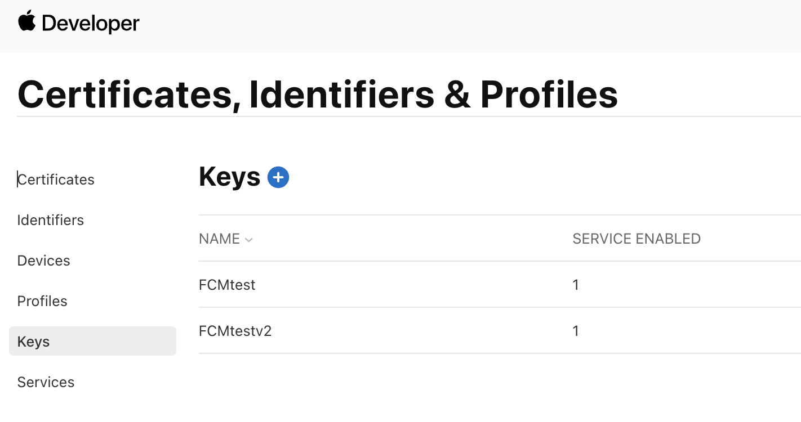

`+` を押して、` Apple Push Notifications service (APNs)` を作成します。

作成した認証キーをダウンロードし、Key ID と共に Firebase プロジェクトにアップロードします。

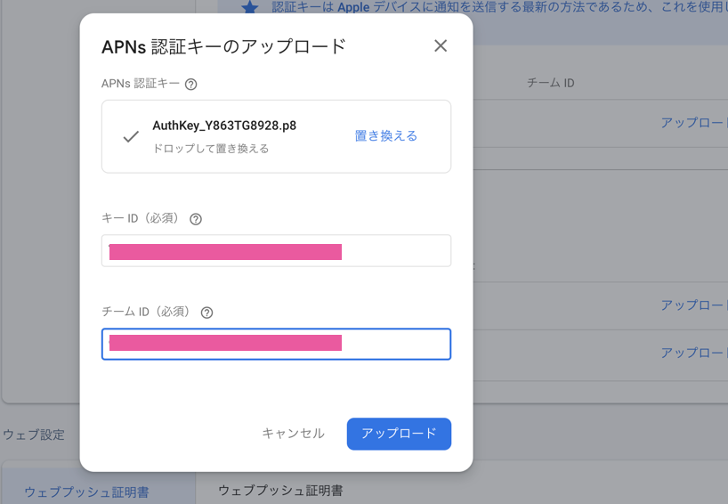

なお、push 通知に必要な『チーム ID』は、以下のようにして確認できます。

https://developer.apple.com/account/ > Membership > Team ID

**注意**  
APNs を Firebase に登録し直した後は、plist を再度ダウンロードし直す必要があります。  
そして、再配置を行います。

『プロジェクトの設定 > 全般 > マイアプリ > Apple アプリ』からダウンロード可能です。

これで apple の FCM の設定は終わりです。  
お疲れ様でした。

### XCode で設定を行う

設定終わり、と思いきや、**もう１ステップ必要**です。

[公式の手順](https://firebase.google.com/docs/cloud-messaging/ios/client?hl=ja)には書いてないと思うのですが、以下のステップをしないと正常に機能しません。  
（参考: [APNS device token not set before retrieving FCM Token for Sender ID](https://stackoverflow.com/questions/58246620/apns-device-token-not-set-before-retrieving-fcm-token-for-sender-id-react-nati)）

1.『プロジェクト名 > 下写真の + ボタン』をクリックする
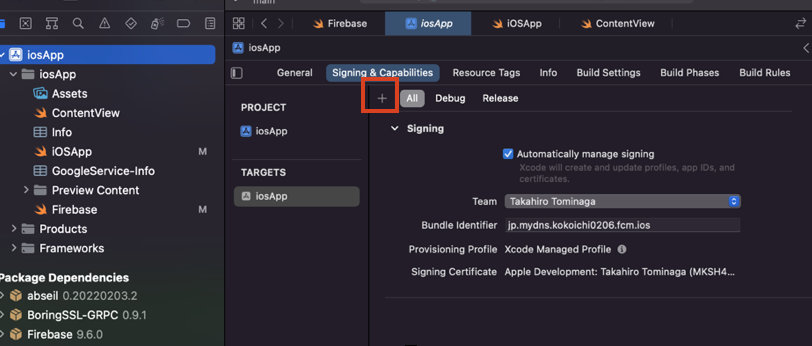

2.Background Modes と Push Notification を追加する
3."Background fetch" と "Remote notifications" を選択する
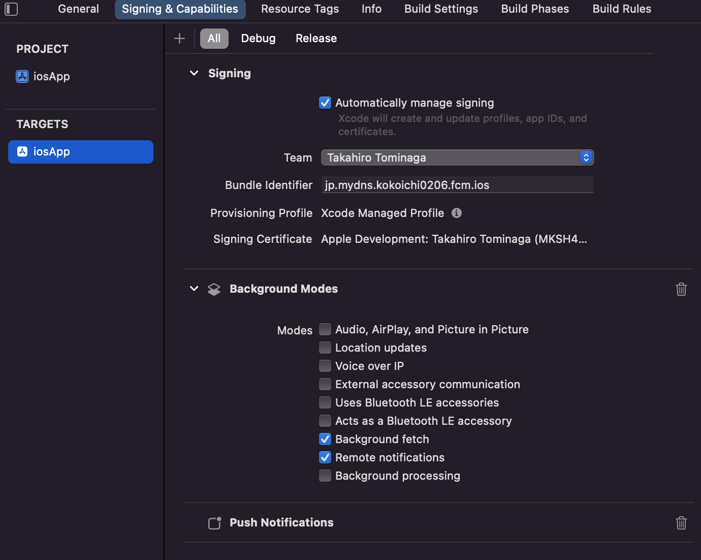

### FCM クライアントを設定する

Android 同様、FCM 登録トークンを管理サーバー側に送信したいです。

[この辺](https://firebase.google.com/docs/cloud-messaging/ios/client?hl=ja#monitor-token-refresh)を参考に実装します（[github](https://github.com/kokoichi206-sandbox/FCM/blob/main/mobile/iosApp/iosApp/Firebase.swift)）。  
Swift はのりでしか分からないので、一旦パスでお願いします。

生成された token を[こちら](https://github.com/kokoichi206-sandbox/FCM/blob/main/mobile/iosApp/iosApp/Firebase.swift#L42-L44)で送信しています。

## トークンを受信するサーバー

本来は、トークンを受け取り何処かで管理する用のことをやりたかったですが、眠すぎて受信するまでで諦めました。

https://github.com/kokoichi206-sandbox/FCM/tree/main/server

本題ではないため飛ばします。

## Firebase-admin-sdk で通知を送信する側を実装

[Firebase の『サーバー オプションの選択』](https://firebase.google.com/docs/cloud-messaging/server?hl=ja&authuser=0#choosing-a-server-option)には、以下の記載があります。

> FCM サーバーとの対話には Firebase Admin SDK または基本的なプロトコルの 2 つの方法があり、どちらを使用するか決定する必要があります。  
> 一般的なプログラミング言語で広くサポートされていること、認証や認可を簡単に処理できることから、Firebase Admin SDK を使用することをおすすめします。

おすすめされている Firebase Admin SDK を利用します。

Firebase Admin SDK は、Node、Java、Python、C#、Go がサポートされています。

今回は Go にしておきます。

### firebase-admin-go

基本的には、[go-admin-sdk のドキュメント](https://pkg.go.dev/firebase.google.com/go/messaging)や、[snippets](https://github.com/firebase/firebase-admin-go/blob/master/snippets/messaging.go) が参考になるので、そちらを参考にします。

### setup

[『サーバーに Firebase Admin SDK を追加する』](https://firebase.google.com/docs/admin/setup/#go)を参考に進めます。

まずはプロジェクトに依存関係をインストールします。

```sh
# Install as a module dependency
$ go get firebase.google.com/go/v4

# Install to $GOPATH
$ go get firebase.google.com/go
```

続いて Firebase の鍵をダウンロードします。

『プロジェクトの設定 > サービスアカウント > Firebase Admin SDK』から新しい秘密鍵を生成します。

Go のプロジェクト内に配置し、後のために環境変数にセットします。

```sh
export GOOGLE_APPLICATION_CREDENTIALS="path_to.json"
```

[サーバーサイド](https://github.com/kokoichi206/go-expart/tree/main/firebase/messaging)

### 実際に送ってみる

送った時のデモ動画です。  
一番左が送信を行う go のプロジェクトを実行するターミナルで、真ん中が iPhone, 右が Pixel3 です。

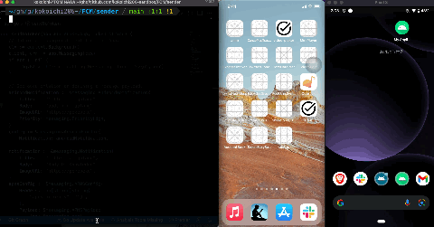

（[ちょっと画質いいバージョン](https://github.com/kokoichi206-sandbox/FCM)）

## 詰まったところ

### iOS で Firebase SDK 追加時に NOT FOUND

`firebase-ios-sdk could not be resolved` という警告が表示され、うまくパッケージ追加できなかった。

https://developer.apple.com/forums/thread/707322

こちらのリンクを参考にし、master から持ってくるのをやめたら解決した。

再度追加する時に、『FirebaseMessaging』のみチェック入れて依存関係を追加した。

## おわりに

push 通知送れて楽しかったです！  
ただ、どうしても人の作ったサービスで遊んでる感が強いよなぁ。。。
