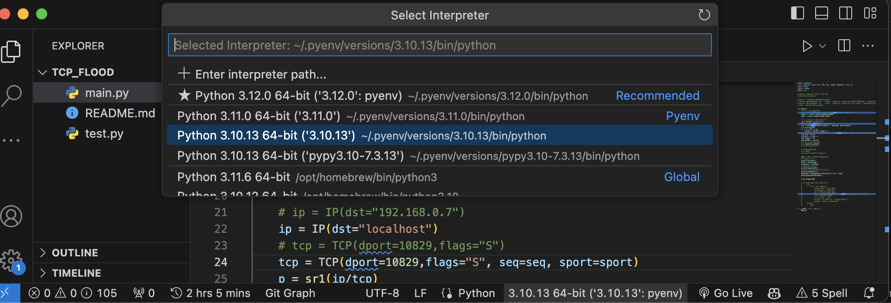

# python を VSCode で使っていてコード定義へのジャンプが効かなかった

## 原因

pyenv で複数のバージョンを使っており, VSCode の解釈する python のバージョンとターミナル（実際に実行する部分）でのバージョンに差異があったことが原因。

## 解決方法

VSCode で python のプロジェクトを開いてる時、下のバーに python Interpreter のバージョンが表示されている。

ここをクリックし、ターミナルなどの実行環境のバージョンと合わせてあげる。

これで pip などで入れたサードパーティのライブラリの参照も無事解決できるようになる。
