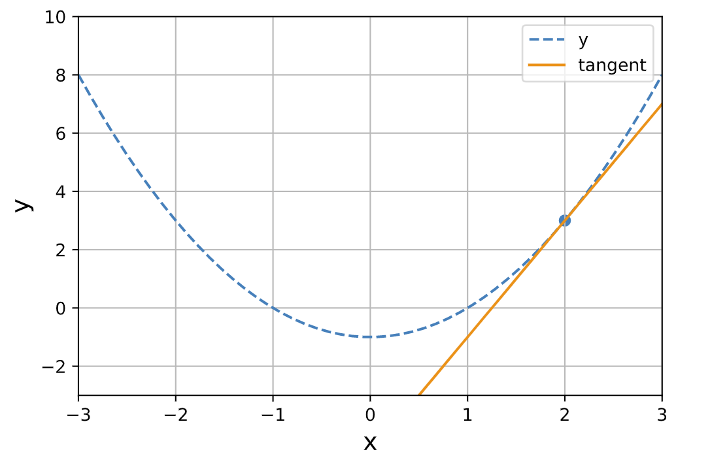
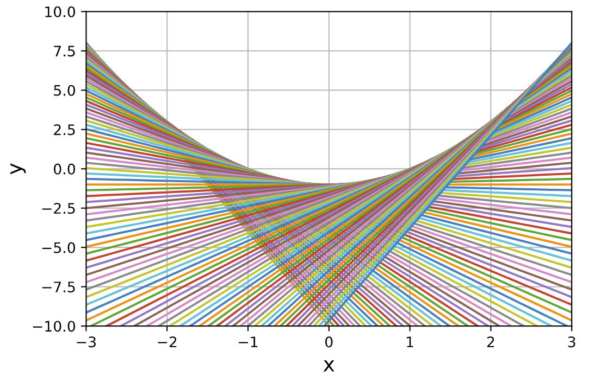

# python で接線を書く

## 接線とは
実際に接線を描画する前に、正確に定義をしておきましょう。

### 微分の定義
ここでは PC により数値的に計算するために、極限による微分の定義を用います。

以下に`x=a`における、`f(x)`の微分の値を計算する式を示します。

$$
f ^{'}(a) = \lim _ {x \to a}\frac{f(x+a)-f(x)}{a}
$$

*x*を微少量変化させた時、微少量と同じオーダーで変化するような係数を（一次）微分と定義していることになります。

以下は微分をコードに起こした例です。

```python
delta_x = 1e-4
derivative = (func(a+delta_x) - func(a)) / delta_x
```

数値計算においては、極限の定義として上のように微小量を使うことが多いです（妥当かどうかは別途判断が必要）。

### 接線の定義
`x=a`における、`f(x)`の接線とは、

> 傾きが`f'(a)`で`x=a`,`y=f(a)`を通る直線

のことであり、数式では以下のように表されます。

$$
y = f ^{'}(a)(x-a) + f(a)
$$

また、接線とは

> `x=a`近傍での関数の近似（テイラー展開）のうち、直線部分のみを残したもの。
つまり、第一次近似である。

であるとも言えます。

以下は`x=a`における接線を返す関数のコード例です。

```python
def tangent(func, x, a):
    delta_x = 1e-4
    derivative = (func(a+delta_x) - func(a)) / delta_x
    return derivative * (x - a) + func(a)
```

## python で実装する
```python
import matplotlib.pyplot as plt

def quad_func(x):
    y = x**2 - 1
    return y

def tangent(func, x, a):
    delta_x = 1e-4
    derivative = (func(a+delta_x) - func(a)) / delta_x
    return derivative * (x - a) + func(a)

x = np.linspace(-3, 3)
y = quad_func(x)
plt.plot(x, y, label="y", linestyle="dashed")

## x = 2 の時の接線
a = 2
tangent = tangent(quad_func, x, a)
plt.plot(x, tangent, label="tangent")

## x = 2 の点も描画しておく
plt.scatter(a, quad_func(a))

plt.legend()

plt.xlabel("x", size=14)
plt.ylabel("y", size=14)
plt.grid()

plt.xlim([-3, 3])
plt.ylim([-3, 10])

plt.show()
```



### おまけ
各点における接線を集めると、以下のように放物線の下半分を覆い尽くします（下に凸だから？）。



## おわりに
VSCode で notebook を使ってみましたが、思ったよりも使いやすくて良かったです。
