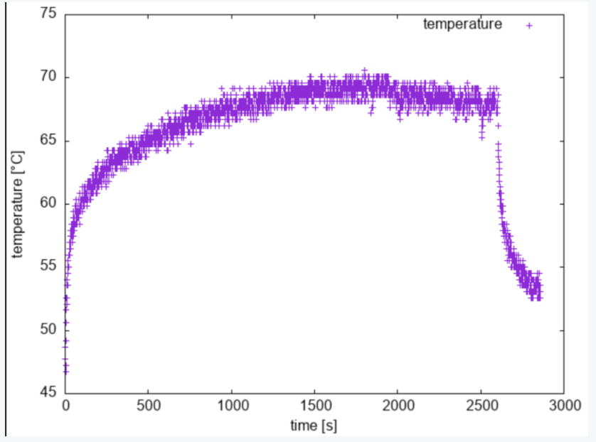
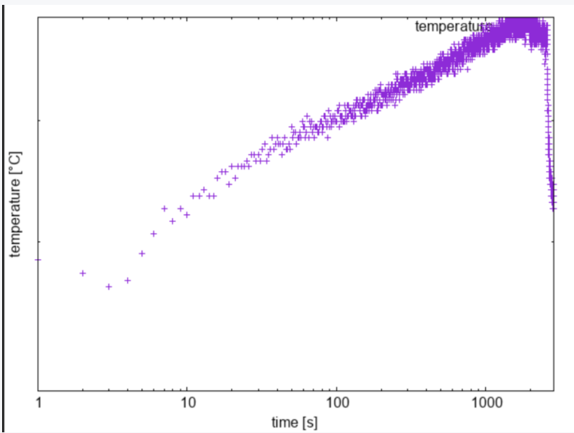
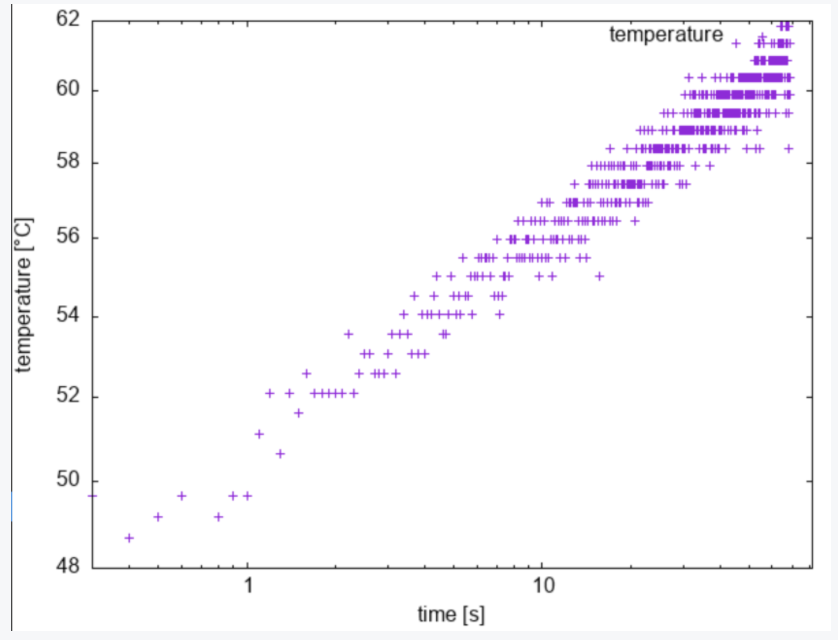
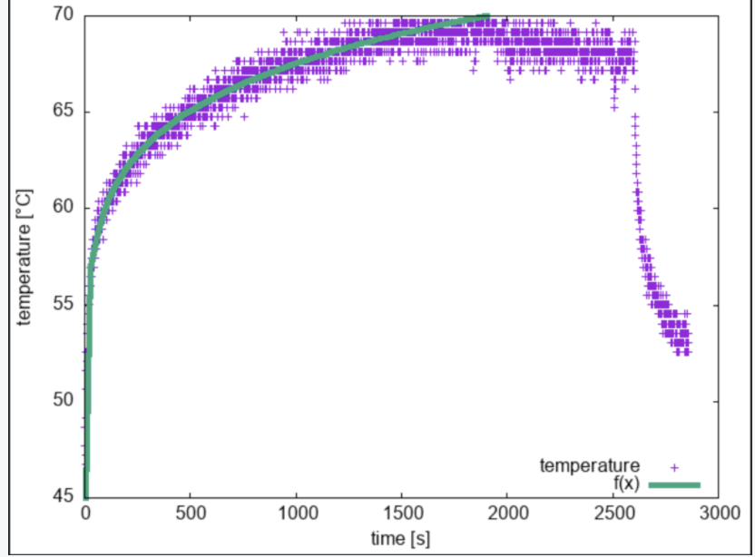

# ラズパイサーバーに100万アクセスし温度を計測してみた

自作ラズパイサーバーに高負荷をかけ、その際の温度を計測してみました。

**結果**



[目次]

[:contents]

## 環境
```
- クライアントサイド
  - zsh 5.8 (mac)
  - go version go1.16.10
- サーバーサイド
  - raspberry pi 4
  - OS: ubuntu 20
  - Apache/2.4.52 (Ubuntu)
  - mydns のドメイン
```


## ラズパイに高負荷をかける
https://mysite.jp の部分には自分のアクセスしたいアドレスを入れてください（**決して知らない外部のURLにしないでください**）

### bash で行う
この方法が最速ではないですが、以下の方法では 1000 アクセス 8 秒くらいでした。

``` sh
time (seq 1000 | xargs -I ZZ -P 5 curl -s "https://mysite.jp" > /dev/null)                                                                                                             
( ... ; )  8.19s user 5.01s system 194% cpu 6.782 total
```

以下のように background で各アクセス処理を走らせるようにすることでスピードアップできると思います。ただ自分には、バックグラウンド処理をうまく待つことができず、時間が測れませんでした。

``` sh
time (seq 10000 | xargs -n 1 -P 5 curl -s "https://kokoichi0206.mydns.jp" > /dev/null 2>&1 &)
( ...)  0.00s user 0.00s system 11% cpu 0.009 total
```

### golang を使った方法
[こちらのQiitaの記事](https://qiita.com/Azunyan1111/items/a1b6c58dc868814efb51)をそのまま使わせてもらいました。

記事内の Local サーバーを使った方法を試したところ、1 万アクセス 1 秒かからなかったので期待していたのですが、実際の URL に対して行うとかなり遅くなりました。

| 回 | 1000 | 1_0000 | 100_0000 |
| :---: | :---: | :---: | :---: |
| 秒 | 2.82 | 28.479 | 2657.5 |

ほぼ線形に変化しているようです（サーバー側で同時アクセ数の制限とかある？）。


## ラズパイの温度を計測する

### ラズパイの温度
以下のコマンドでラズパイの温度を取得できます。

```sh
$ cat /sys/class/thermal/thermal_zone0/temp
55991
```

注意点としては何故か 1000 倍されていることで、上の例は 55.99 度ということになります。

### 定期的に測定する
以下のような measurement.sh ファイルを用意し、定期的に測定しました（１秒に１測定しています）。

``` sh
#/bin/sh -eu
#
# Description
#   measure the temperature regularly

date=`date '+%Y%m%d_%H%M%S'`
while :
do
    temp=`cat /sys/class/thermal/thermal_zone0/temp`
    echo `date '+%Y%m%d_%H%M%S'` "$temp" >> "temp_$date"
    sleep 1
done
```

１列目に時間、２列目に温度を記録するようにしています。例としては以下のようなデータが取れます。

```
20220210_134439 46738
20220210_134440 48686
20220210_134441 48199
20220210_134442 48686
```


## gnuplot でグラフを出力する
なぜ gnuplot を使って描画してるかって？

ワンライナーで使えるからです！！！！

measurement.sh で2列分データを取りましたが、結局1列しか使っていません。


> gnuplot -e 'set terminal png; set output "./temperature.png"; set xlabel "time [s]"; set ylabel "temperature [°C]"; plot "temperature" using 0:($2/1000) title "temperature"'


2500 秒くらいで急に落ちてるのは 100 万アクセスが終わった時間になります。


綺麗なカーブを描いていたので log スケールで取ってみたら、綺麗な直線になりました！


> gnuplot -e 'set terminal png; set output "./temperature.png"; set xlabel "sec"; set ylabel "temperature"; plot "temperature" using 0:($2/1000) title "temperature"'




最初の方の点が少ないので、より細かく見るために測定間隔を 0.1 秒にして測り直しました。



### （おまけ）フィット
両対数を取って線形になる、ということは、以下のような式が成り立つことを意味してます

<div align="center">[tex:\displaystyle{
\log(y-y_0) = a*\log(x-x_0) \\
y = c*(x-x_0)^a + y_0

}]</div>

x0 を0にし、20から1500までの範囲でフィットしています。

> gnuplot -e 'f(x)=a*x**b+c; fit[20:1500] f(x) "temperature" using 0:($2/1000) via a,b,c; set terminal png; set output "./temperature_fit.png"; set yrange [45:70]; set xlabel "time [s]"; set ylabel "temperature [°C]"; set key right bottom; plot "temperature" using 0:($2/1000) title "temperature", f(x) lw 5'

#### 結果：（y=a*x**b + c）

```
a               = 13.1365          +/- 1.717        (13.07%)
b               = 0.121676         +/- 0.009238     (7.593%)
c               = 37.0958          +/- 2.04         (5.498%)
```



理論わからんけどフィットできたぞおおおおお

## おわりに
本当はラズパイサーバーに高負荷をかけてサーバーをダウンさせてみたかったのですが、~~うまくいかなかった~~意外にラズパイが丈夫だったので代わりに温度を測ってみました。

http 通信が、ローカルで試した時よりも速度が出なかったのが敗因だと思っています。知らない間に DOS 対策の WAF など（？）働いてるかもしれないので、いつかじっくりと調べてみます！
