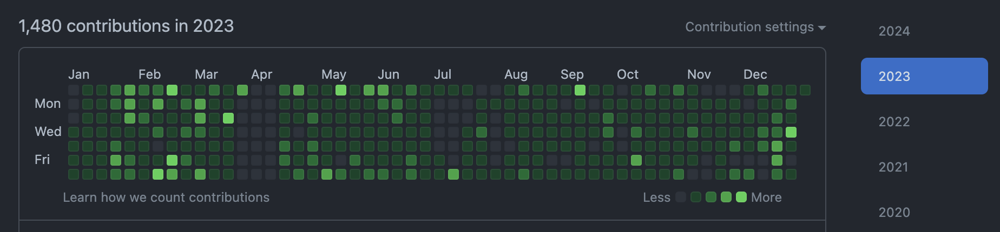

# 2023 のエンジニア活動振り返り

<a href="https://github.com/kokoichi206?tab=overview&from=2023-12-01&to=2023-12-31">(github)</a>

## 時系列での振り返り

2023 年 1 月の頭から、IoT 関連の web アプリケーションを作るチームに社内移動になりました。
（技術スタックが Android から Go, Vue, k8s になりました。）
Vue, Go, AWS を初めて業務で触ったり、gRPC, k8s, bff などの新しい概念を学んだりと技術的には楽しいことが多かったです。

フロントとバックエンドをなんとなく理解できるようになるまで 2,3 ヶ月ほどかかった気がします。
（k8s などのインフラを考えれるようになるのはまた先のお話）

4 月は IPA のネットワークスペシャリストを受けました。
（転職を考えていたこともあり）受ける決断が遅くなってしまい、ほとんど勉強期間が取れなかったのですがなんとか受かることができました。
GitHub で 4 月ごろにコミット 0 が続いている期間がおおよその勉強期間です。

参考書の他には、[まさるさんの youtube](https://www.youtube.com/@masaru-study) を見たり日経ネットワークで気になったタイトルを買って眺めたりしていました。
基礎的な知識を詰め込むことができてよかったのですが、勉強期間が短かったこともあり、あまり手を動かせなかったことが反省でした。
試験内容は(ちょっとだけ分かる) http2 が出たので、運よく ×-76-65-67 で受かりました（手応えは全然なかった）。

7 月は初めてちゃんとした残業をしました。
休日分を含めると 100 時間超えてた気もしますが、自分自身のスキルやプロダクトが前進してる感覚があったため全然きつい感覚がなかったことはいい発見でした。
（GitHub の平日の活動がない期間です。）

8 月は AWS の資格（SAP）を受けたのですが、勉強不足（+ 実習不足）で落ちてしまいました。
（特に IAM の権限周りの勉強が苦痛で、全然解けるようにならなかったです。）
業務で今後も使うことが予想されるため、2024 はリベンジしたいと思います（15k の受験料は痛い。。。）。

9 月になって、やっと Front の 1 画面を作りました。
既存の画面とほぼ同じものを複製するだけだったので何とかなりましたが、結局フロントまともに触ったのはここだけでした。
今の所一番好きな UI フレームワークは Android の Jetpack Compose だなあと感じました。

10 月は IPA のデータベーススペシャリストを受けました。
普段使わない RDB の機能や、さまざまな概念を知れて面白かったです。
ネスペの反省も生かし、動かせるものは手元で実行しながら理解を進めていきました。
試験の時間に追われて手応えはあまりなかったのですが、×-92-82-68 で受かっていました。

業務の方は 10 月から（社内情勢の影響で）かなり暇になったため、これまでできてこなかった改善活動などを進めることになりました。
コスト削減のための AWS・Datadog の見直しや、品質向上のためのログの出力内容の改善などなど。。
Docker や k8s についてはセキュリティを意識したりと、単に動かすだけから一回り詳しくなった気がします。
（業務の k8s のコードは1回全部書き直したい。。。）

また、業務でのフロント構成の大問題の1つに『import のさせ方が問題で、コンポーネントの定義にコードジャンプできない』というのがあったので、VSCode の[拡張を作って公開](https://github.com/kokoichi206-sandbox/components-tag-jumper)するなどしてみました。
ちょっとした効率化のツールなどを作るのは好きです。

11 月には初めて大きめの OSS に [contribute](https://github.com/OpenAPITools/openapi-generator/pull/16962) してみました。
お世話になってるライブラリなどには、今後も積極的に貢献していきたいと思います。
（そのための技術力・英語などは継続して勉強したい）

11 月, 12 月は期日に追われることがなかったのですが、特に何かが出来上がった気もしなく、業務に対するモチベーションがほとんどありませんでした。

## 1 年を通して

### よかった点

- はてなブログでのアウトプットを1年続けられた
- Go については勉強を進められた
  - 標準パッケージを少し読んでみたりできた
- connpass などで様々なイベントに参加し、広く情報を取る習慣ができた
  - 2024 年はオフラインでも参加したい！

### できなかったこと・やり残したこと

- フロントに関しては全然詳しくならず
  - Vue は業務でのメイン言語のはずなんですが。。。
- 外部のイベントで登壇してみたかった（が、できなかった）
  - 社内ですらほぼ機会がなかった。。。。
- 技術の勉強はしていたが、個人で何か作る（+公開）みたいなことができなかった
  - （そもそもしたいのか、という話はある）

## 2024 に向けて

### Must

- 外部のイベントで登壇してみる（LT とかから）
- はてなブログで技術的な発信を続ける
  - やってみた以上の意見を述べられるように
- フロントのキャッチアップをする
- イベントのオフライン参加
  - まずは参加から

### Want

- 低レイヤー（OS など）の理解を深める
  - ゴールがはっきりしないので Want にしてるが実質 Must
- 副業（会社以外の収入源）
  - エンジニアとして
  - ブログなどの収益化？
- 英語を使う環境に身を置く
  - 転職, 移住, OSS などでの文面でのやり取り
  - TOEIC の点数が有効期限切れてるので、ついでに更新しておく

### 直近で触れたい技術

（コロコロ変わるため、今進めているもののみ書いてます）

- Rust
- eBPF
- ...

## おわりに

エンジニアとして活動を始めてから 4 年目が始まろうとしており、そろそろ物理を勉強した期間より長くなろうとしています。
全然この業界について詳しくなりませんが、1つずつできることを積み重ねていきたいです。

技術を単に使う側ではなく、理解してそれを作る側に回りたい。
