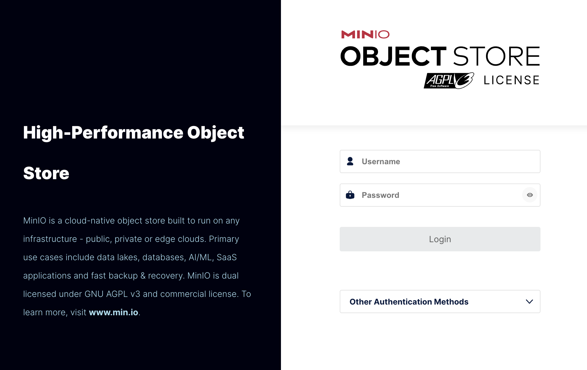

# minio を使ってローカル実行時に s3 を代替する

minio の詳しい説明は[公式](https://min.io/)に頼りたいところですが、minio とは **s3 と互換性のある object storage** です（[object storage とは](https://aws.amazon.com/jp/what-is/object-storage/)）。

今回はこの『s3 と互換性のある』って部分を少し深ぼって、golang の sdk から s3 にアクセスする既存コードを使い、ローカルでは minio に切り替えてみます。

## 環境

``` 
minio: RELEASE.2023-06-02T23-17-26Z
go: 1.20
golang aws-sdk:
    github.com/aws/aws-sdk-go-v2 v1.18.0
    github.com/aws/aws-sdk-go-v2/config v1.18.25
    github.com/aws/aws-sdk-go-v2/service/s3 v1.33.1
```

## minio

### minio の使い方

今回は docker-compose を使って以下のように立ち上げます。

この状態で `http://localhost:9001` にアクセスすると以下のようなログイン画面が現れ、ログインすると s3 のようにバケット操作やアクセスキーの発行ができます。



``` yml
version: '3.9'

services:
  minio:
    image: quay.io/minio/minio:latest
    environment:
      MINIO_ROOT_USER: root_user
      MINIO_ROOT_PASSWORD: root_password
    command: server --console-address ":9090" /data
    ports:
      - 9001:9000
      - 9091:9090
    volumes:
      - ./data:/data
```

### compose で minio 起動時にデータを入れる

詳しくは説明しませんが、以下のように minio に用意されてる `mc` コマンドをつかってデータを投入・アクセスキーの払い出しをしました。

``` yml
version: '3.9'

services:
  minio:
    image: quay.io/minio/minio:latest
    environment:
      MINIO_ROOT_USER: root_user
      MINIO_ROOT_PASSWORD: root_password
      # console から作成しなくて済むよう、環境変数に設定。
      # 注): この方法は非推奨になった。
      # see: https://min.io/docs/minio/linux/administration/identity-access-management/minio-user-management.html#minio-users-root:~:text=later%20deprecates%20the%20following%20variables%20used%20for%20setting%20or%20updating
      # 今後は mc コマンドで作成することになる。
      # MINIO_ACCESS_KEY: 3AFDH6SThcVDnI7FsACg
      # MINIO_SECRET_KEY: thG04kib7mgHwjfstUCpqsb1RQyzZitmbulZKWpI
    command: server --console-address ":9090" /data
    ports:
      - 9001:9000
      - 9091:9090
    volumes:
      - ./data:/data

  minio-mc:
    image: minio/mc:latest
    depends_on:
      - minio
    entrypoint: >
      /bin/sh -c "
        /usr/bin/mc ls myminio;
        # ----- alias の作成 -----;
        until /usr/bin/mc alias set myminio http://minio:9000 root_user root_password; do echo '...waiting...' && sleep 1; done;
        # ----- access key の作成 (sdk で使用) -----;
        /usr/bin/mc admin user svcacct add --access-key '3AFDH6SThcVDnI7FsACg' --secret-key 'thG04kib7mgHwjfstUCpqsb1RQyzZitmbulZKWpI' myminio root_user;

        # ----- bucket の作成 ----;
        /usr/bin/mc mb myminio/mybucket;
        # ----- object の作成 ----;
        /usr/bin/mc cp /testdata/test.txt myminio/mybucket/myobject;

        /usr/bin/mc ls myminio;
        exit 0;
      "
    volumes:
      - ./testdata/:/testdata
```

## golang sdk

今回は [aws-sdk-go-v2](https://github.com/aws/aws-sdk-go-v2) を使っていきます。

### 全体のコード

まず全体のコードを貼って、その後気になる点を説明します。

``` go
package main

import (
	"context"
	"io"
	"log"
	"os"

	"github.com/aws/aws-sdk-go-v2/aws"
	"github.com/aws/aws-sdk-go-v2/config"
	"github.com/aws/aws-sdk-go-v2/service/s3"
)

const (
	bucket = "minio-compatibility-test"
	object = "object-name"
	region = "ap-northeast-1"

	// minio も共通で使うためには、以下の値が必要（環境変数）。
	// for s3
	// see: https://docs.aws.amazon.com/ja_jp/general/latest/gr/s3.html#:~:text=%E3%82%A2%E3%82%B8%E3%82%A2%E3%83%91%E3%82%B7%E3%83%95%E3%82%A3%E3%83%83%E3%82%AF%20(%E6%9D%B1%E4%BA%AC)-,ap%2Dnortheast%2D1,-%E6%A8%99%E6%BA%96%E3%82%A8%E3%83%B3%E3%83%89%E3%83%9D%E3%82%A4%E3%83%B3%E3%83%88
	// endpoint    = "https://s3.ap-northeast-1.amazonaws.com"
	// for minio (local)
	endpoint = "http://localhost:9001"
)

func s3andMinio() {
	// dc 内のの mc で設定した key, secret を環境変数に設定する。
	// （sdk 内で勝手に使われる。）
	os.Setenv("AWS_ACCESS_KEY_ID", "3AFDH6SThcVDnI7FsACg")
	os.Setenv("AWS_SECRET_ACCESS_KEY", "thG04kib7mgHwjfstUCpqsb1RQyzZitmbulZKWpI")

	// =============================================
	// =============== s3 のみとの差分 ===============
	// =============================================
	resolver := aws.EndpointResolverWithOptionsFunc(func(service, region string, opts ...interface{}) (aws.Endpoint, error) {
		return aws.Endpoint{
			URL:               endpoint,
			HostnameImmutable: true,
			SigningRegion:     region,
		}, nil
	})
	// ============================================
	// ============================================
	// ============================================

	cfg, err := config.LoadDefaultConfig(
		context.TODO(),
		config.WithRegion(region),
		config.WithEndpointResolverWithOptions(resolver),
	)
	if err != nil {
		log.Fatal(err)
	}

	// **aws の** s3 client を作成する。
	client := s3.NewFromConfig(cfg)

	// ========= Get an object =========
	obj, err := client.GetObject(context.TODO(), &s3.GetObjectInput{
		Bucket: aws.String(bucket),
		Key:    aws.String(object),
	})
	if err != nil {
		log.Fatal(err)
	}

	writeFile(obj.Body)
}
```

### local 実行時のみ minio を向ける

クライアント用の config を作る時に、エンドポイントを指定するリゾルバを指定します。

s3 のエンドポイントとしては[公式からリージョン毎のエンドポイント](https://docs.aws.amazon.com/ja_jp/general/latest/gr/s3.html)を、minio のエンドポイントとしては local に起動させたものに対してポート付きで指定します。

``` go
resolver := aws.EndpointResolverWithOptionsFunc(func(service, region string, opts ...interface{}) (aws.Endpoint, error) {
	return aws.Endpoint{
		URL:               endpoint,
		HostnameImmutable: true,
		SigningRegion:     region,
	}, nil
})

cfg, err := config.LoadDefaultConfig(
	context.TODO(),
	config.WithRegion(region),
	config.WithEndpointResolverWithOptions(resolver),
)

client := s3.NewFromConfig(cfg)
```
