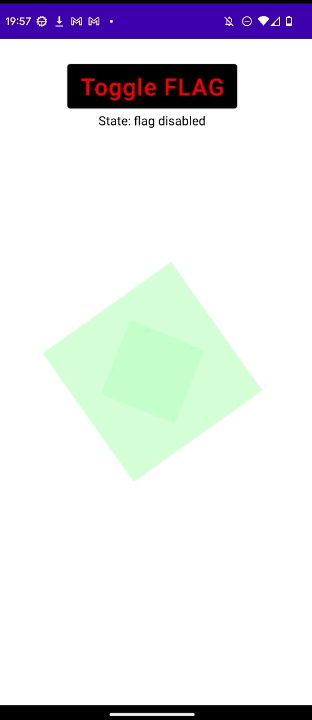
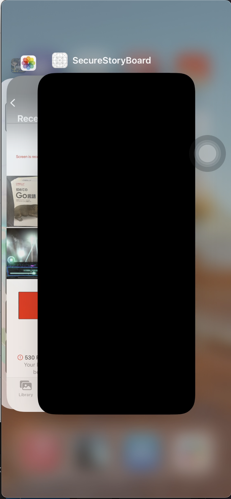

# 各プラットフォームにおけるスクショ防止調査

Netflix 等では、画面スクショ等をしようとした時に、内容が表示されない用画面が真っ黒になります。  
自分はこういった機能をみると実装方法を知りたくなるたちなので、少し調べてみました。

**[目次]**

- [時間がないひとまとめ](#%E6%99%82%E9%96%93%E3%81%8C%E3%81%AA%E3%81%84%E3%81%B2%E3%81%A8%E3%81%BE%E3%81%A8%E3%82%81)
- [はじめに](#%E3%81%AF%E3%81%98%E3%82%81%E3%81%AB)
  - [コンテンツ保護（真っ黒でスクショされる）](#%E3%82%B3%E3%83%B3%E3%83%86%E3%83%B3%E3%83%84%E4%BF%9D%E8%AD%B7%E7%9C%9F%E3%81%A3%E9%BB%92%E3%81%A7%E3%82%B9%E3%82%AF%E3%82%B7%E3%83%A7%E3%81%95%E3%82%8C%E3%82%8B)
  - [スクショ可能](#%E3%82%B9%E3%82%AF%E3%82%B7%E3%83%A7%E5%8F%AF%E8%83%BD)
- [Android](#android)
  - [フラグ操作方法](#%E3%83%95%E3%83%A9%E3%82%B0%E6%93%8D%E4%BD%9C%E6%96%B9%E6%B3%95)
  - [動作確認](#%E5%8B%95%E4%BD%9C%E7%A2%BA%E8%AA%8D)
  - [Links](#links)
- [StoryBoard で UITextField#isSecureTextEntry を使う](#storyboard-%E3%81%A7-uitextfieldissecuretextentry-%E3%82%92%E4%BD%BF%E3%81%86)
  - [UITextField#isSecureTextEntry](#uitextfieldissecuretextentry)
  - [subView として UITextField を加える](#subview-%E3%81%A8%E3%81%97%E3%81%A6-uitextfield-%E3%82%92%E5%8A%A0%E3%81%88%E3%82%8B)
  - [実動](#%E5%AE%9F%E5%8B%95)
  - [SwiftUI](#swiftui)
  - [Links](#links-1)
- [SwiftUI でレコーディングを防止](#swiftui-%E3%81%A7%E3%83%AC%E3%82%B3%E3%83%BC%E3%83%87%E3%82%A3%E3%83%B3%E3%82%B0%E3%82%92%E9%98%B2%E6%AD%A2)
  - [capturedDidChangeNotification イベントを検知](#captureddidchangenotification-%E3%82%A4%E3%83%99%E3%83%B3%E3%83%88%E3%82%92%E6%A4%9C%E7%9F%A5)
  - [録画中の画面があるかどうか](#%E9%8C%B2%E7%94%BB%E4%B8%AD%E3%81%AE%E7%94%BB%E9%9D%A2%E3%81%8C%E3%81%82%E3%82%8B%E3%81%8B%E3%81%A9%E3%81%86%E3%81%8B)
  - [録画中を検知して画面を変更する](#%E9%8C%B2%E7%94%BB%E4%B8%AD%E3%82%92%E6%A4%9C%E7%9F%A5%E3%81%97%E3%81%A6%E7%94%BB%E9%9D%A2%E3%82%92%E5%A4%89%E6%9B%B4%E3%81%99%E3%82%8B)
  - [実動](#%E5%AE%9F%E5%8B%95-1)
  - [Links](#links-2)
- [web](#web)
  - [Links](#links-3)
- [おわりに](#%E3%81%8A%E3%82%8F%E3%82%8A%E3%81%AB)

## 時間がないひとまとめ

```
- 各プラットフォームにおけるスクショ・キャプチャ防止機能の実装方法を調査
- Android
    - FLAG_SECURE を window に設定したら一発
- iOS
    - UITextField#isSecureTextEntry を sublayer として使う（トリッキー）
    - capturedDidChangeNotification のイベントを拾う（キャプチャのみ）
- Web(ブラウザ)で実行するには、js では無理そう
    - DRM などのコンテンツ保護を使うしかない
```

## はじめに

Netflix や Hulu などの動画サービスを調べて、各々スクショが禁止されているかを調べました。

### コンテンツ保護（真っ黒でスクショされる）

基本的には Android, iOS, web も

- Netflix
- Amazon Prime
- hulu

### スクショ可能

- GYAO
- bilibili

## Android

Android で画面録画を禁止するには、[WindowManager.LayoutParams#SECURE_FLAG](https://developer.android.com/reference/android/view/WindowManager.LayoutParams#FLAG_SECURE) を設定してあげるのが最も簡単で正確です。  
(API 1 で追加。)

### フラグ操作方法

window に対して設定するには、[window#setFlags](<https://developer.android.com/reference/android/view/Window#setFlags(int,%20int)>) を使って設定してあげます。

```kotlin
window.setFlags(
    WindowManager.LayoutParams.FLAG_SECURE,
    WindowManager.LayoutParams.FLAG_SECURE,
)
```

フラグを削除するには、[window#clearFlags](<https://developer.android.com/reference/android/view/Window#clearFlags(int)>) を呼びます。

```kotlin
window.clearFlags(WindowManager.LayoutParams.FLAG_SECURE)
```

clearFlag**s** の引数が 1 つであることから想像もできるように、各々のフラグはビット単位で `2**n` だけ異なっているため、各フラグの和から、元のフラグが構成できるようになっています。

例えばこんな感じです。

```java
public static final int FLAG_DITHER = 0x00001000;
public static final int FLAG_SECURE = 0x00002000;
public static final int FLAG_SCALED = 0x00004000;
```

そのため、現在 window に**特定のフラグ**が指定されているかを確認するには、以下のようにします。

```kotlin
fun hasSecureFlag(): Boolean {
    // 今回チェックしたいフラグ: Int 型。
    val FLAG = WindowManager.LayoutParams.FLAG_SECURE
    // 現在設定されているフラグの和: Int 型。
    val flags = window.attributes.flags

    // 論理和を取り、該当ビットが0かどうか判断する。
    return flags and FLAG != 0
}
```

全体のコードについては、[Github](https://github.com/kokoichi206-sandbox/Disable-Screenshot/blob/main/android/app/src/main/java/jp/mydns/kokoichi0206/disable/screenshot/android/MainActivity.kt#L32-L61) を参照ください。

### 動作確認

SECURE_FLAG を設定すると、スクリーンショット時とスクリーンレコード時に画面が真っ黒になります。  
[scrcpy](https://github.com/Genymobile/scrcpy) 等で画面を他端末に投影した場合も同様です。

なぜか録画を開始すると、スクリーンショット（電源ボタン + 音量下）がうまく撮れない。



### Links

- [FLAG_SECURE official](https://developer.android.com/reference/android/view/WindowManager.LayoutParams#FLAG_SECURE)
- [FLAG_SECURE に対するポリシー](https://support.google.com/googleplay/android-developer/answer/12253906#flag_secure_preview)
- [prevent screen capture in Android apps (stack overflow)](https://stackoverflow.com/questions/6764568/prevent-screen-capture-in-android-apps)

## StoryBoard で UITextField#isSecureTextEntry を使う

iOS では [userDidTakeScreenshotNotification](https://developer.apple.com/documentation/uikit/uiapplication/1622966-userdidtakescreenshotnotificatio) や [capturedDidChangeNotification](https://developer.apple.com/documentation/uikit/uiscreen/2921652-captureddidchangenotification) を使うと、ユーザーがスクショや画面録画の開始イベントを監視することが可能です。

しかし、通知タイミングが**イベント完了**であることが致命的に響いてきます。  
[録画についてはなんとかなる](https://qiita.com/osyou84/items/83800faa1a8e678ff600)のですが、スクショにおいては完全にイベントが完了しており、画像フォルダに画像が格納された後となります。

かなりトリッキーなのですが、以下に示すように `UITextField#isSecureTextEntry` を用いて実装できます。

### [UITextField#isSecureTextEntry](https://developer.apple.com/documentation/uikit/uitextinputtraits/1624427-issecuretextentry)

iOS においては、[UITextField#isSecureTextEntry](https://developer.apple.com/documentation/uikit/uitextinputtraits/1624427-issecuretextentry) の値を true にすることで、テキストを隠したりレコード・ブロードキャストから守る事が可能になります。

> A Boolean value that indicates whether a text object disables copying,
> and in some cases, prevents recording/broadcasting and also hides the text.

### subView として UITextField を加える

実は、`UITextField#isSecureTextEntry` を活用することで、**全体の**スクリーンショットを防止する事が可能です。  
（sublayer を他に持っていない時）

Secure な TextField を sublayer として下敷きにしておくことで、うまくやっているものと思われます。  
（難しい。。。）

```swift
class ViewController: UIViewController {
    ...

    override func viewDidLoad() {
        super.viewDidLoad()

        testView.makeSecure()
    }
}

extension UIView {
    func makeSecure() {
        DispatchQueue.main.async {
            let bgView = UIView(frame: UIScreen.main.bounds)
            bgView.backgroundColor = .black
            self.superview?.insertSubview(bgView, at: 0)

            let field = UITextField()
            field.isSecureTextEntry = true
            self.addSubview(field)

            field.centerYAnchor.constraint(equalTo: self.centerYAnchor).isActive = true
            field.centerXAnchor.constraint(equalTo: self.centerXAnchor).isActive = true
            self.layer.superlayer?.addSublayer(field.layer)
            field.layer.sublayers?.first?.addSublayer(self.layer)
        }
    }
}
```

必要に応じて [Github](https://github.com/kokoichi206-sandbox/Disable-Screenshot/blob/main/SecureStoryBoard/SecureStoryBoard/ViewController.swift) もご覧ください。

また、iOS ではこちらの手法を使うことで、特定要素にのみフィルタをかけることが可能かと思われます。

### 実動

こちらは QuickTime Player を使って対象のアプリを mac で投影した時です。  
（[iphone の画面を mac 上に表示する方法](https://koko206.hatenablog.com/entry/2022/03/13/204133)）

（おそらく）ブロードキャストモードと判断されているため、画面が無事真っ黒になっています。



### SwiftUI

上記では StoryBoard なるものを使いましたが、最近は SwiftUI を使います。

そこで SwiftUI でもやってみようとしたのですが、自分の Swift, SwiftUI 力が足りず、実装できませんでした。  
できる方は教えてください！！

### Links

- [Prevent screen capture in an iOS app](https://stackoverflow.com/questions/18680028/prevent-screen-capture-in-an-ios-app)
- [[iOS, Swift] Prevent ScreenShot](https://tigi44.github.io/ios/iOS,-Swift-Prevent-Screen-Capture/)

## SwiftUI でレコーディングを防止

StoryBoard でやったことを SwiftUI に持ってきたかったのですが、実装できず、、、

とりあえず録画の検知のみ実装しました。

### [capturedDidChangeNotification](https://developer.apple.com/documentation/uikit/uiscreen/2921652-captureddidchangenotification) イベントを検知

[capturedDidChangeNotification](https://developer.apple.com/documentation/uikit/uiscreen/2921652-captureddidchangenotification) なるものがあり、これはキャプチャの状態が変更された時（録画開始 or 停止）に発火されるイベントです。

これを swiftUI で検知するには以下のようにします。

```swift
ZStack {
    ...
}
.onReceive(NotificationCenter.default.publisher(for: UIScreen.capturedDidChangeNotification)) { _ in
    // イベント検知後の処理。
}
```

### 録画中の画面があるかどうか

[UIScreen#isCaptured](https://developer.apple.com/documentation/uikit/uiscreen/2921651-iscaptured) を使って判断します。

> A Boolean value that indicates whether the system is actively cloning the screen to another destination.

正確には、画面が他の場所にクローンされているか（ミラーリングされているか？）の判断をしているので、他端末に投影させているかの検知も可能です。

```swift
for screen in UIScreen.screens {
    if (screen.isCaptured) {
        // やばい、録画中だった！
    }
}
// 録画中じゃありませんでした。
}
```

### 録画中を検知して画面を変更する

**ViewModel**

```swift
import Foundation
import SwiftUI

class MainViewModel: ObservableObject {

    @Published var isRecording = false

    init() {
        refreshIsRecording()
    }

    func refreshIsRecording() -> Void {
        // 録画中（isCaptured）なものがあるか調べる。
        for screen in UIScreen.screens {
            if (screen.isCaptured) {
                isRecording = true
                return
            }
        }
        isRecording = false
    }
}
```

**MainScreen**

```swift
import SwiftUI

struct ContentView: View {

    @ObservedObject var viewModel = MainViewModel()

    var body: some View {

        ZStack {
            Text("Hello, world!!")
                .padding()

            // レコーディング検出時
            if (viewModel.isRecording) {
                Text("Detect Recording")
                    .foregroundColor(.red)
                    .font(.system(size: 30, weight: .bold))
                    .frame(maxWidth: .infinity, maxHeight: .infinity)
                    .background(.black)
            }
        }
        .ignoresSafeArea(.all)
        .onReceive(NotificationCenter.default.publisher(for: UIScreen.capturedDidChangeNotification)) { _ in
            viewModel.refreshIsRecording()
        }
    }
}
```

全体のコードは [Github](https://github.com/kokoichi206-sandbox/Disable-Screenshot/blob/main/SecureSwiftUI/SecureSwiftUI/ContentView.swift) にあげてあります。

### 実動


### Links

- [capturedDidChangeNotification](https://developer.apple.com/documentation/uikit/uiscreen/2921652-captureddidchangenotification)
- [SwiftUI detect when the user takes a screenshot or screen recording](https://stackoverflow.com/questions/63954077/swiftui-detect-when-the-user-takes-a-screenshot-or-screen-recording)

## web

軽く調べた感じでは、javascript を用いてスクショを制御する方法はなさそうです。

以下の違いによる自由度の差かな、とか勝手に想像しています。

- ハードウェアが基盤となって、その上に OS, application が構築されるモバイル
- 全てのプラットフォームで使えるように設計された web 通信

そこで DRM や HLS を用いて、コンテンツ自体を保護するようにするのが良さそうです。

### Links

- [How does Netflix prevent users from taking screenshots of chrome browser?](https://stackoverflow.com/questions/63175756/how-does-netflix-prevent-users-from-taking-screenshots-of-chrome-browser)
- [動画配信におけるコンテンツ保護の重要性とそれを実現する仕組みを自分なりにまとめてみた](https://dev.classmethod.jp/articles/hls-aes-with-aws-elemental-medialive/)

## おわりに

コンテンツ保護・DRM などの話をはじめて聞いて勉強になりました。  
今度それらについても深ぼってやってみたいです！
