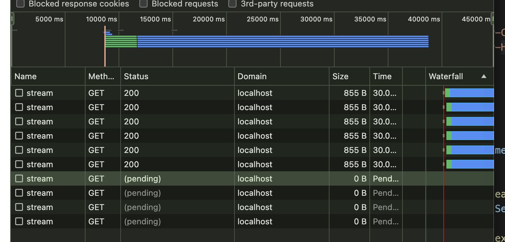

# サーバーサイドからのコミュニケーション技術

## 注意点

今回の記事では概念の説明に留めており、実装例についてはあっても最低限です。
具体例や実装例がある場合は基本 Go です。

また、以下内容については書いておりません。

- 具体的な実装方法について
- プロトコルの歴史や RFC に踏み込んだ内容

## 歴史的背景

サーバーからのコミュニケーション技術は、Webの進化とともに発展してきました。

初期のインターネットでの一般的な HTTP 通信は『クライアントが1回リクエストをサーバーに送信し、サーバーがそれに対して1回応答を返す』だけでした。このため、サーバーからクライアントへの即時データ配信が難しく、（サーバー側から情報を送るために）クライアントからの **HTTP Polling** が主流となりました。HTTP Polling では、クライアントが**一定間隔でサーバーにリクエストを送り**、サーバーがその都度応答する方式でしたが、効率が悪く、サーバー負荷が高くなりがちでした。

その後、**Long Polling** が登場しました。Long Polling では、クライアントがリクエストを送信し、サーバーが新しいデータが利用可能になるまで**接続を保持**します。これにより Polling よりも効率的にリアルタイム性が向上しましたが、依然として HTTP リクエスト/レスポンスのオーバーヘッドが課題でした。

次に登場したのが **Server-Sent Events(SSE)** と **WebSocket** です。SSE は、サーバーからクライアントへの**一方向のストリーミング通信**を実現し、特にイベント駆動の更新に適しています。一方、WebSocket は、クライアントとサーバー間の双方向通信を確立し、低レイテンシでのデータ交換を可能にします。これにより、チャットアプリやリアルタイムゲームなど、インタラクティブなアプリケーションが実現されました。

最近では、gRPC や Web Push のような技術も登場しました。gRPC はバイナリプロトコルを使用し、高効率な通信を可能にします。また Web Pushは、サービスワーカーと連携してプッシュ通知を実現します。これにより、ユーザーがアプリを開いていない場合でも重要な通知を受け取ることができます。

このように、サーバーからのコミュニケーション技術は進化を続けており、各技術はそれぞれの特性を活かしながら、様々なユースケースに対応しています。これにより、現代の Web アプリケーションは、より**リアルタイム性**と**インタラクティブ性**を備えるようになりました。


## なぜ今サーバーからのリアルタイム通信が重要か

サーバーからのリアルタイム通信は、現代の多くのアプリケーションにおいて不可欠な要素となっています。リアルタイム通信が求められる背景には、以下のような具体的なユースケースが存在します。

### チャットアプリ

チャトアプリは、リアルタイムでメッセージをやり取りする必要があります。ユーザーがメッセージを送信すると、即座に相手に届き、反応が返ってくることで、スムーズなコミュニケーションが実現します。遅延があると、ユーザー体験が大きく損なわれてしまいます。

Chat-GPT の Web アプリケーションにおけるコミュニケーションにも SSE が使われていることで話題になりました。

### スポーツのライブスコア

スポーツのライブスコアアプリケーションでは、試合の進行状況やスコアをリアルタイムで提供することが重要です。ユーザーは試合を追いながら、得点や選手の動きなどの最新情報を即座に知りたいと考えています。これにより、試合の臨場感を維持し、ユーザーのエンゲージメントを高めることができます。

### マーケティングツール

マーケティングツールにおいても、クライアントと密なコミュニケーションのためにサーバーからのリアルタイム通信は重要です。例えば、EC サイトでの購買行動をリアルタイムにトラッキングし、カートに商品を追加したユーザーに対して、即時にクーポンを提供することができます。これにより、キャンペーンの効果を最大化し、顧客とのエンゲージメントを高めることができます。

### ゲーム

オンラインゲームにおいてもリアルタイム通信は不可欠です。プレイヤー同士の対戦や協力プレイでは、即時にデータを共有する必要があります。遅延があるとゲームの公平性や楽しさが損なわれるため、低遅延な通信が求められます。

### IoT デバイス

IoTデバイスは、多数のセンサーやデバイスがネットワークを通じてデータをリアルタイムで送受信します。これにより、スマートホームや産業オートメーションなど、効率的でリアルタイムな制御が可能となります。

### 即時性の重要性とその恩恵

これらのユースケースに共通するのは、「即時性」が重要であることです。リアルタイム通信技術を活用することで、ユーザーは遅延のないスムーズな体験を享受でき、アプリケーションの価値を高めることができます。現代の競争の激しい市場では、リアルタイム通信はユーザーの期待を満たすための不可欠な要素となっています。


## 具体的な技術

ここでいくつか具体的な技術について触れておきます。

- **プッシュ通知**：モバイルアプリやブラウザの通知機能、使用するプロトコル（例：Firebase Cloud Messaging、Apple Push Notification Service）
- **SSE (Server-Sent Events)**：
- **WebSocket**：双方向のリアルタイム通信、全二重通信が可能
- **gRPC**：高効率なバイナリプロトコル、ストリーミングのサポート、主にマイクロサービス間の通信で使用

### プッシュ通知

アプリケーションがユーザーのデバイスに対してリアルタイムで通知を送信する仕組みです。
他の技術とは**異なり**、アプリケーションが**フォアグラウンドにない**時でもクライアントとコミュニケーションを取ることができます。これにより**タイムリーな情報提供**が可能となり、より**ユーザーのエンゲージメントを高める**ことが可能です。

特定の通信プロトコルを用いて配信する必要があり、デバイスに固有の方法を用いることが一般的です。Android に対しては Firebase Cloud Messaging (FCM)、iPhone に対しては Apple Push Notification Service（APNs）、ウェブアプリケーションに対しては Web Push が利用されます。

### SSE (Server-Sent Events)

SSE は TCP 接続を可能な限り維持し続ける HTTP 上のプロトコルです。

サーバーからの単方向リアルタイム通信で、特にイベント駆動の更新に強いです。

仕組み的には [HTTP/1.1 の chunk](https://developer.mozilla.org/ja/docs/Web/HTTP/Headers/Transfer-Encoding) を利用しており、response の長さを不定とすることでダラダラとレスポンスを続けてるイメージになります。

[MDM にも実装例があり](https://developer.mozilla.org/ja/docs/Web/API/Server-sent_events/Using_server-sent_events)ますが、基本的には以下3つのヘッダーをつけることが肝となります。

```
Content-Type: text/event-stream
Cache-Control: no-cache
Connection: keep-alive
```

また gin などには SSE 専用のメソッドも[生えております](https://pkg.go.dev/github.com/gin-gonic/gin#Context.SSEvent)。

注意点としては [MDM](https://developer.mozilla.org/ja/docs/Web/API/Server-sent_events) にも記載があるように、HTTP/1.1 を使ってる場合は同一ドメインに対し 6 つまでしか開けないことです。

> 警告: HTTP/2 上で使用されていない場合、 SSE は開くことができる接続の最大数に制限を受けます。この制限はブラウザー単位で設定されており、非常に小さい数 (6) に設定されているため、複数のタブを開くと特に痛みを伴う場合があります。

以下のように 10 個の SSE を同時に接続した場合、6個までしか接続できないことがわかります。



またブラウザが勝手に再接続することもあるため、再接続のされ過ぎに注意が必要です。

### WebSocket

WebSocket クライアントとサーバー間でリアルタイムな双方向通信を実現するもので、チャットアプリなどによく用いられています。

まず、初期段階で HTTP プロトコルのハンドシェイクを行います。
その後の Upgrade 要求が承認され 101 が返されると TCP 接続がアップグレードされ websocket へと化けます。
バイナリデータも送ることができ、詳しい仕様は [RFC6455](https://www.rfc-editor.org/rfc/rfc6455) にまとまっています。

Go では [gorilla/websocket](https://github.com/gorilla/websocket) などのライブラリを使うことで、この辺の処理が簡単に書けます（一時期どうなるかと思ったけど再びメンテナンスされ始めてよかったよかった）。

注意点としては、websocket は **HTTP という枠から外れている**ため、ミドルウェアによってはログなどに残らないなど思わない挙動をする可能性があります。

### gRPC

gRPC は Google が開発したオープンソースの RPC（Remote Procedure Call）フレームワークであり、HTTP/2 の上に構築されています。以下の[4つの通信方式があり](https://grpc.io/docs/what-is-grpc/core-concepts/)、Bidirectional だと双方で自由にコミュニケーションが取れます。

- Unary RPC
- Server streaming RPC
- Client streaming RPC
- Bidirectional streaming RPC

開発の観点からは Protocol Buffers（Protobuf）を使用したスキーマベースの開発ができることも嬉しいです。
現在ではマイクロサービスアーキテクチャ内の通信でで主に使われていますが、**モバイルや web をクライアントとした活用**も個人的には注目しています。

### WebRTC

WebRTC (Web Real-Time Communication) は、ブラウザやモバイルアプリケーション間でリアルタイムの音声、ビデオ、およびデータ通信を可能にするオープンなプロジェクトです。
Google が 2011 年に発表し、[W3C が標準化を進めています](https://www.w3.org/TR/webrtc/)。特別なプラグインや外部**ソフトウェアを必要とせず**に、**ブラウザだけでリアルタイム通信できる**ことが特徴です。
ビデオ会議やライブストリーミングで使われることが多いです。

技術的には、リアルタイム性を最重要しており、トランスポート層に UDP を利用しています。また P2P 通信をサポートしており、サーバーを介さずにクライアント同士が直接通信を行うことができます。
これにより、**低遅延・帯域幅の効率利用**などが期待できます。

#### P2P通信

WebRTCの大きな特徴の一つは、P2P（ピアツーピア）通信をサポートしていることです。これにより、サーバーを介さずにクライアント同士が直接通信を行うことができます。P2P通信の利点には以下があります。

- **低遅延**：データが直接送受信されるため、サーバーを経由するよりも遅延が少なくなります。
- **帯域幅の効率利用**：サーバーの帯域幅を使用しないため、大規模なデータ転送にも適しています。


## 技術の使い分け

リアルタイム通信技術は、それぞれ特性が異なり、適用すべきユースケースも異なります。

以下では、プッシュ通知、Server-Sent Events（SSE）、WebSocket、gRPC、Web Pushについて、どのような場面でどの技術を使うべきかを説明します。

### プッシュ通知

**適用シナリオ**：  
モバイルアプリやウェブアプリにおいて、ユーザーがアプリを開いていない時でも通知を送りたい場合。

**特性**：  
サーバーからクライアントへの一方向通信。通知の内容は比較的短く、即時性は高いが、双方向通信には適していない。

**例**：  
ECサイトでのセール情報の通知、SNSアプリでの新しいメッセージ通知、リマインダーアプリでの予定通知。

### Server-Sent Events（SSE）

**適用シナリオ**：  
クライアントに対してサーバーから継続的にデータを送りたい場合。特に**一方向のストリーミング**が必要な場合に有効。

**特性**：  
サーバーからクライアントへの一方向のデータストリーム。実装が比較的簡単で、HTTPを基盤とするため、ファイアウォールやプロキシとの互換性が高い。

**例**：  
リアルタイムのニュースフィード、株価の更新、スポーツのライブスコア、GPT のレスポンス。

### WebSocket

**適用シナリオ**：  
**双方向のリアルタイム**通信が必要な場合。特に低遅延が求められるインタラクティブなアプリケーションに最適。

**特性**：  
クライアントとサーバー間の全二重通信。最初にHTTPハンドシェイクを行った後、持続的な接続を確立する。高頻度のメッセージ交換が可能。

**例**：  
オンラインチャット、リアルタイムゲーム、共同編集アプリケーション。

### gRPC

**適用シナリオ**：  
マイクロサービス間の効率的な通信が必要な場合。特に複雑なRPC（Remote Procedure Call）パターンを実装する際に有効。

**特性**：  
HTTP/2を使用した高性能なバイナリプロトコル。ユニキャスト、サーバーストリーミング、クライアントストリーミング、双方向ストリーミングをサポート。高効率で低レイテンシ。

**例**：  
マイクロサービス間のデータ交換、リアルタイムデータ処理、バックエンドのAPI通信。

### Web Push

**適用シナリオ**：  
ウェブアプリに対して、ユーザーが**ブラウザを閉じている場合でも**通知を送りたい場合。

**特性**：  
サービスワーカーを利用し、サーバーからクライアントへのプッシュ通知を実現。通知はユーザーの関心を引き続けるために利用される。

**例**：  
ニュースサイトの速報通知、ECサイトでの特別オファー通知、SNSアプリの新しいフォロワー通知。

## おわりに

サーバーサイドからのコミュニケーション技術は、現代のウェブアプリケーションのリアルタイム性とインタラクティブ性を支える重要な要素です。各技術にはそれぞれの特性と適用シナリオがあり、適切に選択することでユーザーエクスペリエンスを大幅に向上させることができます。

今回の記事を通じて、これらの技術に対する理解が深まり、実際のプロジェクトでの適用に役立てていただければ幸いです。今後も新しい技術やプロトコルが登場することが予想されますので、常に最新の情報をキャッチアップし、最適な技術を選択できるようになりたいです。
