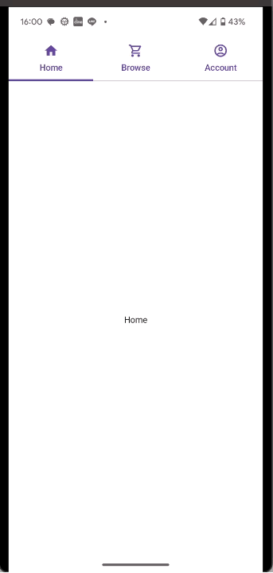

# Jetpack Compose の TabRow(material3) で画面を横スクロールで切り替える方法

material3 のドキュメントでいう[『Swipe within the content area』](https://m3.material.io/components/tabs/guidelines#a10c71e1-a038-4ff7-8e2f-1ece2a34e15c)を compose で実現する方法が v1.1.1 の compose.material3 にはなさそうだったため、その実装方法のメモです。

## はじめに

[こちらの youtube](https://www.youtube.com/watch?v=9r4st6dmyNE&ab_channel=PhilippLackner) で勉強させてもらった内容のになります。
本当に本当にありがとうございます。

本記事の実装で、多くのアプリで見るような以下のような挙動が実現可能です。

- タブクリックによる画面遷移
- 画面内を左右にスワイプすることによる画面遷移
- （タブと表示内容が連動）



## 環境

```
androidx.compose:compose-bom:2023.06.01
androidx.compose.material3:material3:1.1.1
```

## コード

注意点

- SwipableTabRows が material3 にあるけどそれは？
  - SwipableTabRows を使うとタブが長い時にその中でスクロールが可能になる
  - content area が左右スクロール可能になるわけではない
- HorizontalPager と rememberPagerState を使ってページングを実装
  - TabRow とは連携が取れてないので、LaunchedEffect を使って state 同士を同期

``` kotlin
package jp.mydns.kokoichi0206.playground

import android.annotation.SuppressLint
import android.util.Log
import androidx.compose.foundation.ExperimentalFoundationApi
import androidx.compose.foundation.background
import androidx.compose.foundation.layout.Box
import androidx.compose.foundation.layout.Column
import androidx.compose.foundation.layout.fillMaxSize
import androidx.compose.foundation.layout.padding
import androidx.compose.foundation.pager.HorizontalPager
import androidx.compose.foundation.pager.rememberPagerState
import androidx.compose.material.Icon
import androidx.compose.material.icons.Icons
import androidx.compose.material.icons.filled.AccountCircle
import androidx.compose.material.icons.filled.Home
import androidx.compose.material.icons.filled.ShoppingCart
import androidx.compose.material.icons.outlined.AccountCircle
import androidx.compose.material.icons.outlined.Home
import androidx.compose.material.icons.outlined.ShoppingCart
import androidx.compose.material3.MaterialTheme
import androidx.compose.material3.Scaffold
import androidx.compose.material3.Tab
import androidx.compose.material3.TabRow
import androidx.compose.material3.Text
import androidx.compose.runtime.Composable
import androidx.compose.runtime.LaunchedEffect
import androidx.compose.runtime.getValue
import androidx.compose.runtime.mutableIntStateOf
import androidx.compose.runtime.remember
import androidx.compose.runtime.setValue
import androidx.compose.ui.Alignment
import androidx.compose.ui.Modifier
import androidx.compose.ui.graphics.Color
import androidx.compose.ui.graphics.vector.ImageVector


@SuppressLint("UnusedMaterial3ScaffoldPaddingParameter")
@Composable
fun SwipableTabRows() {
    Scaffold { pad ->
        Box(
            modifier = Modifier
                .fillMaxSize()
                .padding(pad)
        ) {
            SwipableTabRowContents()
        }
    }
}

@OptIn(ExperimentalFoundationApi::class)
@Composable
fun SwipableTabRowContents() {
    val tabItems = listOf(
        TabItem(
            title = "Home",
            unselectedIcon = Icons.Outlined.Home,
            selectedIcon = Icons.Filled.Home,
        ),
        TabItem(
            title = "Browse",
            unselectedIcon = Icons.Outlined.ShoppingCart,
            selectedIcon = Icons.Filled.ShoppingCart,
        ),
        TabItem(
            title = "Account",
            unselectedIcon = Icons.Outlined.AccountCircle,
            selectedIcon = Icons.Filled.AccountCircle,
        ),
    )

    var selectedTabIndex by remember {
        mutableIntStateOf(0)
    }

    val pagerState = rememberPagerState {
        tabItems.size
    }
    // pagerState を selectedTabIndex の変更に追従させる。
    LaunchedEffect(selectedTabIndex) {
        Log.d("swipable tab rows", "selectedTabIndex: $selectedTabIndex")
        pagerState.animateScrollToPage(selectedTabIndex)
    }
    // selectedTabIndex を pagerState の変更に追従させる。
    LaunchedEffect(pagerState.currentPage, pagerState.isScrollInProgress) {
        Log.d("swipable tab rows", "pagerState.currentPage: ${pagerState.currentPage}")
        if (!pagerState.isScrollInProgress) {
            selectedTabIndex = pagerState.currentPage
        }
    }
    // ================== うまくいかない例 ==================
    // 2 つ以上離れたタブがクリックされた時に、1つずつ動く挙動をしてしまう。
    // そのため、1つ動いた時点で selectedTabIndex が変更され、それにより animateScrollToPage がトリガーされて、
    // 移動が1つで終わってしまう事象が発生する。
//    LaunchedEffect(pagerState.currentPage) {
//        Log.d("swipable tab rows", "pagerState.currentPage: ${pagerState.currentPage}")
//        selectedTabIndex = pagerState.currentPage
//    }

    Column(
        modifier = Modifier
            .fillMaxSize()
            .background(Color.White)
    ) {
        // ScrollableTabRow is not waht i want...
        TabRow(selectedTabIndex = selectedTabIndex) {
            tabItems.forEachIndexed { index, item ->
                Tab(
                    selected = index == selectedTabIndex,
                    onClick = {
                        selectedTabIndex = index
                    },
                    text = {
                        Text(text = item.title)
                    },
                    icon = {
                        Icon(
                            imageVector = if (index == selectedTabIndex) {
                                item.selectedIcon
                            } else item.unselectedIcon,
                            contentDescription = null,
                            tint = MaterialTheme.colorScheme.primary,
                        )
                    }
                )
            }
        }

        HorizontalPager(
            state = pagerState,
            modifier = Modifier
                .fillMaxSize()
                .weight(1f)
        ) { index ->
            Box(
                modifier = Modifier.fillMaxSize(),
                contentAlignment = Alignment.Center,
            ) {
                Text(text = tabItems[index].title)
            }
        }
    }
}

data class TabItem(
    val title: String,
    val unselectedIcon: ImageVector,
    val selectedIcon: ImageVector,
)
```

## Links

- [youtube](https://www.youtube.com/watch?v=9r4st6dmyNE&ab_channel=PhilippLackner)
- [material3 tabs guidelines](https://m3.material.io/components/tabs/guidelines)
- [androidx.compose.material3#Tab](https://developer.android.com/reference/kotlin/androidx/compose/material3/package-summary#Tab(kotlin.Boolean,kotlin.Function0,androidx.compose.ui.Modifier,kotlin.Boolean,kotlin.Function0,kotlin.Function0,androidx.compose.ui.graphics.Color,androidx.compose.ui.graphics.Color,androidx.compose.foundation.interaction.MutableInteractionSource))
