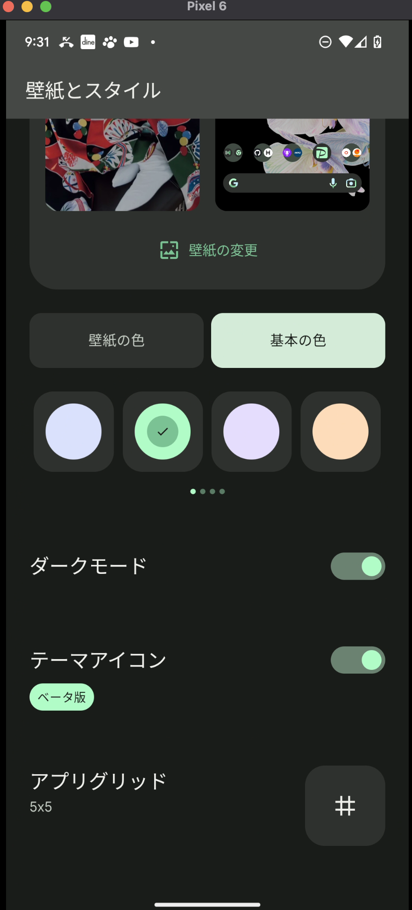
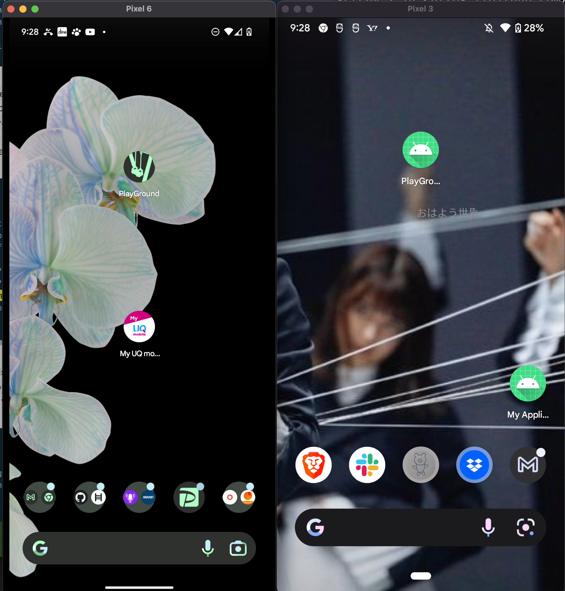

# Android のテーマアイコンの設定

Android のテーマアイコンを有効にする方法と、アプリに設定する方法を紹介します。

**[目次]**  
[:contents]

## テーマアイコンとは

アプリのテーマアイコンとは、以下のように『ユーザーの背景・ダークモード設定によって雰囲気を変えてくれる』アプリのアイコンのことです。  
Android Developers の言葉では『themed app icons』と呼ばれています。


## テーマアイコンを有効にする方法

このアイコンを表示させるには  
『壁紙長押し > 壁紙とスタイル > テーマアイコン』を有効にする必要があります。



[ドキュメント](https://developer.android.com/develop/ui/views/launch/icon_design_adaptive)によると、以下の場合はテーマアイコンが表示**されない**ようです。

- ユーザーがテーマアイコンの設定を有効にしてない場合
  - 壁紙とスタイル
- アプリが『monochromatic app icon』を提供していない場合
- ランチャーが『themed app icons』をサポートしていない場合

つまり、『ユーザー設定・アプリ・ランチャー』の全てにおいて有効になっているかを確認する必要があるようです。

## 自アプリに設定する方法

`ic_launcher.xml` に、`monochrome` の設定を追加します。

```xml
<?xml version="1.0" encoding="utf-8"?>
<adaptive-icon xmlns:android="http://schemas.android.com/apk/res/android">
    <background android:drawable="@drawable/ic_launcher_background" />
    <foreground android:drawable="@drawable/ic_launcher_foreground" />
    <!-- SVG ファイルを追加する！ -->
    <monochrome android:drawable="@drawable/playground" />
</adaptive-icon>
```

なお、これは Android 13 からの機能になります（[テーマ別アプリアイコン](https://developer.android.com/about/versions/13/features?hl=ja#themed-app-icons)）。

**Android 12 以下の端末**  
元々入っている一部のアプリ（Play Store, Settiings, Photos,...）においては有効になっていますが、基本は機能してません。

自分でカスタマイズしたアプリの見た目（中央ちょい上）  
（左: Android13, 右: Android12）



標準で入っているアプリの見た目  
（左: Android13, 右: Android12）


## リンク

- [Android13 機能: テーマ別アプリアイコン](https://developer.android.com/about/versions/13/features?hl=ja#themed-app-icons)
- [ドキュメント: Adaptive icons](https://developer.android.com/develop/ui/views/launch/icon_design_adaptive)

## おわりに

現在、自分がインストールしているアプリでテーマアイコンを設定しているのは 1/4 くらいでした（2022/11/18）。  
個人では、今後このアイコンを設定するようにしたいと思います！
