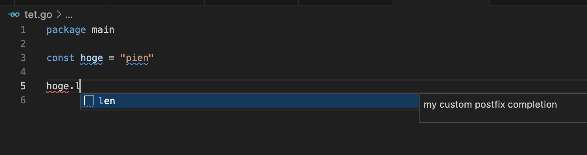

# VSCode で自分だけの補完機能を作る 〜postfix 拡張機能作成のすすめ〜

VSCode にはユーザー独自のスニペットを作る機能があり、prefix に反応して補完する機能であれば [Snippets](https://code.visualstudio.com/docs/editor/userdefinedsnippets) の機能を使えば簡単にできます。

例えば **workspace でのみ有効なスニペットを定義**するには、`.vscode` フォルダ内に拡張子を `code-snippets` にした以下のようなファイルを保存するだけで有効になってくれます。

``` jsonc
// go.code-snippets
{
  "Main": {
    "scope": "go",
    "prefix": "main",
    "body": ["package main\n\nfunc main() {\n\t$1\n}"],
    "description": "main function"
  }
}
```

他にも、**特定キーワード（. など）に反応して該当部分を変換する機能**（対比して **postfix と命名**）も簡単だろうと思われるかもしれませんが、そこまで手軽には作成できず、自作の拡張機能を作る必要がありそうだったのでその紹介です。

<!-- more -->

## 環境

``` sh
❯ code -v
1.82.3
fdb98833154679dbaa7af67a5a29fe19e55c2b73
arm64

❯ yo --version
4.3.1
```

## postfix 作り方

### 今回作るもの

prefix だけでは達成できない、`a.len` -> `len(a)` とする機能を作成してみたいと思います。
`.` よりも前にある `a` の位置が移動しているのが特徴です。

### プロジェクト作成

いつも通り yo を使って拡張機能のプロジェクトを作成します。
初めての方は公式の[チュートリアル](https://code.visualstudio.com/api/get-started/your-first-extension)もご参照ください。

``` sh
$ yo code

# 自分の設定。
? What type of extension do you want to create? New Extension (TypeScript)
? What's the name of your extension? postfix-example
? What's the identifier of your extension? postfix-example
? What's the description of your extension? 
? Initialize a git repository? No
? Bundle the source code with webpack? Yes
? Which package manager to use? npm
```


### コード

以下のコードは、VSCode の拡張機能を使って、独自の postfix 補完を追加するサンプルです。

`extension.ts` をまるっと置き換えます。
気になった点はコメントで補足してるのですが、分からない部分があればコメントください。

``` typescript
import * as vscode from "vscode";

export function activate(context: vscode.ExtensionContext) {
  context.subscriptions.push(
    vscode.languages.registerCompletionItemProvider(
      // go ファイルのみを対象とする。
      {
        language: "go",
        scheme: "file",
      },
      {
        provideCompletionItems(
          document: vscode.TextDocument,
          position: vscode.Position,
          token: vscode.CancellationToken,
          context: vscode.CompletionContext
        ) {
          let line = document.lineAt(position.line);
          let dotIdx = line.text.lastIndexOf(".", position.character);
          if (dotIdx === -1) {
            return [];
          }

          // コメント部分があれば除外する。
          let commentIndex = line.text.indexOf("//");
          if (commentIndex >= 0 && position.character > commentIndex) {
            return [];
          }

          // . の前のコード(変数名等が期待値)を取得する。
          let code = line.text.substring(
            line.firstNonWhitespaceCharacterIndex,
            dotIdx
          );

          // len
          let lengthSnippet = new vscode.CompletionItem("len");
          lengthSnippet.additionalTextEdits = [
            vscode.TextEdit.delete(
              new vscode.Range(
                position.translate(0, -(code.length + 1)),
                position
              )
            ),
          ];
          lengthSnippet.insertText = new vscode.SnippetString(`len(${code})`);
          // VSCode で表示するコメント。
          lengthSnippet.documentation = 'my custom postfix completion';
          // VSCode で表示するアイコンを指定する。
          lengthSnippet.kind = vscode.CompletionItemKind.Snippet;
          // 選択肢の中で最初に表示されるようにする。
          lengthSnippet.sortText = "\u0000";
          // 選択された状態にする。
          lengthSnippet.preselect = true;

          return [lengthSnippet];
        },
      },
      // . に反応させる。
      "."
    )
  );
}
```

また `package.json` の `activationEvents` を適当に設定してあげます。
（`*` は非推奨な感じだと思いますが、とりあえずこれで。。。）

``` json
{
  ...
  "activationEvents": [
    "*"
  ],
  ...
}
```

このコードは Go のファイルで、`.`（ドット）の後に `len` と入力すると、前のコードを `len(変数名)` の形式に変換する機能を追加しています。



## Links

- [DocumentFilter](https://code.visualstudio.com/api/references/vscode-api#DocumentFilter)
  - どのような条件で補完機能を適用するかを定義するための情報が記載されています。
- [Language Identifiers](https://code.visualstudio.com/docs/languages/identifiers)
  - VSCode がサポートしているプログラミング言語の識別子に関する情報。
- [User Defined Snippets](https://code.visualstudio.com/docs/editor/userdefinedsnippets): 
  - VSCode の標準機能である prefix 補完を追加する方法に関する公式ドキュメント。

## おわりに

VSCode の拡張機能を使って、独自の postfix 補完を追加する方法を紹介してみました。

prefix と postfix をうまく活用して、便利に VSCode を使っていきたいですね！
