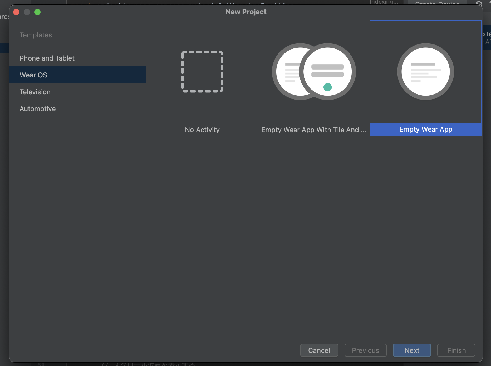
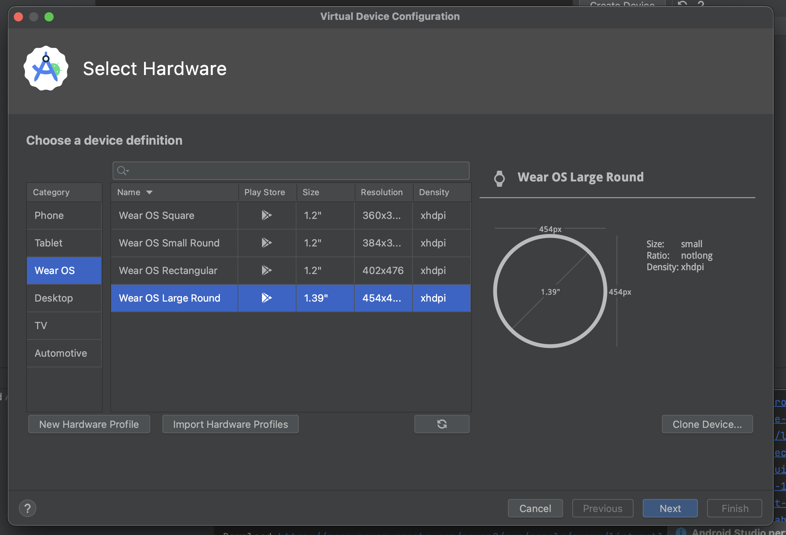
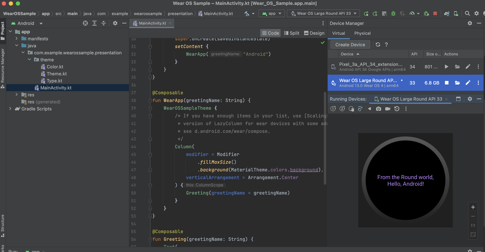
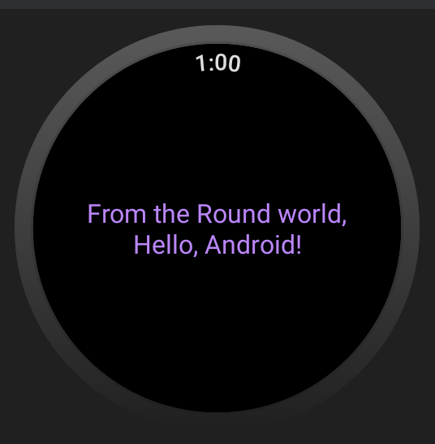
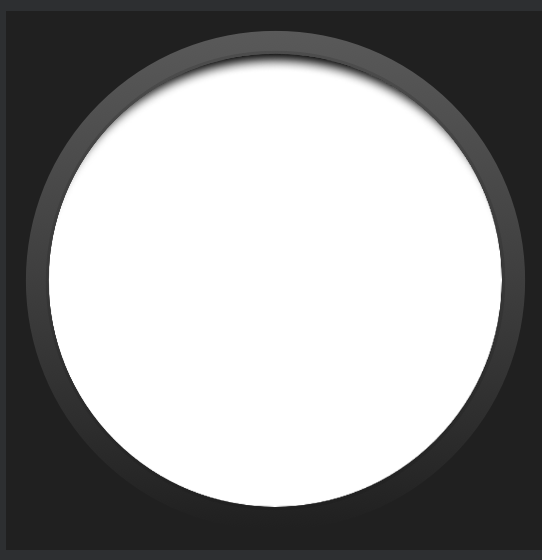
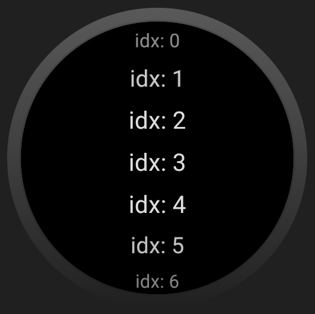
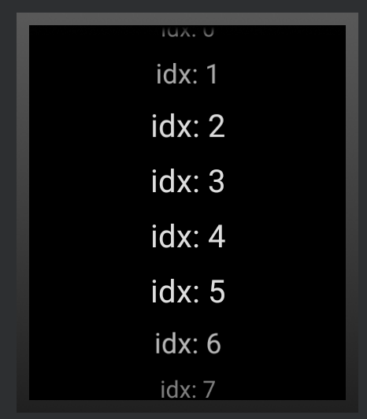
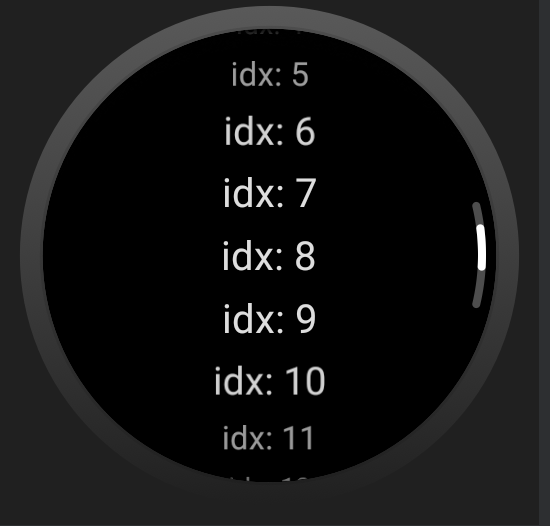
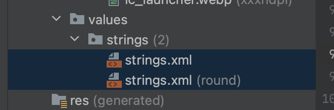
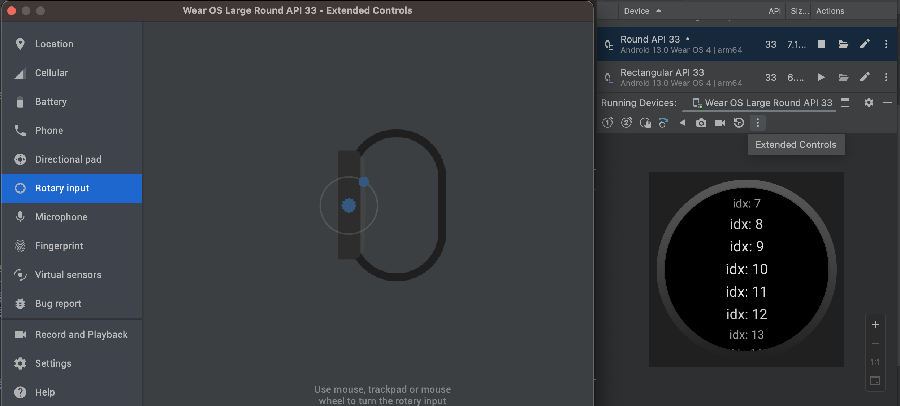

# Jetpack Compose による Wear OS 開発入門

最近 pixel watch を買ってみたので WearOS を少し触ってみています。

今更ですが『Jetpack Compose で始める WearOS 開発入門』という内容で、Android 開発との違いに焦点を当てて記事を書いてみます。
（Jetpack Compose での wear os 開発の基礎となる [androidx.wear.compose.material](https://developer.android.com/jetpack/androidx/releases/wear-compose?hl=ja) ですが、バージョン 1.0.0 は（20回以上のα版を重ねた後） 2022 年 7 月 27 日にリリースされました。）

[wear os のドキュメント](https://developer.android.com/training/wearables?hl=ja)が詳しいので、自分からは簡単な紹介にとどめておきます。
こんな違いがあるんだ〜、こんなことできるんだ〜って思ってもらえたら幸いです。
（エミュレータでも起動できるので、動作確認に実機は不要です。）

## 環境

本記事の内容はすべて、以下の環境・バージョンで動作確認をしております。

```
Android Studio Giraffe | 2022.3.1 Patch 2
Build #AI-223.8836.35.2231.10811636, built on September 15, 2023
Runtime version: 17.0.6+0-17.0.6b829.9-10027231 aarch64
VM: OpenJDK 64-Bit Server VM by JetBrains s.r.o.
macOS 13.2.1
GC: G1 Young Generation, G1 Old Generation
Memory: 1280M
Cores: 10
Metal Rendering is ON
Registry:
    external.system.auto.import.disabled=true
    ide.text.editor.with.preview.show.floating.toolbar=false
```

```
implementation(platform("androidx.compose:compose-bom:2023.03.00"))
implementation("androidx.wear.compose:compose-material:1.2.1")
implementation("androidx.wear.compose:compose-foundation:1.2.1")
```

## WearOS アプリ hello world

『File > New > New Project』から、 Wear OS の Empty War App を選択しプロジェクトを作成します。



エミュレーターも追加しておきます。



エミュレータを追加すると『Run 'app'』が押せるようになり、以下のように起動が確認できます。
（ちなみに、実機に入れるためには Android 端末同様『開発者モードになる』+『Wi-fi を通した接続』が必要です。）



フォルダ構成も他のプロジェクトと変わらないため受け入れやすいかと思います。

ちょっとだけ API の紹介もしておきます。

なお、基本以下の content は androidx.wear.compose:compose-material の [Scaffold](https://developer.android.com/reference/kotlin/androidx/wear/compose/material/package-summary#Scaffold%28androidx.compose.ui.Modifier,kotlin.Function0,kotlin.Function0,kotlin.Function0,kotlin.Function0,kotlin.Function0%29) にぶち込んで使うことを想定しています。

``` kotlin
@Composable
fun Sample() {
    Scaffold() {
        Box(
            modifier = Modifier
                .fillMaxSize(),
            contentAlignment = Alignment.Center,
        ) {
            Text(
                modifier = Modifier.fillMaxWidth(),
                textAlign = TextAlign.Center,
                color = MaterialTheme.colors.primary,
                text = stringResource(R.string.hello_world, "Android"),
            )
        }
    }
}
```

### 時計表示

[Scaffold](https://developer.android.com/reference/kotlin/androidx/wear/compose/material/package-summary#Scaffold%28androidx.compose.ui.Modifier,kotlin.Function0,kotlin.Function0,kotlin.Function0,kotlin.Function0,kotlin.Function0%29)  の引数にそれっぽいのがあるので使ってみます。

現在時刻を表示させるには androidx.wear.compose.material.TimeText を使います。
ちなみにここの TimeText の部分の実装は、時計の形状が Rounded かどうかで表示方法を変えている簡単なサンプルになってるので見てみると面白いです。

``` kotlin
import androidx.wear.compose.material.TimeText

@Composable
fun Sample() {
    Scaffold(
        timeText = {
            TimeText()
        },
    ) {
        ...
    }
}
```



表示形式やスタイルに関しては、全て TimeText の引数から指定することが可能です。

``` kotlin
Scaffold(
    timeText = {
        TimeText(
            timeSource = TimeTextDefaults.timeSource("HH:mm:ss"),
            timeTextStyle = TimeTextDefaults.timeTextStyle(
                background = Color.Red,
                color = Color.Blue,
            ),
        )
    },
) {
    ...
}
```

### vignette

続いて Scaffold の他の引数である vignette について挙動を確かめておきます。
日本語には『周辺減光』と訳されます。

デバイス周辺を少し暗くすることで、コンテンツエリアと縁の境界を目立たせることが目的です。

``` kotlin
Scaffold(
    vignette = {
        Vignette(
            // 比較のため上にだけ周辺減光を入れる。
            vignettePosition = VignettePosition.Top,
        )
    },
) {
    Box(
        modifier = Modifier
            .fillMaxSize()
            .background(Color.White),
    )
}
```

なんとなく上側だけぼんやりしてることがわかるでしょうか。。。？



正直微妙な差だなとは思いつつ、エリアサイズや色を変える方法はなさそうなので、とりあえず入れておくかって感じですかね。

実際のコンテンツを配置しみてましょう。

``` kotlin
@Composable
fun Sample() {
    Scaffold(
        vignette = {
            Vignette(
                // 比較のため上にだけ周辺減光を入れる。
                vignettePosition = VignettePosition.Top,
            )
        },
    ) {
        LazyColumn(
            modifier = Modifier
                .fillMaxWidth(),
            horizontalAlignment = Alignment.CenterHorizontally,
        ) {
            items(20) { idx ->
                Text(
                    text = "idx: $idx",
                    fontSize = 20.sp,
                    modifier = Modifier
                        .padding(2.dp),
                )
            }
        }
    }
}
```


idx 7 (下部) 周辺に比べ、idx 0 (上部) の方がぽくなってる。。。？気がしなくもないですね。

### ScalingLazyColumn

先ほどしれっと LazyColumn を使いましたが、実は WearOS ように特化した LazyColumn もあり、
それが ScalingLazyColumn と呼ばれるものです。

円形のデバイスにおいては、上部と下部が小さいくなっているため、アイテムを表示する横幅が少なくなります。
**それに合わせてフォントサイズ等も変えてやろう**という大胆な発想のもの作成された API ですが
[wear-compose のリリースノート一覧](https://developer.android.com/jetpack/androidx/releases/wear-compose?hl=ja)を見る限り、かなりの苦労を感じます。。。

使い方は LazyColumn を ScalingLazyColumn に変えるだけです（中ですごい頑張ってます）。

``` kotlin
// 画面の上部と下部で要素が小さくなる。
ScalingLazyColumn(
    modifier = Modifier
        .fillMaxWidth(),
    horizontalAlignment = Alignment.CenterHorizontally,
) {
    items(20) { idx ->
        Text(
            text = "idx: $idx",
            fontSize = 20.sp,
            modifier = Modifier
                .padding(2.dp),
        )
    }
}
```

円形デバイスのみに対する考慮かと思ってたのですが、どうやら正方形のデバイスにも多少の違いが出そうでした。

| Rounded | Rectangular |
| :---: | :---: |
|  |  |

### スクロール位置の表示

コンテンツ量が多い場合には、今全体のどのあたりを見てるのかを表示することも有効です。

``` kotlin
@Composable
fun Sample() {
    // スクロールを管理する状態。
    val columnState = rememberScalingLazyListState(initialCenterItemIndex = 0)

    Scaffold(
        // スクロール位置を表示する。
        positionIndicator = {
            PositionIndicator(scalingLazyListState = columnState)
        },
    ) {
        ScalingLazyColumn(
            modifier = Modifier
                .fillMaxWidth(),
            state = columnState,
            horizontalAlignment = Alignment.CenterHorizontally,
        ) {
            items(20) { idx ->
                Text(
                    text = "idx: $idx",
                    fontSize = 20.sp,
                    modifier = Modifier
                        .padding(2.dp),
                )
            }
        }
    }
}
```




## そのほかの色々

何となく気づいたことを書いていますが、公式にも [モバイル開発の比較](https://developer.android.com/training/wearables/wear-v-mobile?hl=ja)という章があり、読んでみてほしいです。

### アプリ以外

アプリを作る以外にも、WearOS に情報を表示するには[タイル](https://developer.android.com/training/wearables/tiles?hl=ja), [ウォッチフェイス](https://developer.android.com/training/wearables/watch-faces?hl=ja)などさまざまな方法があります。

また、Android Device に対する通知は、デフォルトで受け取るかどうかの設定があるため、そちらで十分な場合がほとんどだと思います。

### 文言ファイル

言語別に文言ファイルを分けるのとは別に、デバイスの形状（Rounded or Rectangular）で設定ファイルを分けることが可能となっています。
wear os 独自で面白いですね。



### horologist という便利ライブラリ

Jetpack Compose を用いた Android 開発するにおいて、
痒い所に手が届く用にするために google が用意してくれている [accompanist](https://github.com/google/accompanist) が有名ですが、
WearOS 用のそれとして [horologist](https://github.com/google/horologist) があります（こちらも google 配下のリポジトリ）。

[名前にもこだわりを持っている](https://github.com/google/horologist#why-the-name)らしく『時計を作ったり修理したりする』という意味らしいです。

README に参考画像が豊富にありますが、今のところ media player や audio サポート, date time picker などが用意されてます。

### 入力イベント

通常のスクロール等に加え、[特殊なボタン](https://developer.android.com/training/wearables/user-input/physical-buttons?hl=ja)からの入力を受け付けることができます。

特に、ボタンを回した時の入力に対応する[ロータリー(Rotary)入力](https://developer.android.com/training/wearables/compose/rotary-input?hl=ja)は Android Device にない機能なので面白いかなと思います。

ここの rotary event に対するハンドリングは [horologist の rotaryWithScroll Modifier](https://google.github.io/horologist/api/compose-layout/com.google.android.horologist.compose.rotaryinput/rotary-with-scroll.html) を使うことが[公式でも推奨](https://developer.android.com/training/wearables/compose/rotary-input?hl=ja)されてます。

> 注: onRotaryScrollEvent() を自分で処理する代わりに、Horologist ライブラリで提供される rotaryWithScroll() 修飾子の使用を検討してください。
> セットアップの一部は、この修飾子によって処理されます。

実装は、horologist の中でも [compose-layout](https://google.github.io/horologist/compose-layout/) を使用します。

```
// 依存関係の追加。
implementation("com.google.android.horologist:horologist-compose-layout:0.5.7")
```

``` kotlin
import androidx.wear.compose.foundation.lazy.rememberScalingLazyListState
import androidx.wear.compose.foundation.lazy.rememberScalingLazyListState

@OptIn(ExperimentalHorologistApi::class)
@Composable
fun Sample() {
    val focusRequester = remember { FocusRequester() }
    val columnState = rememberScalingLazyListState(initialCenterItemIndex = 0)

    Scaffold() {
        ScalingLazyColumn(
            modifier = Modifier
                .fillMaxWidth()
                .rotaryWithScroll(
                    scrollableState = columnState,
                    focusRequester = focusRequester,
                ),
            state = columnState,
            horizontalAlignment = Alignment.CenterHorizontally,
        ) {
            items(20) { idx ->
                Text(
                    text = "idx: $idx",
                    fontSize = 20.sp,
                    modifier = Modifier
                        .padding(2.dp),
                )
            }
        }

        LaunchedEffect(Unit) {
            focusRequester.requestFocus()
        }
    }
}
```

[エミュレータでロータリーイベントを再現する](https://developer.android.com/training/wearables/user-input/rotary-input?hl=ja#emulator)ことが可能です。
図のくるくるの部分を回すと表示情報が流れていきます。




## Links

- [developer.android.com: Wear OS モジュールを既存プロジェクトに追加する](https://developer.android.com/training/wearables/apps/creating?hl=ja#add-wear-os-module)
- [developer.android.com: pathways](https://developer.android.com/courses/pathways/wear?hl=ja)
- [developer.android.com: training/wearables](https://developer.android.com/training/wearables)
- [developer.android.com: Wear OS とモバイル開発の比較](https://developer.android.com/training/wearables/wear-v-mobile?hl=ja)
- [wear-os-samples](https://github.com/android/wear-os-samples/tree/main)
- [DroidKaigi2022](https://www.youtube.com/watch?v=o0HhsnVAGNA&ab_channel=DroidKaigi)
