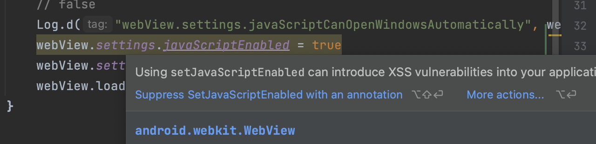

# Jetpack Compose の Webview でリダイレクトされなかった

OAuth の連携画面を Jetpack Compose の Webview で表示していて、ログイン後に**リダイレクトされない**ことがありました。

次のように **javascript を有効に**してあげることで解決しました。  
（リダイレクトに javascript が使われることが多々あるようです。）

``` kotlin
@SuppressLint("SetJavaScriptEnabled")
@Composable
fun Login(url: String) {
    Log.d("hoge", "accessing $url ...")

    AndroidView(
        factory = ::WebView,
        update = { webView ->
            webView.webViewClient = WebViewClient()

            // default では false
            Log.d("webView.settings.javaScriptEnabled", webView.settings.javaScriptEnabled.toString())
            // default では false
            Log.d("webView.settings.javaScriptCanOpenWindowsAutomatically", webView.settings.javaScriptCanOpenWindowsAutomatically.toString())

            // js を有効化する。
            webView.settings.javaScriptEnabled = true
            webView.settings.javaScriptCanOpenWindowsAutomatically = true

            webView.loadUrl(url)
        }
    )
}
```

Android Studio 上で `webView.settings.javaScriptEnabled = true` のように js を有効にすると、以下の写真のように『XSS の危険性あるよ〜』って警告を出してくれます。  
信頼のおけるサイトでのみ本設定を有効にするように注意しましょう。  
（今回は `SuppressLint` をつけることで警告を無効化してます。）


