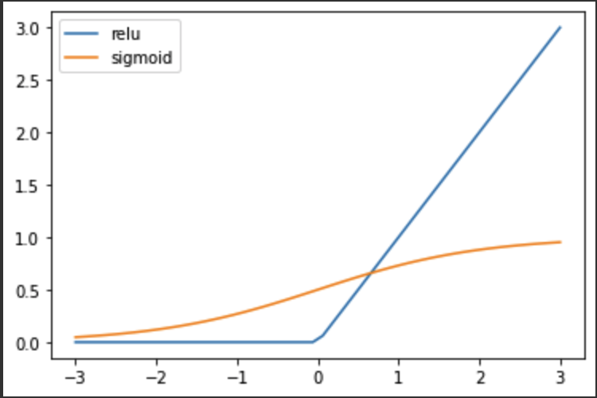
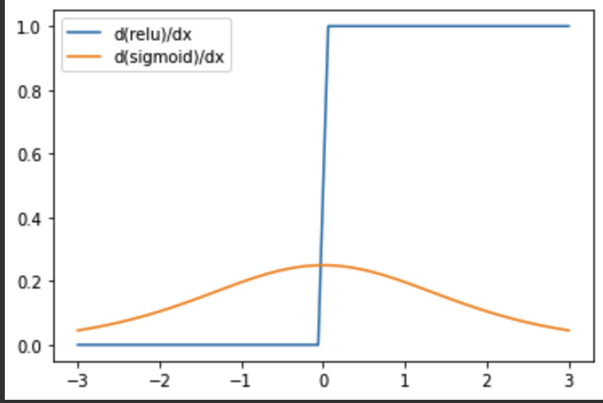

# 活性化関数に ReLU が使われる理由
ニューラルネットワークにおける各層の線形変換の直後には、必ず活性化関数が挟まれています。

今回は、「なぜ ReLU が好まれるのか」についてまとめておきます。

## 活性化関数
まず、活性化関数は、中間層のものと出力層のものでは求められる役割が異なることに注意しておきます。

### 中間層における活性化関数 
その後も線形変換が続くため、一旦**非線形にする**のが主な役割。非線形を挟むことで**モデルがスケールを獲得し、多層にする意味が出てきます。**

この中間層において活性化関数が必要な理由については[「ニューラルネットワークに活性化関数が必要な理由」](https://koko206.hatenablog.com/entry/2022/01/18/230240)に記載していますので、よろしければご覧ください。

### 出力層における活性化関数
タスクの内容に合わせて**出力結果を整える**のが主な役割。問題設定に合わせて出力範囲を調整します。


## 中間層で ReLU がよく使われる理由
中間層においては、次の数式で表される`ReLU`という関数がよく使われます。

$$
ReLU(x) = \max(0, x)
$$

ここからは、なぜ中間層で ReLU が使われるのかについて説明します。

### 誤差逆伝播法
ニューラルネットワークにおいて、次のようなステップで重みの学習を行なっています。

1. 最終的な出力値と正解ラベルとの差分から**損失関数**の計算をおこなう
1. 損失関数（誤差）を用いて、**ネットワークを出力から入力へと逆順に**パラメータの調整を行う
    * 誤差逆伝播法と呼ばれる
    * **調整の値に損失関数の微分が用いられる**

このステップのうち「損失関数の微分」の値に着目してみます。

### 損失関数の微分の値
ここでは`ReLU`の性質を調べるために、活性化関数の代表例でもある`sigmoid`関数との比較をすることで話を進めたいと思います。

まず、生の関数の値は以下の図のようになっています。



次に、これらの関数の微分の値を比べてみます。



`ReLU`は x が正の領域で常に 1 をとっている一方、`sigmoid`の方は x = 0 付近でピークを持ち、それ以外では急速に小さくなっています。

### ニューラルネットワークにおいて
ニューラルネットワークにおいて、微分の値が 0 付近になってしまうことはいいことではありません。

なぜなら、誤差逆伝播法においてパラメータの調整は活性化関数の微分を用いて行われるため、**微分の値が小さいことは学習がなかなか進まないことを意味します（勾配消失問題）**。
また、層をさかのぼるにつれて微分同士の掛け算で効いてくるため、中間層が多くなればなるほど勾配消失問題は起こりやすくなります。

`ReLU`では x が正の領域で常に微分の値が 1 となり安定しているため、多層ニューラルネットワークにおいて学習が早くなり安定するようになります。

以上が、ニューラルネットワークの中間層の活性化関数において`ReLU`関数が優れている理由となります。


## おわりに
ReLU は「Rectified Linear Unit」の頭文字を取ったもので、日本語では「修正された線形関数」となります。

略語の名称を知ると、知識の定着も早くなるし、より理解も深まると感じています。ぜひ英語名称も一緒に覚えてみましょう。


## おまけ
今回のグラフのプロットに使った python のコード

### 関数
``` python
import numpy as np
import matplotlib.pyplot as plt

def relu(x):
    return max(0, x)

def sigmoid(x):
    return 1 / (1 + np.exp(-x))

x_range = 3
x = np.linspace(-x_range, x_range, 50)

y_rel = [relu(a) for a in x]
y_sigmoid = [sigmoid(a) for a in x]

plt.plot(x, y_rel, label="relu")
plt.plot(x, y_sigmoid, label="sigmoid")
plt.legend()
```

### 関数の微分
``` python
def differential(func, a):
    h = 1e-5
    return (func(a+h) - func(a)) / h

d_y_rel = [differential(relu, a) for a in x]
d_y_sigmoid = [differential(sigmoid, a) for a in x]

plt.plot(x, d_y_rel, label="d(relu)/dx")
plt.plot(x, d_y_sigmoid, label="d(sigmoid)/dx")
plt.legend()
```

### Error
最初、`y=relu(x)`のように linspace で作った numpy array の x を突っ込んでいたのですが、以下のようなエラーが出ました。

```
ValueError: The truth value of an array with
 more than one element is ambiguous. 
 Use a.any() or a.all() site:stackoverflow.com
```

エラーメッセージに従ってみたり、調べても解決できなかったので、自分は以下のように array 内の要素を for 文で回すことで回避しました。


``` python
# エラーを吐いた例：y_rel = relu(x)
y_rel = [relu(a) for a in x]
```

